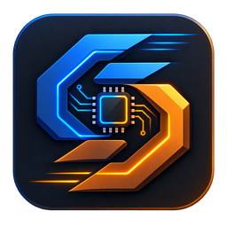
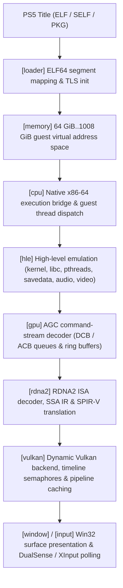

<div align="center">
  
  <h1>PSPC5 Plus</h1>
  <p><strong>Open-source PlayStation 5 emulation and compatibility research.</strong></p>
  <p>Native x86-64 guest execution · RDNA2 ISA to SPIR-V translation · Dynamic Vulkan renderer · Zero-dependency Windows launcher</p>
  <p>
    
    
    
    <a href="LICENSE"></a>
    
    
  </p>
  <p>
    <a href="#core-team--contributors"><strong>Core Team</strong></a>
    · <a href="#origins-and-upstream-attribution">Origins & Upstream</a>
    · <a href="docs/README.md">Documentation</a>
    · <a href="docs/compatibility/README.md">Compatibility Database</a>
    · <a href="#architecture-overview">Architecture</a>
    · <a href="#building-and-running">Build Guide</a>
    · <a href="CHANGELOG.md">Changelog</a>
    · <a href="CONTRIBUTING.md">Contributing</a>
    · <a href="https://github.com/gurjotsenghww/pspc5-plus/issues">Report an issue</a>
  </p>
</div>


> [!IMPORTANT]
> **PSPC5 Plus** is an experimental open-source PlayStation 5 emulator and computer science research project under active development. A growing number of commercial and homebrew titles reach in-game and playable status, but stability, performance, and accuracy vary depending on title complexity and host GPU capabilities. Use only software backups and system resources that you legally own.

---

## Core Team & Contributors

PSPC5 Plus is actively maintained and engineered by:

- **Gurjotpal Singh** ([@gurjotsenghww](https://github.com/gurjotsenghww)) — Project Lead, Architecture, Core Development & Integration
- **Antigravity** (Google DeepMind) — Core System Engineering, Shader Pipeline Optimization & Automated Test Verification

We welcome community pull requests, bug reproductions, and compatibility reports following our [Contributing Guidelines](CONTRIBUTING.md).

---

## Origins and Upstream Attribution

**PSPC5 Plus** is derived from and builds upon [**PS5PCEM**](https://github.com/iStark/PS5PCEM), created by **Artur Strazewicz (`@iStark`)**.

- **Upstream Repository**: [https://github.com/iStark/PS5PCEM](https://github.com/iStark/PS5PCEM)
- **Upstream Creator**: Artur Strazewicz (`@iStark`)
- **License**: [GNU General Public License v3.0 or later](LICENSE) (fully preserved)

PSPC5 Plus evolves the codebase with automated regression testing, full 100% test suite passing verification (all 1,546 tests green), structured JSON compatibility databases with automated CI validation, RDNA2 shader inspection tools, execution profiling utilities, and modernized Windows launcher branding.

---

## Architecture Overview

PSPC5 Plus executes PlayStation 5 applications on Windows x86-64 PCs through a clean multi-stage pipeline:



### Execution Pipeline Breakdown

1. **Title Loader (`src/loader/`)**: Loads decrypted SELF/ELF64 binaries, maps program segments to the guest address space, resolves dynamic symbols, and initializes Thread Local Storage (TLS).
2. **Memory Subsystem (`src/memory/`)**: Virtual memory manager handling 48-bit address space, Direct Memory mappings, GPU page table translation, and write protection.
3. **CPU Execution (`src/cpu/`)**: Host-assisted execution utilizing the host x86-64-v3 CPU directly for guest code, with dedicated stack switches and structured exception containment.
4. **Firmware HLE (`src/hle/`)**: High-Level Emulation for PlayStation 5 system libraries:
   - `libkernel`: Virtual memory, thread management, mutexes, condition variables, semaphores, timers.
   - `libSceSaveData`: Directory layout, mount/unmount operations, slot metadata, and title isolation.
   - `libSceAudioOut` & `libSceAjm`: Multi-stream audio mixing, ATRAC9, MP3, AAC, and Opus audio decoders.
   - `libSceVideoOut`: Display resolution negotiation, refresh rates, and swapchain presentations.
5. **GPU / AGC Processor (`src/gpu/`)**: Decodes Asynchronous Graphics Commands (AGC), managing Draw Command Buffers (DCB), Asynchronous Compute Buffers (ACB), context registers, and GPU synchronization labels.
6. **RDNA2 Shader Translation (`src/rdna2/`)**: Full RDNA2 instruction decoder, Control Flow Graph (CFG) reconstruction, Intermediate Representation (IR), and lowering into standard Vulkan SPIR-V binaries.
7. **Vulkan Renderer (`src/vulkan/`)**: Robust Vulkan 1.2+ backend with descriptor indexing, push constants, timeline semaphores, asynchronous pipeline warmup, and dynamic render passes.
8. **Window & Input (`src/window/`, `src/input/`)**: Hardware presentation layer with low-latency windowing, DualSense controller haptics/triggers mapping, and XInput/keyboard bindings.
9. **Desktop Launcher (`src/launcher.zig`)**: Lightweight, zero-dependency Win32/GDI launcher with title library manager, savegame inspector, controller tester, and graphical configuration.

---

## Compatibility Milestones

A curated selection of verified titles running on PSPC5 Plus:

| Title | Title ID | Status | Measured Milestones & Highlights |
|---|---|---|---|
| **Subnautica: Below Zero** | PPSA02457 | **Playable · Completable** | Restores Survival save, renders snowy terrain and HUD. 10.60 FPS combined (15.5 FPS menu). |
| **Terminator 2D: No Fate** | — | **Playable · Completable** | Full playthrough completed without defects. Backgrounds, characters, HUD, textures accurate. |
| **Jets 'n' Guns 2** | — | **Playable · Completable** | Playthrough confirmed. Parallax scrolling, audio routing, levels, HUD and enemies render accurately. |
| **Asterix & Obelix: Slap Them All!** | — | **Playable · Completable** | 28–31 ms frame times, 3,000-flip stability run verified without rejected submissions. |
| **Cat Quest III** | — | **Playable · Completable** | In-game navigation, cards, dialogue, and island terrain render smoothly. |
| **Dreaming Sarah** | — | **Playable · Completable** | Title menu and first scene run at 60 FPS cap on modern discrete GPUs. |
| **Quake II (2023)** | PPSA09477 | **Playable · Completable** | Lighting, textures, weapons, NPCs, controller input, buffer reuse fully operational. |
| **Jurassic Park Classic Games Collection** | — | **Playable · Completable** | FreeType font rendering and Latin-1 atlas support verified. |
| **Mighty Morphin Power Rangers: Rita's Rewind** | — | **Playable · Completable** | Publisher intro, menu, training stage and controller input working. |
| **Grand Theft Auto III: The Definitive Edition** | PPSA03527 | **In-game** | Opening scene renders, walking, car entry and driving verified. |
| **Little Nightmares Enhanced Edition** | PPSA10737 | **In-game** | Opening room reached, save/reload verified. Dark/reflective material shader ongoing. |
| **Ghost of Yōtei** | — | **Intro / In-engine** | H.264 intro video presented; 3D scenes, post-tree cinematic reached. |

See the complete [Compatibility Database](docs/compatibility/README.md) for full title profiles and metadata.

---

## Developer Tooling & Infrastructure

PSPC5 Plus includes dedicated utilities for reverse engineering, debugging, and quality assurance:

- **Shader Inspector** (`tools/shader-tools/inspect_shader.py`): Analyzes RDNA2 instruction binaries, instruction frequency, and opcode statistics.
- **Performance Profiler** (`tools/profiler/profile_report.py`): Parses JSON profile sessions, computing frame times, 99th percentiles, and subsystem bottlenecks.
- **Compatibility Validator** (`tools/compatibility/validate.py`): Ensures title metadata, IDs, milestones, and status strings comply with the database schema.
- **Trace Viewer** (`tools/trace-viewer/index.html`): Web-based visual inspector for command buffers, draw calls, and GPU queue events.

---

## Building and Running

### System Requirements

- **Operating System**: Windows 10 (version 2004 or newer) or Windows 11 (x64)
- **Processor**: x86-64-v3 baseline processor (Intel Haswell / AMD Zen 2 or newer with AVX2, FMA, BMI2)
- **Graphics Card**: Vulkan 1.2+ capable GPU (Vulkan 1.3 / 1.4 recommended; NVIDIA GeForce RTX, AMD Radeon RX, Intel Arc)
- **Memory**: 16 GB RAM minimum (32 GB recommended)
- **Toolchain**: [Zig 0.16.0](https://ziglang.org)

### Build Commands

```powershell
# Check compilation across all modules
zig build check

# Run the complete test suite (1,546 tests across all subsystems)
zig build test

# Build the native Windows desktop launcher (zig-out/bin/pspc5-plus.exe)
zig build

# Build the PS5 title runner (zig-out/bin/game-run.exe)
zig build build-game-run

# Build the PKG extractor (zig-out/bin/pkgextractor.exe)
zig build build-pkgextractor

# Run the headless Vulkan graphics smoke probe
zig build vulkan-smoke
```

---

## Quick Start Guide

1. Clone the repository:
   ```sh
   git clone https://github.com/gurjotsenghww/pspc5-plus.git
   cd pspc5-plus
   ```
2. Build the launcher:
   ```sh
   zig build
   ```
3. Run `zig-out\bin\pspc5-plus.exe`.
4. Select your legally decrypted PS5 game folder containing `eboot.bin`.
5. Connect your controller (DualSense or XInput) or configure keyboard bindings.
6. Click **Launch game ▶** to start emulation!

---

## Documentation Directory

| Document | Description |
|---|---|
| [docs/README.md](docs/README.md) | Central documentation directory |
| [docs/getting-started.md](docs/getting-started.md) | Setup instructions, debugging options, CLI switches |
| [docs/architecture/overview.md](docs/architecture/overview.md) | Detailed subsystem architecture breakdown |
| [docs/compatibility/README.md](docs/compatibility/README.md) | Game compatibility tracking and title profiles |
| [docs/development/hle-coverage.md](docs/development/hle-coverage.md) | PlayStation 5 firmware HLE implementation matrix |
| [docs/project-status.md](docs/project-status.md) | Implementation progress, current milestones, roadmaps |
| [docs/legal.md](docs/legal.md) | Research scope, legal policies, copyright notice |
| [CONTRIBUTING.md](CONTRIBUTING.md) | Contribution standards, code style, Git workflow |
| [CHANGELOG.md](CHANGELOG.md) | Version history, updates, and notable changes |

---

## Legal and Ethical Policy

PSPC5 Plus is an independent interoperability and computer science research project.

- PSPC5 Plus contains **NO copyrighted game assets**, proprietary ROMs, leaked Sony console firmware, or cryptographic keys.
- PSPC5 Plus does not include or provide DRM circumvention mechanisms designed for piracy.
- Users must provide their own legally obtained software and decryption keys for interoperability testing.
- Licensed under the [GNU General Public License v3.0 or later](LICENSE).
