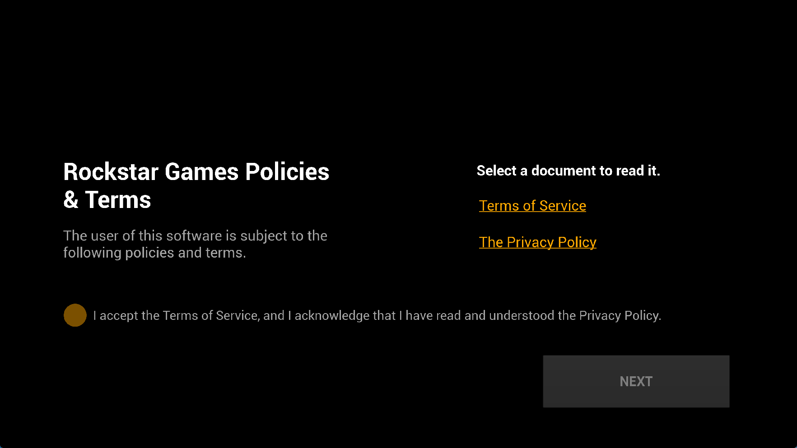

# GTA III: AMPR imports and first startup — October 2, 2026

**Grand Theft Auto III: The Definitive Edition, PPSA03527 v1.007**, now
passes linking and reaches the readable **Rockstar Games Policies & Terms**
screen. Two fresh processes reached this screen, including one using the
updated `zig-out/bin/game-run.exe`. Gameplay has not been verified.

This is an unedited 1765×993 client-window capture with 1920×1080 output.
The initial blank stage advanced after a keyboard Cross press (`Space`).
The policy screen's window counter read 29.8–30.0 FPS; recent frame samples
were 31–35 ms. These are UI measurements, not gameplay performance.

## Why linking failed

The application imports 13 `libSceAmpr` entry points that were absent from
the HLE export registry. Their names are independently checked against the
guest's NIDs during registration. They are the unsuffixed address/counter
wait and size-measurement APIs, plus completion-only writes and their sizes.
The previous build exposed the related `_04_00` APIs only.

The shared registry now exposes the requested variants. Explicit adapters
handle the completion-only signatures, which omit legacy arguments. In
particular, the four-argument completion event uses its supplied data word;
it does not read an unspecified fifth guest register as user data. Recorded
address writes still execute during APR submission, before subsequent
completion events, rather than when the command is constructed.

The local [KytyPS5 AMPR source](https://github.com/KytyPS5/KytyPS5/blob/main/src/libs/libAmpr.cpp)
and [SharpEmu AMPR source](https://github.com/sharpemu/sharpemu/blob/main/src/SharpEmu.Libs/Ampr/AmprExports.cs)
helped identify the export names and argument differences. The implementation
uses PS5PCEM's existing APR command buffer and event delivery mechanisms.

This is **API coverage for startup, not complete AMPR hardware emulation**.
Wait/counter variants retain the existing compatibility placeholders:
waits and counter updates are not scheduled, and time/counter-to-address
writes produce zero. These paths were not called in the observed live trace.
The live
trace exercises the new event-size and completion-event functions; it does
not validate every newly linkable import.

## Checks and observed behavior

- ReleaseFast runner build succeeds.
- **16 APR/AMPR tests pass** in ReleaseSafe. The new regression resolves all
  13 import IDs, invokes the registered completion functions using their
  guest ABI, checks that recording does not publish a write/event, and checks
  the label value and event payload when the submission completes. It also
  checks rejection of a null write destination.
- The 180-second diagnostic run reaches the policy screen. Its trace records
  370 calls each to `sceAmprMeasureCommandSizeWriteKernelEventQueueOnCompletion`
  and `sceAmprCommandBufferWriteKernelEventQueueOnCompletion`, with no matched
  AMPR error return. It performs more than 10,000 APR file-read submissions.
- A fresh run of the installed executable, with the verbose APR trace disabled,
  also reaches the policy screen after Cross input.
- The test runner deliberately stops each owned process at its configured
  duration. These stops are not spontaneous title crashes.

Initial shader lowering diagnostics, the blank startup stage, audio correctness,
gameplay and saves remain unverified. No gameplay or completion status is claimed.
The separate RusSound package has not been applied.

## Installed build and evidence

`zig-out/bin/game-run.exe` and its matching PDB are updated. EXE SHA-256:
`a4d2cf426b24ad30b8f19d820f565d4d4402ec03c12c51fb4b20b3473bb6a5e8`.
The preceding binary is retained locally in the ignored
`out/gta3-ampr-20261002/` evidence directory, together with build/test logs,
run manifests, trace summaries and both run captures.

The title data remains at `E:\PS5 GTA III`; re-extraction is unnecessary.
See the separate [package extraction report](gta3-pkg-extraction-2026-10-02.md)
for the earlier NAPS correction and archive-index checks. Public release
archives have not been replaced.
