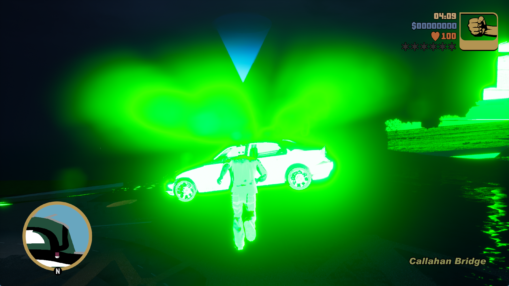

# GTA III: NGG export snapshots — October 2, 2026

**Grand Theft Auto III: The Definitive Edition, PPSA03527 v1.007.**
The installed runner reaches the opening mission, **Give Me Liberty**, with
visible world geometry, the player, a vehicle, the HUD and minimap. Keyboard
movement and a change of direction are verified at Callahan Bridge. The shared
renderer now preserves NGG export values before their registers are reused,
restoring the game's 32-layer color-grading table and removing one cause of
the completely black world. Strong green tint, overexposure, missing sampled
resources and startup instability remain. The result is **In-game**, not a
playable or completion claim.

## Live gameplay check

The `fixed9` run uses the updated installed runner with default submission
settings, 1080p presentation and keyboard input. It advances through the policy
screen, title menu, new-game loading and the opening scenes into Give Me Liberty.
Holding W moves the player toward the marked vehicle; holding D changes his
direction. The unedited 1765×993 client-window capture above records the player
running with the HUD and Callahan Bridge label visible.
The process continues rendering through the 15-minute test limit and is then
terminated by the test harness after its final capture (905.779 seconds total).
Its exit code of 1 records that deliberate stop, not a new guest crash.

A subsequent **30.002-second** world sample records **29 new flips and 29 new
presented frames: 0.97 FPS**. It is a gameplay measurement on the development
host, not a speedup claim. Earlier attempts still fail intermittently during
loading or stop at Unreal's RenderThread timeout. Reaching this mission once
does not establish reliable startup, save recovery or a complete playthrough.

## Why the world was black

A graphics trace of the preceding build shows recognizable world geometry
in the intermediate scene image. The tone-mapping draw then produces an
entirely black output, and the HUD is drawn over it.

The color-grading pass renders 32 instances into a 32×32×32 volume. Its NGG
vertex program stores clip-space Z/W and the layer index into LDS, then
reuses those VGPRs for position and texture-coordinate fetches. The emulator
previously reconstructed the export from their values at the final
`S_SETPC_B64`, after that reuse. This changes both clipping and the selected
layer. A native target capture contains only 120 nonzero RGB texels in the
first layer; all 31 remaining layers are black.

The shared implementation now records each component's LDS-write instruction
and snapshots its bits at that instruction, respecting the execution mask.
The terminal export loads those saved values. Constant Z/W recognition also
examines the register before its write, rather than at the terminal branch.
No game shader signature, asset modification or replacement tone mapper is
used.

After the correction, a live capture contains nonzero RGB data in all 32
layers: 1,023 of 1,024 texels in layer zero and 1,024 in every other layer.
The black origin texel is retained. World geometry subsequently appears in
the actual window, although its color and lighting are visibly incorrect.

## Validation

- The extended headless `--layered-volume` probe checks every texel in all
  32 layers, for both linear and tiled surfaces. It covers explicit exports,
  an NGG program that overwrites Z/W and layer registers after their LDS
  writes, ancillary layer input, and repeated full-volume DCC clears.
- The new probe **fails against the unchanged `a808221` renderer** in an
  isolated source copy and **passes with the correction**.
- **154 backend tests pass** in ReleaseSafe. The resource-pool test's
  manually constructed renderer now initializes the three scratch pointers
  that its cleanup routine reads; leaving them undefined caused its own
  invalid-free failure.
- The complete RDNA2 suite gives **252 passes and 10 failures**, with one
  reported leak. An isolated `a808221` source copy reproduces the same ten
  failing tests and leak. This suite is not claimed as fully passing.
- The ReleaseFast runner builds successfully. Live target captures verify
  that the title's actual color-grading pass benefits from the correction.

## Remaining limitations

Repeated starts have exposed unrelated guest access violations during loading
and Unreal's 120-second RenderThread timeout. Both occurred before this
correction as well. Conservative submission/early-readback settings did not
establish a reliable workaround. Runtime image-binding warnings remain;
visible geometry is not evidence that every shader or pass executes correctly.

At earlier timeout stops, submitted Vulkan work was complete while the game's
RHI thread waited for a framebuffer event. The native interrupt worker signals
that event after checking a submission label. The lost-completion cause is
still unproven. An experiment preserving repeated interrupt notifications did
not remove the failure in two runs and was reverted; it is not in the installed
runner or this change.

The requested presentation output is 1920×1080. The game still uses larger
internal targets: the traced tone-mapping allocation is 3360×1892, with a
2940×1654 viewport, followed by a 3840×2160 compositor. This change does not
force those internal surfaces to 1080p. One 30.002-second intro sample on the
installed build measures 40 flips, or **1.33 FPS**; it is not a gameplay
benchmark or a controlled performance comparison.

## Local build and evidence

`zig-out/bin/game-run.exe` and its matching PDB are updated. EXE SHA-256:
`02a98591f12be02e6a959cc79d0c58712e002f4da5ba73c360d5647c202b0386`.
The previous installed pair, run manifests, logs, frame and draw captures,
isolated baseline checks and test results are retained under the ignored
`out/gta3-gameplay-20261002/` directory. Game shader binaries and captured
resource data are local diagnostic evidence and are not distributed.

See the [AMPR startup report](gta3-ampr-startup-2026-10-02.md) for the earlier
linker fix and its remaining API limitations. Public release archives have
not been replaced.
