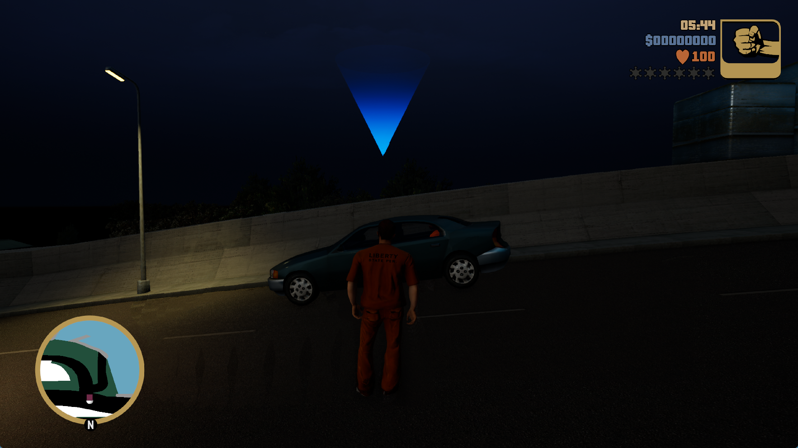

# GTA III: resource coherence, reflections and frame preparation — October 3, 2026

**Grand Theft Auto III: The Definitive Edition, PPSA03527 v1.007.**
The installed runner records **8.10 and 8.97 FPS** in two 30-second samples of
the opening position in Give Me Liberty: **8.53 FPS** over the combined measured
minute. The player, car, bridge and HUD render; walking, entering the car and a
short drive are verified. Other viewpoints remain below 8 FPS. This is an
opening-scene result, not a minimum for the whole game.

The shared renderer fixes causes of the earlier green overexposure and incomplete
reflection mips. Lighting, shadow and resource-recovery defects remain. A complete
playthrough, save recovery and audio correctness have not been validated.

Actual game-window capture from the installed runner; no image corrections applied.

## Rendering corrections

Packed mip-tail publication now covers the subresource's actual byte range.
Previously a late mip could include unrelated earlier faces in its backing
range and publish stale bytes over them. Typed storage views also materialize
every matching cube face before sampling their raw backing. The cube publication
probe covers all six faces, eight mip levels and two content revisions with
4 KiB and 64 KiB layouts.

The fragment interpreter's bounded dispatcher previously stopped after 256
basic-block visits. GTA III's 64-sample GGX filter exceeds that budget despite
having a finite loop, leaving reflection mip levels black. A 1,024-visit budget
allows the filter to complete; a finite guard remains. The loop probe checks
64- and 128-iteration programs as well as its guard. Live captures show populated
faces throughout the filtered cube mip chain.

Depth-only passes omit a stale pixel program only when the depth-control
register proves that its exports and side effects are inactive. Alpha-to-coverage,
depth/stencil/mask exports, kills and unrecognized control bits retain the program.
A headless depth/extent regression checks subsequent attachment changes.

CPU-visible completion interrupts publish pending GPU buffer writes before
their guest completion label. GPU-only ordering retains the less expensive
deferred path. Device-buffer readbacks that share a completion point are batched
under one wait, with cached readiness cleared by subsequent GPU writes.

## Resource and transfer costs

- GPU-produced color-grading volumes can be copied from their resident 2D-array
  attachment into a 3D sampled image. This avoids publishing 128 KiB of LUT data
  to the CPU, allocating and tiling a 2 MiB guest surface, and uploading it again
  every frame. The path checks format, layout, generations and competing writes;
  unsupported views retain the existing fallback.
- Complete resident mip chains are assembled on the GPU. Extents, all levels,
  CPU replacement and other producers are validated before reuse. In the
  measured GTA scene, sampled texture uploads and render-target readbacks fall
  to zero; raw buffer readbacks remain substantial.
- Exact range-generation cache keys mix both aligned endpoints instead of
  concentrating similarly aligned resources in a few slots. The cache retains
  endpoint and generation checks. It does not cache an untracked zero result.
- Permission lookups retain small mapping-index hints, rechecking the current
  interval and permissions under the mapping lock on every access. Stale hints
  after splitting, replacing or removing a mapping fall back to the search;
  they never cache permission to use a former allocation.
- The buffer overlap index visits occupied tree heights for wide queries.
  Unchanged guest-write pages avoid copying and invalidation while preserving
  completion labels and wakeups. Adjacent changed pages share a publication
  notification so native protection changes can be batched within their views;
  unchanged pages split those runs and remain armed. Unchanged storage-buffer content can reuse an
  upload only after its watch and full content fingerprint agree.
- Forward-only shader programs can share one scalar walk between sampled
  resources, storage resources and specialization history. Later consumers
  revalidate captured input bytes. Loops, indirect transfers, insufficient
  instruction budgets and changed inputs retain the original interpretation.
- Large checkpoint and resource bitsets are queried through pointers. The
  previous by-value query copied up to 8 KiB to inspect one bit; CPU sampling
  found those copies in frequently executed resource-discovery paths.
- Nested resource timers sample the initial and periodic report frames rather
  than executing tens of thousands of host-clock queries every frame. Whole-frame,
  draw/dispatch, fence and presentation timing remains continuous. The report
  identifies whether detailed resource timing was active. Every-frame resource
  timing remains available through `profile_all_resource_timings`.
- Storage-buffer descriptors are collected during draw/dispatch preparation
  and published in one Vulkan update before binding their consumer. Repeated
  preparation of one array element publishes its final buffer, offset and range.
  Public staging outside a reserved batch remains eager, and descriptor-set
  retirement is unchanged. `batch_storage_descriptors` permits an A/B comparison.

The GTA III profile uses four copy workers and serial command processing.
An in-process off/on/off comparison of command lookahead records 6.80, 6.08 and
6.92 FPS respectively with the same camera. Frequent guest ordering callbacks
make command hand-offs expensive in this title. Other titles retain their
existing command policy, and the environment override remains available.
Its completed-buffer pool grows from 32 to 64 MiB to fit the observed roughly
42 MiB working set. This reduces native allocation destruction; buffers still
wait for their retirement tick and must match size, usage and memory preferences
before reuse. Other titles retain the existing 32 MiB default.

## Measurement conditions

Host: AMD Ryzen 7 7700, NVIDIA GeForce RTX 3070 Ti (8 GiB), Windows,
ReleaseFast build, warmed shader/pipeline caches. FPS comes from the change in
the renderer's actual presented-frame counter divided by wall-clock time.
The world is unpaused during samples; CPU profilers and builds are stopped.

Presentation output is 1920×1080; the title controls internal render targets.
The game's Performance mode is selected through its own interface. Later CPU
comparisons disable Bloom and Motion Blur through that interface, retain
Classic Lighting and use the default brightness and contrast. These setting
changes are separate from emulator improvements.

Before the shared scalar walk, one 30.003-second sample with effects enabled
records 151 presented frames, or 5.03 FPS. An effects-off sample records
167 frames in 30.003 seconds, or 5.57 FPS, before the serial-command profile.
The 0.97 FPS result in the previous report used an older renderer and different
conditions; it is not a controlled ratio for these individual changes.

Traffic, weather and the number of submitted draws vary even with a stationary
camera. Resource-worker comparisons ranging from 6.60 to 7.60 FPS do not isolate
a benefit, so they do not justify disabling workers for all titles.

An off/on/off comparison of the shared scalar walk records 6.28, 8.32 and
7.48 FPS over three 25-second intervals. The enabled interval averages 1,039
draws per frame, versus 1,293 and 1,076 in the controls. A subsequent 30-second
sample falls to 7.27 FPS. This demonstrates why the 8.32 sample alone cannot
establish a stable 8 FPS minimum.

The subsequent mapping-hint/completed-buffer-pool build records 260 and 232
presented frames in two 30-second opening-position samples: 8.67 and 7.73 FPS
(8.20 FPS pooled over 60.007 seconds). After entering the car, a 30-second
sample falls to 7.03 FPS. Driving a few metres opens a wider view with roughly
3,600 draws per frame and 3.57 FPS. Increasing the buffer cache to 8,192 entries
and its device budget to 1 GiB reduces uploads from about 80 MiB to 18 MiB/frame
in that view, but the first 30-second sample still records only 3.93 FPS.
These experiments are not evidence of an 8 FPS minimum throughout gameplay.

### Installed descriptor-batch build

SHA-256 of `zig-out/bin/game-run.exe`:
`785b2120d658322430659e947866846db8b456e552fb5edfc9525499cda88fcc`.
The matching PDB is installed alongside it. These samples use the default
renderer settings, including the 4,096-entry buffer cache and 512 MiB device
buffer budget; the larger-cache experiment above is not a new default.

| Unpaused gameplay sample | New presented frames | Seconds | FPS |
| --- | ---: | ---: | ---: |
| Opening position, first sample | 243 | 30.003377 | 8.10 |
| Opening position, repeat | 269 | 30.003141 | 8.97 |
| Seated in the car | 216 | 30.003454 | 7.20 |
| Wider city view after a short drive | 107 | 30.003179 | 3.57 |

Both opening samples exceed 8 FPS, with 512 frames in 60.006518 seconds combined.
The HUD/window's short FPS average can still dip below 8. These changing world
samples do not isolate a numerical speedup from descriptor batching alone.

The wider view submits roughly 3,600 draws/frame and uploads about 74–80 MiB
of buffer data/frame with the default cache. Resource preparation, repeated
buffer staging and driver work remain major costs. Reported draw/dispatch
failures and unsupported-compute counts are zero in the settled samples, but
unresolved storage-resource diagnostics remain: this does **not** prove that
every shader/resource path is correct. Colored tiles appeared in an earlier
intro capture, and lighting/shadow differences still require investigation.

## Validation

- 75 scalar-provenance, resource-recovery, checkpoint, preparation and bitset tests pass, including shared
  history, skipped sites, failed reads, live-input invalidation and cleanup.
- 159 backend and buffer-overlap tests pass.
- 61 AGC tests pass, including changed-page publication through both private
  mappings and direct-memory views, untouched page watches and unaligned ends.
- 31 memory tests pass, including invalidated mapping-index hints.
- Headless layered-volume, resident-mip-chain, cube-publication, fragment-loop
  and completion/readback probes pass.
- The complete RDNA2 suite still has the previously recorded ten failing tests
  and leak on the unchanged baseline; this report does not claim a clean full
  project suite.

Local manifests, logs, timing samples and diagnostic resource captures are
retained under ignored `out/gta3-*-20261003/` directories. Captured game shader
binaries and resource dumps are not distributed. Public release archives are
unchanged.
