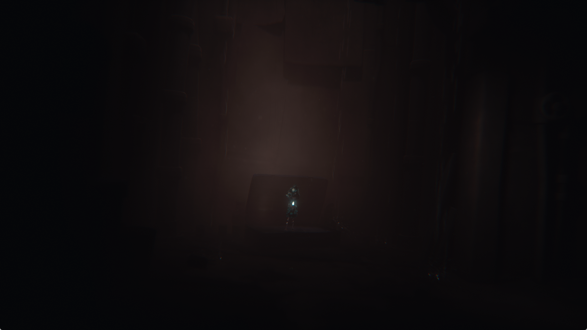

# Little Nightmares Enhanced Edition: gameplay reached, 2.16 FPS measured

Development check, October 3, 2026. Local title: PPSA10737,
`contentVersion` 01.004.000. This follows the
[startup investigation](little-nightmares-startup-2026-10-03.md).
No game binaries or extracted game resources are included.

The opening room now renders and accepts movement and lighter input. Two
unpaused, stationary gameplay intervals each present 65 frames in approximately
30 seconds: **2.16 FPS**. Materials and lighting remain visibly incorrect, so
this is an **In-game / rendering incomplete** result, not a playable rating.

## The repeatable 510-frame stop

The previous runner stops after 510 presented frames and subsequently reports
Unreal's 120-second GameThread/RenderThread timeout. Normal and synchronous
submission runs reproduce this. A render-thread stack shows an occlusion-result
wait, but another thread identifies the upstream failure: the native AGC driver
spins in its compute-ring free-space check.

The driver registers compute queues through `/dev/gc` request 33. Graphics work
continues through request 50, while compute submissions write PM4 indirect-buffer
packets into registered memory and advance an aperture doorbell. The emulator
retained the registration but did not consume those doorbells.

In the captured first queue, the ring is at `0x9005248000`, its control/read-pointer
page at `0x900524c000`, and its doorbell at `0xfe0200000`. The native driver uses
4,096 dwords per ring and advances by eight dwords per kick. Its producer moves
forward while the read pointer remains zero. The driver's free-space guard
eventually prevents the next submission; subsequent visibility results cannot
be produced. Writing a query's ready flag would not repair this queue.

## Implementation

An independent host worker polls registered native compute doorbells. It copies
the committed ring span, including wraparound, and sends it to the existing
graphics/compute scheduler with the native queue's interrupt identity. The read
pointer advances only after the scheduler accepts and snapshots the commands.
Guest completion labels still come from the command stream's `RELEASE_MEM`.

The new compute submission path leaves unmet memory waits parked until their
actual writer runs. It does not invoke the older submission path's forced-wait
recovery. No game executable, query-ready flag, or watchdog timeout is patched.
The shared scheduler still has its existing graphics/compute queue model; this
change does not claim independent hardware scheduling of all 56 native queues.

## Validation

- Seven focused ReleaseSafe tests pass, including 525 consecutive ring submissions,
  wraparound, no replay when the producer is unchanged, invalid-pointer rejection,
  and a compute wait released by an actual graphics-queue write.
- The ReleaseFast runner build passes all seven build steps.
- The title-profile ReleaseSafe test passes: eager publication is selected for
  Little Nightmares and Tetris Effect, with the other checked title IDs excluded.
- The first live ring implementation presents 1,216 frames before an intentional
  test stop, passing the former 510-frame limit. Its older wait-recovery behavior
  makes this a preliminary check, not the final gameplay/performance sample.

## New Game and storage publication

The subsequent native-ring build passes first-run setup, the main menu, story
selection and save-slot selection. With deferred storage publication, the
25-minute run stops at 3,345 presented frames during New Game. Its
`AgcCleanupThread` encounters an invalid free-list link and reports
`MallocBinned3 Corruption Canary was 0x3, should be 0x1`. The process later exits
with code 1. This is a separate failure from the fixed 510-frame ring stop.

A fresh process using the existing `PS5_GPU_EAGER_STORAGE_WRITES=1` mode reaches
the opening room, moves Six away from the suitcase, and toggles her lighter.
It presents 3,540 frames before an intentional test stop after the measurements;
the allocator failure does not recur in this run. This comparison supports an
eager-publication compatibility profile for PPSA10737, but does not establish
the exact writer responsible for the earlier corrupted link. The final runner
selects that mode automatically for Little Nightmares, as it already does for
Tetris Effect. Other title profiles keep their existing behavior.

The transition after selecting Six's story is unusually long and mostly dark.
The pause menu responds during it. The room eventually becomes visible without
patching the game clock, allocator checks, query flags or game resources.

## Gameplay measurement

Host: NVIDIA GeForce RTX 3070 Ti, Windows driver 595.71. ReleaseFast runner,
Speed preset, 1920x1080 VideoOut request, warm caches, keyboard input. The actual
desktop client area is 1765x993. Internal resolution is game-controlled; the
frame trace includes 2960x1664 attachments, so this is not a claim of native
1080p rendering.

The samples are taken after visible movement, with Six stationary near the
opening suitcase and the lighter on. No pause menu, debugger, frame capture,
build or second game runs during either measurement. The temporary controller
diagnostics and frame tracing have been disabled/restored beforehand. FPS uses
the increase in the renderer's **presented_frames** counter divided by host
monotonic elapsed time, sampled every 250 ms, rather than guest time or the
window's smoothed FPS label.

| Interval | Presented frames | Host seconds | FPS |
| --- | ---: | ---: | ---: |
| Stationary gameplay 1 | 65 | 30.042902 | 2.164 |
| Stationary gameplay 2 | 65 | 30.044543 | 2.163 |
| Combined | 130 | 60.087445 | **2.164** |

The measured executable uses the new native-ring code and explicitly enables
eager storage publication. Its SHA-256 is
`cdf2911023ac6e9cc048806d81a6f414463171d1de2d445939c6081e0e5d9f6d`.
The final rebuild adds automatic selection of the same storage mode for this
title. The gameplay numbers above belong to the recorded measurement build.
Local raw samples, manifests, logs and captures are retained under
`out/little-nightmares-gameplay-20261003/run6/`.

## Installed build

The final ReleaseFast executable and its matching PDB replace
`zig-out/bin/game-run.exe` and `zig-out/bin/game-run.pdb`. A fresh launch without
the eager-write environment override reports `defer_storage=0` and
`defer_storage_auto=0`, consumes native compute rings and enters the game process.
This is a startup/profile check, not another gameplay measurement.

| Installed file | SHA-256 |
| --- | --- |
| `game-run.exe` | `161537a1634c8a6c21bb992cdcf66b02a551f178bb818b9368e021a2fd3b6009` |
| `game-run.pdb` | `3055d1bfda4a57aa8702e489b2e69616183cc03e02300658b605065d7cf5e7ed` |

The website adds a separate gameplay history entry and preserves the earlier
startup report. Its 98 tests, TypeScript check, lint and production build pass.

## Remaining limitations

- Six's coat and other materials have incorrect dark, reflective colors;
  lighting is also too dark. The captures are unmodified.
- `FLAT_LOAD_DWORD` at program `0x79d8100` still fails buffer-address recovery;
  a ray-intersection program still reports `UnsupportedOpcode` for
  `IMAGE_BVH_INTERSECT_RAY`. Storage-image binding gaps remain. Reaching the
  room does not mean all shaders run correctly.
- The first-run and slot-save files created in this check are empty. Save
  persistence is not established; a restart repeats initial setup.
- 2.16 FPS is far below real-time play. In a pre-measurement frame, compute
  handling accounts for 344 ms of a 432 ms frame, with 117,955 KiB of buffer
  readback and 240,022 KiB of uploads. These counters describe host renderer
  work, not isolated GPU execution time, and are not a speedup comparison.
- Only the opening room, movement and lighter interaction were checked.
  Completion and long gameplay sessions remain unverified.
