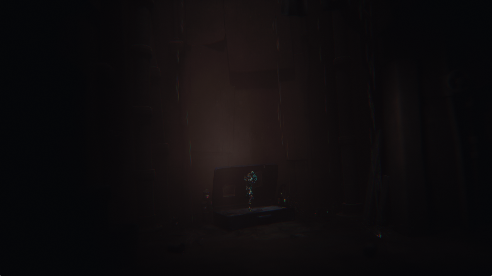

# Little Nightmares Enhanced Edition: saves and rendering costs

Development check, October 3, 2026, PPSA10737 v01.004.000. This follows the
[first gameplay measurement](little-nightmares-gameplay-2026-10-03.md).
The current result remains **In-game / rendering incomplete**. The requested
5 FPS gameplay target and correct materials have not yet been established.

Unmodified client capture from the default-profile measurement run below.

## Save persistence

The game creates its save containers with ordinary file opens, but writes the
payload through `sceKernelAioSubmitWriteCommands`. That function previously
accepted the batch and unconditionally returned a failed result for every
write. This explains the empty containers observed in the previous check.

Asynchronous writes now use the filesystem's positional write path and report
the actual byte count or error. Positional writes, file resizing, and truncating
an existing writable file preserve the descriptor's seek position. Installed
game content remains read-only. Save-slot deletion is confined to an unmounted
slot of the active title and rejects names that would be sanitized into a
different path.

The real game writes a 4,885-byte slot, 1,477-byte slot metadata, and 1,348-byte
user metadata. Subsequent fresh processes skip first-run setup, expose Resume
Game, and load the opening room. These are local save/reload checks, not proof
of full-game completion or all save-management features.

## Rendering changes

- Cache depth/stencil/HTILE allocation bounds instead of recomputing swizzle
  layouts for unrelated resource probes.
- Expand an exact, allocation-wide zero/one depth clear with a uniform fill.
  Mixed metadata, partial views, mip chains, and other formats retain the
  existing texel path. Reuse scratch memory and omit reading the previous
  allocation when every byte will be replaced.
- Publish multiple independent small device-local compute outputs using one
  transfer submission and fence. Eager visibility is preserved; overlapping
  outputs retain the ordered path.
- Select four copy/fingerprint participants for this title. The byte coverage
  and fingerprint partitioning do not change with worker count.

The original per-texel HTILE expansion consumed about 200 ms in a traced frame.
The uniform path reduced this to about 8–9 ms before the additional scratch
reuse/read-elision change. This is a component timing, not a whole-frame result.

## Measurements

Host: Ryzen 7 7700, RTX 3070 Ti 8 GB, Windows, ReleaseFast. Output request
1920x1080, Speed preset, keyboard input. The saved in-game graphics mode is
Performance. Internal rendering remains game-controlled: the trace includes
2960x1664 attachments. The desktop client area is 1765x993.

Each interval uses the increase in `presented_frames` divided by host monotonic
elapsed time, sampled every 250 ms. The game is unpaused. No build, profiler,
frame trace, capture, or second game runs during the recorded intervals.
Scene position differs between runs; the worker comparison below is within
one process without intervening movement.

| Check | Frames | Seconds | FPS |
| --- | ---: | ---: | ---: |
| Earlier save-fix build, after movement | 93 | 30.040920 | 3.096 |
| Device-placement experiment, one copy participant | 102 | 30.046205 | 3.395 |
| Same process and position, four participants | 117 | 30.042659 | 3.894 |
| Larger-cache experiment | 107 | 30.047151 | 3.561 |
| Updated default profile, beside the suitcase | 134 | 30.044004 | 4.460 |
| Same default build, after moving right | 112 | 30.045754 | 3.728 |

The default-profile measurement executable has SHA-256
`61425eb41d58ab73a15eb3e85634bc5b72893b5a658fb43a5658b1b388c9201c`.
Its samples are in `out/little-nightmares-fixes-20261003/run8/`.
The installed `zig-out/bin/game-run.exe` was rebuilt with ReleaseFast and has
the same SHA-256; its matching PDB was installed alongside it.
The previous 2.16 FPS result remains a historical baseline; it is not a
controlled comparison isolating one optimization or an identical player pose.

Increasing buffer residency limits did not produce a reliable improvement.
Host-memory import was slower in the title menu. The queued host-upload
experiment faulted during startup. Depth-transfer/alias experiments added
readbacks without repairing the observed materials. These options are excluded
from the title's defaults.

## Validation and remaining work

The focused ReleaseSafe checks pass 35/35 tests, including positional writes,
truncation, asynchronous batch persistence, read-only rejection, confined
save deletion, HTILE values across depth formats/samples/layers, and the eager
batching eligibility conditions. The ReleaseFast runner builds successfully.
A real Vulkan probe verifies two independent eager compute outputs and their
unchanged neighbouring bytes with one additional submission.

Dark/reflective material artifacts remain. The instance-header kernel still
fails at a FLAT load (`0x79d8100`, PC `0xc8`), and the ray traversal kernel fails
at `IMAGE_BVH_INTERSECT_RAY` (PC `0x2ec`). Existing software intersection support
does not yet stage this title's pointed geometry/acceleration data. The tested
performance numbers include these known rendering omissions; they do not
represent complete graphics emulation.

Several attempts report an unrecognized `MallocBinned3` block during startup,
including a repeat with the final default build. Other fresh default runs reach
gameplay. A hardware write-watch investigation did not reproduce the bad write
while attached, so its exact writer and relationship to the rendering path are
unidentified. This is an unresolved intermittent startup failure, not a verified
fix. Eager publication is retained.

A short sampling profile still finds substantial time in GPU waits, memory
copies, allocation destruction, and resource provenance checks. Larger recycle
pools did not establish a repeatable benefit and were reverted. Completion,
extended stability, correct lighting, and a sustained 5 FPS result remain open.

Raw manifests, samples, traces, save backups, and real window captures remain
under `out/little-nightmares-fixes-20261003/`. No extracted game assets or save
payloads are included in the repository.
