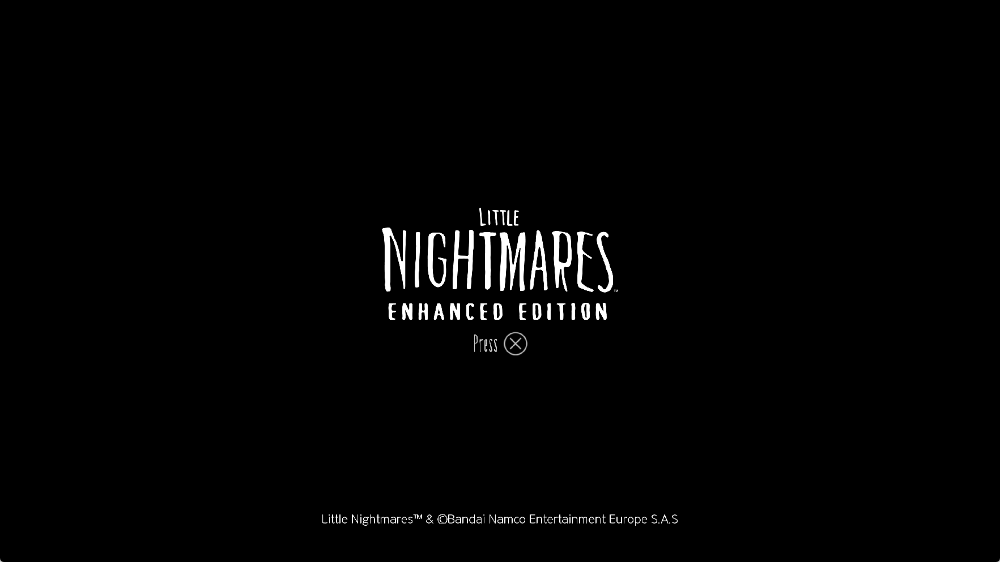

# Little Nightmares Enhanced Edition: startup imports and GPU completion

Development check, October 3, 2026. Local title: PPSA10737,
`contentVersion` 01.004.000. No title binaries are included in the repository.

## Failure and correction

The previous installed runner exits before entering the guest process with
`UnresolvedImport`. The bundled `fakelib/libSceAgcDriver.sprx` imports the
unprovided `libkernel` function `yu17wG8L5FI`.

The driver's nine observed direct call sites pass no arguments and test the
integer return as a boolean. They select ordinary or larger AGC allocations:
for example, 1 MiB versus 1.5 MiB, 16 MiB versus 22 MiB, and 10 MiB versus
16 MiB. Hashing the name `sceKernelHasTrinityMode` from the local sharpemu
symbol-name list reproduces the exact imported NID.

`kernel_info.zig` now registers this named export with a no-argument guest-ABI
function returning zero. This selects baseline allocations, consistent with
the emulator's existing hardware-mode queries. It does not make unresolved
imports succeed globally or modify the game's files.

The local KytyPS5 and sharpemu source trees were checked. Their baseline
model-query implementations and sharpemu's symbol-name list were useful
context; no third-party implementation was copied. Registration verifies
that the name hashes to `yu17wG8L5FI`.

After this correction, checking the complete graph reveals two more missing
imports in `libSceNpEntitlementAccess.sprx`: the IPMI client configuration
constructor and `IPMI::Client::create`. Both names also hash to the observed
NIDs. The unavailable host service now has exact bindings. Creation returns
`ENOSYS` without manufacturing a client or vtable. The configuration remains
opaque and is not read by the refusing create operation. This is an offline
compatibility path, not an implementation of console IPC or online services.

The runner's unresolved-import diagnostics now use its normal stderr writer,
so the offending module and NID are also retained with redirected output.

## Native driver completion registration

With those imports resolved, the first live check initializes AGC and Unreal,
then stops before the first displayed frame. Its final GPU completion reports
zero registered graphics event queues, while the guest waits for work to finish.
The native AGC driver calls `kevent` with `EV_ADD`/`EV_DELETE` and filter -14
(`EVFILT_GRAPHICS`); that entry point previously always returned `ENOSYS`.

The supported change-only `kevent` path now adds, updates and deletes the same
graphics registrations used by the HLE driver. `sceKernelWaitEqueue` can then
receive real completion events with the registered ID and callback data.
Unsupported filters, flags and POSIX retrieval requests still report failure.
This does not synthesize completion of unexecuted commands.

## GPU stall after linking

With native graphics events registered, ordinary runs present eight to ten
black frames before progress stops. CPU sampling initially shows Unreal
polling the ready word of an occlusion query. Its interleaved DB results are
present, but the separate ready word is zero.

Command tracing and hardware write watchpoints disprove the initial suspicion
that the ready write was simply lost: the renderer writes one, and the guest's
next BeginQuery resets it to zero. The GPU stays at 100% utilization while its
last submitted timeline tick does not retire. Immediate storage publication
and synchronous release writes do not resolve this stop.

A diagnostic run that waits after each GPU operation isolates the stalled
dispatch: program `0x79d5d00`, **2,527,395,840 × 127 × 150,994,945** groups.
The renderer previously passed these invalid dimensions to Vulkan. The
application-facing query wait is downstream of that unfinished GPU work.

Dispatch counts are now checked against the selected physical device's
`maxComputeWorkGroupCount` on each axis, before translating or issuing guest
work. The direct SPIR-V entry point is checked too. Invalid guest dispatches
are counted and reported as rendering failures, with the program and indirect
argument address; subsequent commands and completion labels remain reachable.
Counts are never clamped to an invented workload. This implements the
[Vulkan dispatch bounds](https://docs.vulkan.org/refpages/latest/refpages/source/vkCmdDispatch.html)
(VUIDs 00386–00388). It does not repair missing compute output or establish
that the title's rendering is correct.

## Descriptor construction

Resource-failure tracing finds a separate defect in the uniform scalar walk:
`S_BITSET1_B32` invalidates its destination rather than reading and modifying
that register. Native AGC kernels use this instruction to turn a pointer into
a buffer descriptor by inserting the stride bits. The eleven-instruction
initialization kernel at `0x79bd000` consequently has no recovered writable
buffer and is elided; its later indirect argument records remain invalid.

The scalar evaluator and reaching-definition resolver now support the 32-bit
BITSET set/clear forms. Both preserve the old destination, mask the index to
five bits and keep SCC unchanged. Scalar dependency tracking includes the
previous destination and the bit-index source. Unknown inputs remain unknown;
recovery cannot borrow an unrelated entry value after a register clobber.

## Validation

- The previous installed executable reproduces the link failure in a fresh
  process (exit code 1).
- The full executable graph links after the import corrections: seven
  dependencies and 46,244 guest exports.
- **23/23** focused ReleaseSafe HLE tests cover exact NID/ABI resolution, service refusal
  and native graphics registration, delivery, update, deletion and error paths.
- **65/65** scalar provenance/resource tests pass, including BITSET descriptor
  reconstruction, masked indices, dependency tracking and clobber refusal.
- **2/2** compute-shape tests pass, including the captured corrupt dimensions,
  per-axis boundaries, zero dispatches and device-specific large X limits.

Before the descriptor correction, the bounds-checked runner presents **417
frames over a 409-second diagnostic process** without the previous GPU stop.
At the last state sample both submitted and completed timeline ticks are
56,731. The actual client capture is still black; frame-count progress is not
evidence of visible menus or gameplay. That owned test is stopped deliberately.

The descriptor-corrected run restores the title logo and **Press X** prompt.
The formerly elided `0x79bd000` kernel now has a recovered writable buffer and
executes. Input advances through the DLC check to brightness calibration and
readable license text. The 240-second diagnostic run ends at its configured
test limit, rather than a guest crash. A second launch from the installed
`zig-out/bin/game-run.exe`, without the resource/frame tracing overrides,
reproduces the visible title screen.

That second run later stops during license-screen scrolling. At guest frame
511 the game thread waits for the render thread; after its 120-second deadline
Unreal reports `GameThread timed out waiting for RenderThread` and exits through
the guest libc fatal path. Total process lifetime is 328.7 seconds, exit code 1.
This is a real remaining failure, not a test timeout or a memory-guard stop.

A diagnostic repeat with synchronous submissions and per-operation completion
tracing from frame 480 also stops after 510 presented frames. Submitted and
completed GPU ticks are both 93,084, and there are no deferred internal releases
at the captured stop. Sampling places the render thread in the occlusion-query
getter/yield path. It later reports the same render-thread timeout. This later
stop is distinct from the oversized-dispatch GPU hang above; its synchronization
cause is still unresolved. No query-ready flag is forced and no timeout is
disabled to make the test appear successful.

Captured from the actual 1765 × 993 client area. Host output is configured to
1080p with the Speed preset; internal rendering remains game-controlled.
This is a title-screen capture, not gameplay or proof of correct 3D rendering.

Installed ReleaseFast executable SHA-256:
`11b10b54d607d3ec3800ca7e51062ca8d6bfd00d2863c2d486167b549b3b2f9a`.
The corresponding PDB is installed alongside it and checked against the same
build output. ReleaseFast build: 7/7 steps succeeded.

## Remaining limitations

- Some indirect argument sets remain invalid and are explicitly reported.
- Startup can still terminate with the reproduced render-thread timeout above.
- Program `0x79d8100` reaches an unsupported FLAT load path at PC `0xc8`.
- The observed ray-intersection shader fails lowering at
  `IMAGE_BVH_INTERSECT_RAY` (PC `0x2ec`). Image-binding gaps also remain.
- Visible menus beyond first-run setup, gameplay, audio correctness, save
  recovery and long-session stability are not established by these checks.
- No gameplay FPS improvement or playability grade is claimed.
