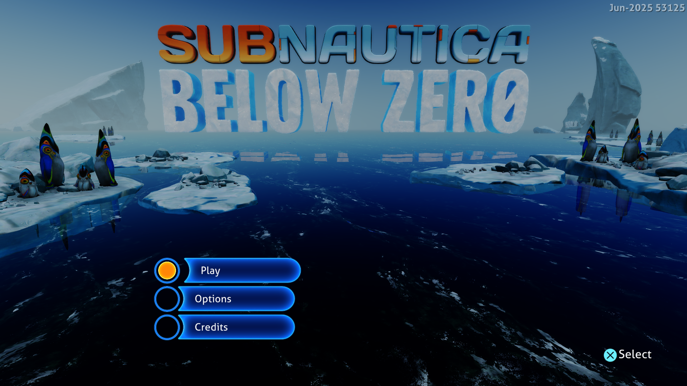

# Deferred GPU completion and short fragment loops — September 27, 2026

This follow-up removes repeated host waits at AGC submission boundaries and
replaces a large fragment shader's block dispatcher with proven structured
control flow. The changes apply to shared emulator paths, without a Subnautica
title-ID condition. The default presentation remains 1920×1080. **The 30 FPS
menu target has not been reached.**



## Completion ownership

An accepted submission can now seal its recorded Vulkan work into a timeline
ticket. A bounded FIFO owns its release notifications, driver completion label,
captured retirement sequence and any synthetic DCB event. Completion is published
only after that ticket and its required storage output are visible. A late
callback belongs to its original submission even while a newer batch is open.
Captured sequence numbers cannot retire a later submission using the same label.

The completion worker polls under the renderer's existing execution lock.
Ordinary graphics and compute submissions use this path, including graphics
submissions without an explicit release interrupt. Queue capacity applies
backpressure. Failed or detached batches drop their notifications. Unsupported
backends, imported host allocations, blocked streams and recognized private
SDK11 generation bridges retain synchronous handling.

`PS5_SYNC_SUBMISSIONS=1` restores the previous HLE completion path for comparison.
Omit the variable to use the new default. It is separate from the renderer's
existing `PS5_FORCE_SYNCHRONOUS_SUBMITS` diagnostic option.

## Shader and CPU preparation

The structured control-flow proof now recognizes forward if/else diamonds and
terminal arms around disjoint natural loops. Automatic fragment use is limited
to one loop spanning at most four basic blocks, with proven region boundaries.
Longer, nested and unsupported shapes retain their existing translation. The
broader experimental `fragment_branch_loops` option remains off.

The new path preserves the dispatcher's block-visit limit, conditional exits,
continues, instruction side effects and early returns. It does not omit draws
or compute dispatches. The largest observed fragment shader contains 3,121
instructions and 68 blocks, but only one four-block loop. Its translated SPIR-V
no longer contains the dispatcher switch. SPIR-V byte size increased from
568,752 to 578,792 bytes; a smaller binary is not the purpose of this change.

Scalar resource interpretation also reuses its current instruction and resource
checkpoint positions during forward execution. Backward jumps still search the
indices and merge revisited checkpoint values. Guest memory and dynamic resource
values are read again; this is not a cache of previous draws' guest data.

## Measurements

Host: Windows, NVIDIA GeForce RTX 3070 Ti, ReleaseFast, performance preference,
keyboard input, PPSA02457 v1.022.125. All three runs used the same executable,
native 1920×1080, the same starting pipeline cache and 180-second duration.
Enter was sent after frame 256 to open Play / Options / Credits. Each row uses
24 samples at flips 600–1980. Progress captures were enabled; their overhead is
included. No compiler, CPU sampler or shader dumping ran with these measurements.

| Configuration | Median frame | Approx. FPS | Sample range | Median GPU waits |
|---|---:|---:|---:|---:|
| New defaults: deferred completion + short fragment loops | **73 ms** | **13.7** | 68–86 ms | **2.40 ms** |
| Deferred completion, short fragment loops disabled | 81.5 ms | 12.3 | 77–96 ms | 10.80 ms |
| Synchronous HLE completion, short fragment loops enabled | 90 ms | 11.1 | 82–102 ms | 17.03 ms |

For the second row, the diagnostic `fragment_short_loops` export was set to
false before shaders were compiled. The third row uses
`PS5_SYNC_SUBMISSIONS=1`. Neither diagnostic setting is the installed default.
No guest fault or device loss was reported in these three runs.

The shader change reduced median frame time by about 10% in this comparison;
deferred completion reduced it by about 19%. These effects are not additive.
The [preceding development measurement](subnautica-cpu-costs-2026-09-27.md)
was 91.5 ms (10.9 FPS). Its comparison with 73 ms is historical, rather than
another configuration in this controlled set. The scalar checkpoint change
has not been assigned a separate measured FPS gain.

At flip 1740 with the new defaults, the frame took 71 ms: draw handling was
40 ms, GPU dispatch handling 5 ms, and measured GPU waits 2.16 ms. The frame
still executed 339 draws, 70 GPU dispatches and 1,662 CPU-emulated dispatches,
with zero elided dispatches. Resource preparation took 10 ms, checkpoint
preparation about 7.1 ms, and graphics storage handling about 12 ms. These
instrumentation categories overlap and must not be added as an exclusive
breakdown. GPU waiting is now a small fraction of the frame; CPU preparation,
resource checks and command handling remain the next bottleneck. Reaching
30 FPS requires a frame below 33.3 ms.

A separate 20-second CPU sample of the final installed build still finds memory
copying, virtual-memory queries, scalar interpretation, resource preparation and
allocation/protection calls on the submission thread. Resolved GPU wait sites
include host-write preparation, storage readback, command writes and presentation;
the former `finishCompletionBatch` wait site is absent. This diagnostic run is
excluded from the FPS table.

The screenshot is the unscaled frame 512 from the new-default run, converted
directly from its native frame capture. Its menu labels are readable. Existing
rendering artifacts and intermittent label problems remain unresolved.

New-default frame intervals in flip order:

```text
71, 71, 73, 71, 71, 76, 85, 72, 71, 72, 79, 73,
73, 79, 68, 76, 70, 73, 72, 71, 75, 73, 86, 78 ms
```

## Validation and limits

- 536 HLE tests and 233 GPU tests passed, covering ticket ownership, delayed
  callbacks, failed submissions, queue backpressure, backend detachment,
  synthetic events and scalar interpretation through branches and loops.
- 184 Vulkan tests passed, including nonblocking ticket polling when newer
  storage output is still in flight.
- 95 control-flow proof/dependency tests passed. The Vulkan branch-loop probe
  compared complete images against the dispatcher for exits, continues, nested
  merges, forward diamonds, terminal arms and exhausted execution budgets.
  It ran with the Khronos validation layer enabled.
- Against the preceding default shader dump, 649 matching fragment files were
  identical and two changed. Both changed modules passed
  `spirv-val --target-env vulkan1.2` from Vulkan SDK 1.4.357.0. Diagnostic shader
  dumping writes files repeatedly and is excluded from performance measurements.
- The standalone RDNA2 suite has 10 pre-existing failures, also reproduced on
  the previous commit in a separate source copy (251 passed / 10 failed).
  The modified suite has 252 passed / the same 10 failed; the added proof test
  passes. Both runs also report a leak in the failed flat-load expectation.
  These unrelated failures are not described as a green full suite.
- The final installed ReleaseFast executable passed a 50-second Terminator 2D:
  No Fate regression run through its intro into the Start / Options / High
  Scores menu at 1920×1080. No guest fault or device loss was reported. Gameplay
  was not re-tested; the other supplied titles were not launched.
- The rebuilt executable was also checked again in Subnautica's open menu,
  including the separate CPU sample described above.
- The website passed 56 tests, TypeScript checking and its production build.

Installed game files were not edited. Gameplay, audio correctness and longer
sessions remain unverified. Existing rendering artifacts and intermittent menu
label problems are not claimed fixed. These are development changes; the
published 0.3.2 download predates them.
