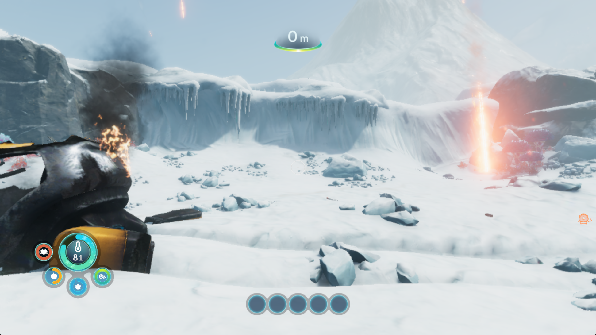

# Subnautica: Below Zero — sRGB lighting and cached mip checks

Title: PPSA02457, v1.022.125. Development tests on Windows with keyboard input,
1080p guest output, the speed preset and the default 4096-entry buffer cache.

This change fixes missing sRGB encoding in colour attachments and removes
repeated mip-span calculations during resident-memory checks. It does not
establish 30 FPS, stable loading across repeated runs or complete rendering
accuracy.

The installed candidate reaches the snowy world after New Game / Survival.
The rocks, snow, wreck and HUD are visibly brighter, with more material detail.
The stationary world sample records **9.49 FPS**, compared with **9.13 FPS** in
the preceding baseline run. Weather, particles and temperature effects differ,
so these samples do not establish an overall performance improvement.

*Actual 1765×993 client-window capture, with 1920×1080 guest output. This is
the start of the candidate's FPS sample, not a modified or reconstructed image.*

## Baseline

The installed `94922d261decf92fabcdf9df039d910e613c2cac542ff31fccf9835c3e996594`
executable completed another New Game / Survival load, the intro and the snowy
crash-site transition. This run is recorded in
`out/subnautica-buffer-pool-baseline-20261001`. It was stopped by the diagnostic
runner's 1200-second deadline, not by a recorded guest fault.

A foreground stationary sample recorded 274 flips in 30.010469 seconds,
**9.13 FPS** (flips 4625–4899). No build or profiler ran during this sample.
The temperature warning changed during measurement; this is a live gameplay
sample, not a deterministic replay. The earlier 8.66 FPS sample used a different
run and must not be treated as an A/B comparison.

The subsequent CPU profile sampled `sourceByteOffset` 119 times and
`colorTargetBackingRange` 18 times on the renderer thread. These are sampling
counts, not measured milliseconds or a guaranteed potential FPS gain. Driver
allocation work was much smaller in this warmed scene than in the previous
mixed-scene profile; increasing cache limits is not justified by those counts.

## Change

Colour backing snapshots now retain their verified byte range. A packed mip
tail can require examining thousands of texels to find a contiguous span.
Resident-image checks and sibling-publication validation no longer repeat that
layout calculation for the same snapshot. Page-generation checks, content
fingerprints and CPU-replacement rejection still run as before. A new snapshot
recalculates the range.

Render-target identity also includes the maximum mip level. Different pyramids
can occupy the same padded allocation size; they must not share a cached
snapshot solely because that byte size matches. Regression coverage includes
this collision and CPU writes to neighbouring linear and packed mip levels.

## Lighting evidence

The baseline captured the draw sequence at flip 3365 and the inputs/output of
the lighting draw at flip 3976 (`VS 0x24d61ac00`, `PS 0x24d61b600`). The latter
changed **383,128 of 518,400 pixels** in the 960x540 RGBA16F target. Its shadow
input contains a range of values, rather than a uniformly missing texture;
the median of each captured channel is 255. This proves that this lighting
pass executes and contributes colour. It does not prove its calculations or
all its material inputs are correct.

Dark regions are already visible before the final image-processing passes.
The capture therefore does not support a blanket final-brightness adjustment
as the rendering fix. Lighting and material correctness remain under review.

The bounded resource diagnostic reports one unresolved scalar-buffer load in
the blit pixel shader (`0x24d614700`, PC `0x8`). Later sampled frames report zero
draw failures, zero dispatch failures and zero unsupported compute programs,
with `storage_unresolved=1`. Those counters do not establish that every shader
resource was recovered correctly.

## Validation

The source revision passes **129/129 focused CPU tests**. The sRGB probe,
all four RG32F mip cases, and the BGRA scanout probe pass. A second sRGB run
loads `VK_LAYER_KHRONOS_validation` (confirmed in the loader trace) and emits
no validation errors. Website checks pass: 98 tests, type checking, lint and
production build.

The ReleaseFast build succeeds (7/7 steps). The installed executable at
`zig-out/bin/game-run.exe` has SHA-256
`bbaf3943208054f930c0bab037a64ba8b0ab4ee07ae7646654800c97b74d9e8b`;
the matching PDB is installed alongside it. The fresh game run is recorded in
`out/subnautica-srgb-live-20261001`. Public release archives are unchanged.

## Candidate gameplay and remaining costs

The candidate completes the intro and records 285 flips in 30.045937 seconds,
**9.49 FPS** (flips 5457–5742). It uses the same default settings as the baseline.
The window is foreground, with no build or profiler active during measurement.
The temperature indicator falls from 81 to 51 and meteor effects change during
the sample. The diagnostic process is deliberately stopped after capture,
measurement and a separate CPU profile; this run does not end in a guest fault.

At flip 5700, the renderer reports an 84 ms frame: 61 ms in graphics draws,
including 15 ms preparing graphics resources, and 3 ms in compute dispatches.
Those scopes overlap and must not be added as independent costs. The frame
submits 106 times, uploads 23,194 KiB (15,548 KiB buffers, 7,644 KiB indices,
2 KiB textures) and reads back 2,334 KiB of buffers. Colour-target uploads and
readbacks remain zero. Graphics and compute pipeline-cache misses are zero
in this sampled frame, so repeated pipeline compilation is not its bottleneck.

The subsequent 10-second CPU profile no longer lists `sourceByteOffset` or
`colorTargetBackingRange` among its 60 leading sampled sites. It still records
104 renderer-thread samples in `memcpyFast`, 99 in `evaluateInto` and 39 in
`prepareComputeResources`, alongside driver submission and wait work. These
counts point to resource preparation, guest-memory copying and submission
overhead as the next areas to investigate; they are not percentages or timings.

Sampled world frames retain zero draw failures, dispatch failures and
unsupported compute programs, but still report `storage_unresolved=1`.
The unresolved scalar binding and other rendering artifacts remain open.
One successful load does not resolve the earlier intermittent loading
corruption. Full playthrough, save recovery and audio correctness are untested;
the 30 FPS target remains unmet.

## sRGB attachment bug found during the follow-up

The colour format in the captured G-buffer and final output passes is
`CB_COLOR_INFO=0x8e28`: data format 10, number type 6 (sRGB). The attachment
mapper handled that as ordinary RGBA8 UNORM, while sampled format 130 correctly
used an sRGB view. Consequently a linear shader output was stored without
encoding, then decoded as if it had been encoded. Repeating this through
material and output passes darkens intermediate values severely.

RGBA8 number type 6 now uses an sRGB attachment view. The underlying mutable
image stays UNORM so storage operations preserve raw bytes and VideoOut blits
do not decode the already encoded display pixels again. The attachment view
excludes storage usage, which sRGB does not support. CPU presentation, channel
swapping and raw clear paths also accept this encoded byte representation.

The local KytyPS5 source confirms channel type 6 in
`src/graphics/guest_gpu/gpu_defs.h` and selects a UNORM presentation format for
sRGB images in `src/graphics/presentation/window/swapchain.cpp`. No source was
copied from that project. The attachment encode/decode behavior follows the
[Vulkan framebuffer specification](https://docs.vulkan.org/spec/latest/chapters/framebuffer.html).

A new `vulkan-smoke --srgb-color` regression probe renders linear
`(0.25, 0.5, 0.75, 0.5)`, checks encoded RGB bytes `(137, 188, 225)` with linear
alpha 128, samples the resident image back to linear values, and blits to a
UNORM display image without changing those encoded bytes. A separate UNORM
control checks the original path. This tests the colour conversion itself,
rather than applying a title-specific brightness adjustment.
