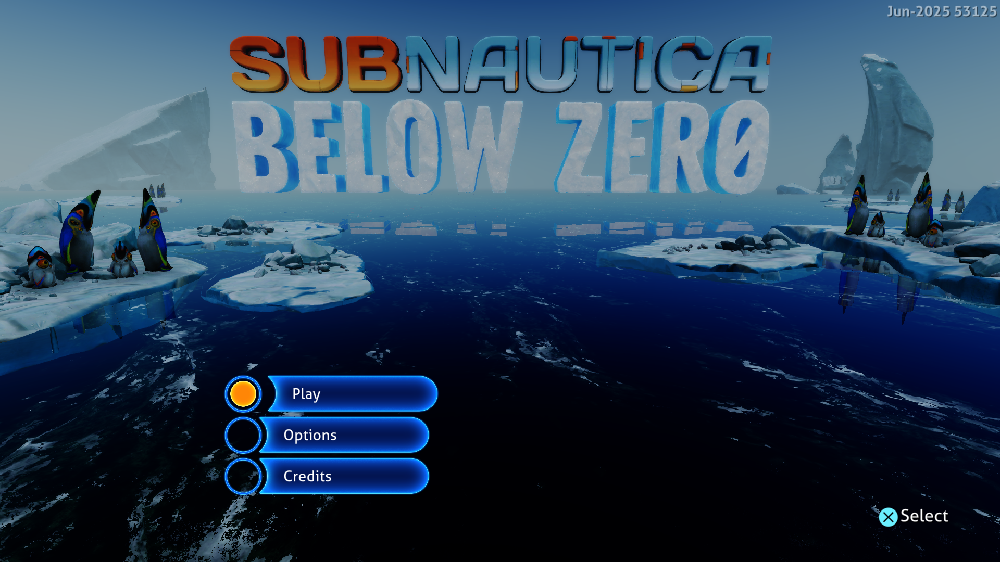

# Shader resource preparation and guest copies — September 27, 2026

This follow-up reduces CPU work in the shared graphics path. Subnautica:
Below Zero still renders its title screen and Play / Options / Credits menu
at native 1920×1080. **The requested 30 FPS has not been reached.**



## Changes

CPU sampling found repeated copies of decoded instruction structures in
resource preparation and scalar interpretation. Those hot helpers now borrow
instructions. Resource passes copy only the instructions they actually use.

Each immutable shader analysis also retains resource instruction indices and
the static read-only resource property. Buffer, sampled-image and pointer-load
passes visit these indices in program order. A different instruction allocation,
including a branch-pruned program, falls back to the full opcode filter. Guest
register values, descriptors and memory reads still come from the current draw.

The existing CPU implementation of the recognized buffer-copy kernel can batch
contiguous copies in 4 KiB chunks through the guest memory callbacks. The HLE
must first prove that both ranges have disjoint backing in committed guest
mappings and avoid submitted command arenas, active snapshots and guarded
headers. Direct-memory aliases are compared by physical offset. Overlaps, strides,
control labels and declined spans keep the individual word path. This preserves
write tracking and label behavior. Failed spans fall back to word operations,
retaining the completed prefix and original access error. The diagnostic
`[gpu emulated copies]` line reports total and batched words.

These changes have no Subnautica title-ID condition. They do not skip draws,
compute work, guest reads or required GPU completion notifications.

## Measurements

Host: Windows, NVIDIA GeForce RTX 3070 Ti, ReleaseFast, performance game
preference, native x86-64 guest execution, Vulkan, PPSA02457 v1.022.125.

The preceding 1080p build measured a median of 105.5 ms (about 9.5 FPS) across
20 late samples. A new diagnostic run of that build measured 103 ms; GPU
timestamps and CPU sampling were enabled in that diagnostic run.

The final 180-second run sampled **87–129 ms across 24 frames from flips
600–1980, median 91.5 ms (about 10.9 FPS)**. This reduces median frame time
by about 13% from the preceding 105.5 ms result. Occasional longer frames remain;
captures were enabled and their overhead is included. No compiler or CPU
sampler ran alongside this final measurement. No guest fault or device loss
was reported in this run.

Late frames copied 7,104–8,240 words through the recognized CPU kernel;
6,624–8,240 words were batched, depending on range eligibility. At flip 1740,
all 1,680 emulated dispatches still executed, with 6,624 of 8,240 copy words
batched. Draw handling took 39 ms, the translated compute dispatch path 4 ms,
and GPU fence waits about 23 ms. These categories overlap and are not an
exclusive breakdown. The earlier representative draw cost was about 47 ms.

The screenshot is the unscaled 1920×1080 capture of frame 768 from this run.
Menu labels were readable there, but intermittently missing in other captures,
including frame 512. An intermediate build without applicable copy batching
also lost a menu label at frame 1728. This rendering issue remains unresolved.

The sampled frame intervals, in flip order, were:

```text
90, 92, 88, 91, 92, 91, 105, 90, 87, 94, 110, 90,
129, 95, 92, 99, 91, 103, 89, 88, 93, 90, 107, 90 ms
```

The earlier 4K result and the initial 1080p changes remain documented in
[1080p startup and retained buffers](1080p-buffer-reuse-2026-09-27.md).

## Remaining limits and rejected experiments

Synchronous completion of AGC submission batches remains a significant wait
site. Removing that wait requires deferred ownership of completion labels,
driver sequence numbers and interrupt delivery; merely omitting the fence wait
would publish completion while resources are still in use.

Diagnostic per-command GPU timestamps isolated repeated calls of one large
fragment shader at roughly 1–3 ms each. Its SPIR-V uses a block dispatcher.
Those diagnostic runs force additional synchronization and are not FPS
benchmarks. Experimental SSA translation produced `UndefinedRegister` errors
in the native title, so it remains disabled. Experimental branch-loop lowering
also remains disabled; its earlier native stability concerns are unresolved.

One intermediate launch stopped on a null read at
`Il2CppUserAssemblies.prx+0x1ec4fb7` during startup. A repeat reached the menu.
The cause has not been isolated; this report does not claim that startup or
longer gameplay is fault-free. Existing rendering artifacts remain.

## Validation

- 233 GPU tests, including cached/full instruction iteration, replacement
  allocations, fresh guest reads, active snapshot exclusion and allocation
  failure cleanup.
- 183 Vulkan tests, including bulk-copy equivalence, overlapping ranges,
  strides, chunk boundaries, declined spans, partial read/write faults and
  address overflow.
- 531 HLE tests, including physical aliases and exclusion of command headers
  and labels. The existing neutral-stick test intermittently observed a live
  controller value of 130 instead of 128. The final suite uses
  `PS5_INPUT_MODE=keyboard` to exclude that device input.
- The final Subnautica title/menu run described above, with native frame
  captures. Gameplay was not tested.
- A 50-second Terminator 2D: No Fate intro run at 1920×1080, without a guest
  fault or device loss. This was a short regression check; its gameplay was
  not re-tested. The other supplied titles were not launched in this follow-up.

The installed game files were not edited. These are development changes; the
published 0.3.2 download predates them.
