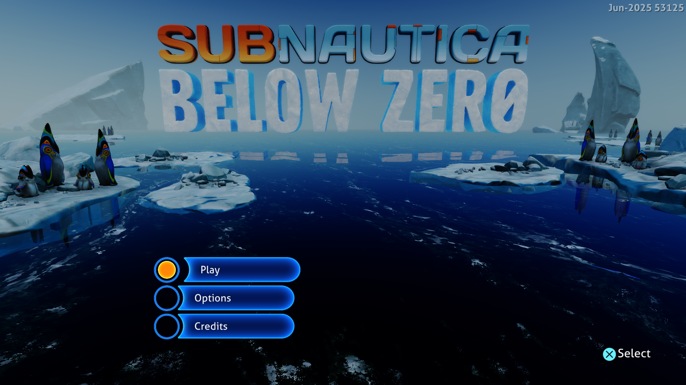

# Index staging and scalar input preparation — September 28, 2026

This follow-up reduces host allocation and list traversal in the shared Vulkan
draw path. It has no title-ID condition and keeps the default 1920×1080 output.



Frame 512 from the measured final run, converted directly from the native capture
without scaling. Play, Options and Credits are readable; existing water and
lighting artifacts remain visible.

## Changes

Indexed color and depth draws now borrow temporary CPU storage from a separate
bounded pool instead of allocating and freeing host pages for every draw. Two
idle allocations of at most 4 MiB each can be retained. Larger requests remain
transient. Each draw reads the current guest indices through the existing checked
reader before upload allocation, which can flush queued GPU work. Nested reads
hold distinct leases, and errors release their leases. The pool retains storage,
not previously uploaded index contents.

Adding shader USER_DATA used to scan the complete scalar-specialization list for
each input word. A 128-bit set now records existing entry registers in one pass.
Constants produced at a particular shader instruction remain separate from entry
values, including a producer at PC zero. Existing entry values, order, output
capacity and the 128-SGPR boundary are preserved. Scalar-load records and the
pointer-table helper also borrow immutable inputs to avoid temporary copies.

An attempted cache of complete scalar checkpoint results was rejected before
delivery. Exact input and memory validation produced only two hits per roughly
1,060 preparations; retaining snapshots increased checkpoint time from about
6–7 ms to about 34 ms. The implementation and its diagnostic switch are absent
from the final source and executable. The final change does not reuse scalar
results between draws or skip submitted commands.

## Measurement

Windows, NVIDIA GeForce RTX 3070 Ti, ReleaseFast, performance preference,
keyboard input, Subnautica: Below Zero PPSA02457 v1.022.125. Each measured run
lasts 180 seconds, begins with the same 22 MiB pipeline cache, keeps progress
captures enabled, and sends Enter after frame 256. No compiler or CPU sampler
runs concurrently with the measurements. The common comparison window is
flips 600–1980, with 24 samples per run.

| Build | Median frame | Approx. FPS | Sample range | Median GPU waits |
|---|---:|---:|---:|---:|
| Previous executable (`edb74dd`) | 64.5 ms | 15.5 | 60–82 ms | 2.553 ms |
| Index staging and scalar input changes (installed) | **59 ms** | **16.9** | **56–73 ms** | **2.131 ms** |

The median frame is about 8.5% shorter in this comparison. These short runs do
not establish a stable minimum or the same gain in other scenes or titles.
No guest fault or device loss was reported in either measured session.

Frame intervals in flip order (600–1980):

```text
Previous: 66, 61, 65, 64, 60, 65, 82, 65, 66, 67, 74, 80, 62, 66, 65, 62, 62, 60, 62, 62, 64, 62, 78, 61 ms
Installed: 57, 59, 59, 57, 59, 56, 69, 60, 56, 67, 73, 58, 58, 57, 60, 60, 58, 59, 59, 59, 59, 64, 70, 60 ms
```

At flip 1740 the installed build takes 59 ms: 333 draws account for 31 ms,
70 GPU dispatches for 4 ms, and 1,680 additional dispatches are CPU-emulated;
none are elided. Resource preparation takes 9 ms and checkpoint preparation
6.432 ms across 1,058 calls and 122,829 scalar steps. These categories overlap
and must not be summed as an exclusive frame breakdown.

A separate 25-second CPU sample no longer identifies index staging as a hot
virtual-allocation caller. Compared with the preceding diagnostic sample,
virtual-memory allocation/free samples fall from 9/25 to 2/6; the remaining
sampled stacks include computed metadata flushes. Stack attribution scans
possible return addresses rather than performing a full unwind; this is
supporting evidence, not an exclusive timing measurement. Accessibility checks,
memory copies, scalar interpretation and resource preparation remain prominent. The sampler run is
excluded from the frame-time comparison.

The preceding result of 63 ms is historical; the fresh comparison is used to
avoid attributing run-to-run variation to this change. The 30 FPS target needs
less than 33.3 ms per frame and remains unmet.

## Validation and limits

All 187 Vulkan tests passed in ReleaseSafe. Coverage includes small-allocation
reuse, nested leases, alignment at the configured retention limit, transient
oversized requests, producer-specific constants, existing entry values, and
register/output bounds. The final ReleaseFast runner was rebuilt successfully.

The installed runner also completed a 55-second Terminator 2D: No Fate check
through the intro and Start / Options / High Scores menu at native 1920×1080.
The menu is visible in frame 3712. No guest fault or device loss was reported.
Gameplay was not re-tested, and the other supplied games were not launched.

The website passed all 56 tests, TypeScript checking and its production build.

Rendering artifacts and intermittent missing menu labels remain unresolved.
Gameplay, audio correctness and long sessions are unverified. Installed game
assets were not edited. These are development changes; the public 0.3.2 download
predates them. Earlier subsystem test limitations are recorded in the
[completion and shader report](subnautica-async-completion-2026-09-27.md).

Installed runner: `zig-out/bin/game-run.exe`, ReleaseFast, built September 28,
2026 at 02:35 local time. SHA-256:
`27EE01CB33333E98D2A9ED89FFBCC6C0869E69252CCC3D8E53FFF80DD0E5F003`.

The [preceding shader and submission report](subnautica-pipeline-submission-reuse-2026-09-28.md)
records the earlier changes and their separate measurements.
