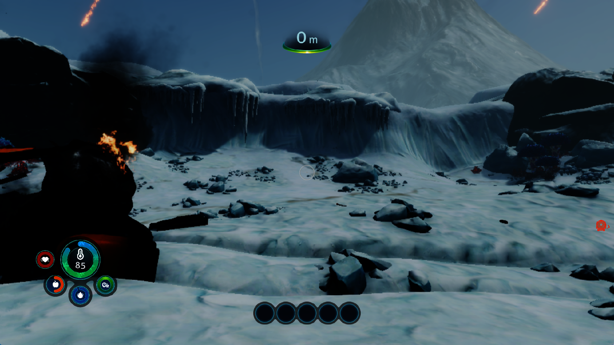

# Subnautica: Below Zero — colour mip sampling and lighting

Date: October 1, 2026. Title: PPSA02457, v1.022.125. Windows, Vulkan,
1080p guest output. These are development-build checks; published release
archives have not been replaced.

## Additional baseline runs

The previous report records two successful new-game runs and a stationary
world sample of 10.43 FPS. Three additional runs of that same installed binary
(SHA-256 `d995cc193c820c47b7d4b3a50e575b8b72321eb90e0e0a2fb7888d02bd1884df`)
failed during loading or the transition into the world:

- `subnautica-lighting-baseline-20261001`: a contained fault in the native
  IL2CPP collector, RVA `0x9ed6`, followed by process exit.
- `subnautica-lighting-control2-20261001`: a contained fault at guest
  `0xb3c0fb` in `UnityGfxDeviceWorker`, after flip 1391. Audio continued while
  the window stayed black; the diagnostic process was then stopped.
- `subnautica-lighting-control3-20261001`: contained faults at `0xddadc2` and
  `0xeab8e0` during loading; the diagnostic process was stopped afterward.

The bad pointer values indicate memory corruption, but these observations do
not establish its writer. They are separate results, not replacements for the
previous successful runs. Stable loading and a complete playthrough are not
established by the earlier success.

## A mip was mistaken for a resized base image

The old live log repeatedly reports:

```text
DRS sample refresh @0x287e90000 512x512 <- 1x1
```

Colour attachments for different mip levels share an allocation address.
The resident-texture lookup compared that address, format and recency, without
checking the selected mip. Its dynamic-resolution refresh could therefore
copy the newest 1x1 tail over the 512x512 base image. A descriptor requesting
several levels could also receive a Vulkan view with only one mip.

Resident lookup now respects mip and array-slice identity and uses the
selected mip's dimensions. Sampling one mip while rendering a different mip
of the same allocation no longer requests an unnecessary feedback snapshot.
Genuine overlapping feedback keeps the existing synchronization path.

Complete 2D colour pyramids can be assembled from resident GPU attachments.
Every requested level must exist with the expected extent and format; newer
buffer or storage-image writes and changed CPU backing force the normal
coherence path. The assembled cache signature includes every source image
and write generation, including a producer rewritten without a new flip. Image copies restore each source's prior layout and
avoid a host wait. Unsupported or incomplete chains retain the fallback.

## Validation

The six-level RG32F Vulkan probe checks independent sampled views and a full
chain down to 1x1, with a distinct pair of float values in each level. Sampling
adds no target readbacks or sampled-image uploads. The focused CPU suite
passes 129 tests, including mip/slice identity, feedback overlap and publication
coherence checks.
The existing storage-mip-chain probe also passes its same-frame rewrite,
odd-extent, swizzle, sRGB and CPU-replacement checks. Depth-bias, zero-mask
stencil/depth and fullscreen-orientation probes pass.

The general smoke path still hits its existing `IndexedCopyMismatch`; the
previous probe binary reproduces it. It is not reported as a passing full
suite.

Local evidence is retained under `out/subnautica-lighting-*`. Extracted game
assets and full logs are not included in the repository.

## Candidate loading checks

The mip-sampling candidate (`e6dbbf772ea334523dde4d75f8e13edbec98cf61a98d44df1041e250493af233`)
also encountered the existing loading corruption. The default run stopped in
`Job.Worker 1` at guest `0xeaaa60`. A diagnostic run with synchronous Vulkan
submits, eager small storage writes and synchronous internal releases stopped
at `0xe3d770`; these settings do not force all large storage writes eager.
Increasing the buffer-entry limit from 4096 to 8192 did not prevent a fault at
`0xe3e9e0`. The configurable ceiling is now 8192, while the default remains
4096 pending a successful comparison in the same world scene.

These runs did not reach a usable world-performance sample. Neither a higher
world FPS nor fully corrected scene lighting is claimed from the GPU probe.

## Tracked mip publication

A subsequent diagnostic run, `subnautica-lighting-writewatch2-20261001`, did
reach the intro and snowy crash site. A bounded guest-write observer was
enabled around loading; this run did not reproduce the loading fault. That
success does not establish that the intermittent corruption is fixed.

Live transfer diagnostics showed ten readbacks of the same RG32F allocation
per frame: 512x512 through 1x1, totalling 2730 KiB, followed by uploads of the
larger levels. Their write generations kept resetting to one. The initial
synthetic probe had no memory fingerprint callback; enabling the same tracking
used by the game reproduced an unwanted upload and failed the test.

The backing check covered the allocation prefix through the selected mip.
Publishing a neighbouring mip changed this prefix and was then mistaken for
a CPU replacement. The renderer now narrows fingerprinting and publication
to the selected contiguous mip span where its layout permits this. Packed
tails that require a shared span retain the conservative path. A sibling's
baseline is updated only when the pre-publication bytes match its existing
hash and the layout identifies another mip of the same allocation. The new
hash is calculated from the expected GPU publication, not blindly recaptured
from guest RAM. Its page-generation shortcut is cleared, so concurrent CPU
changes remain observable.

The Vulkan probe now covers all four combinations of linear/packed-tail
layout and tracked/untracked memory. All pass independent mip sampling,
resident-chain sampling, CPU publication and a same-frame producer rewrite.
The CPU regression also checks that changed CPU contents are rejected as a
publication baseline. The storage-mip, target-reuse, depth-bias, stencil/UI and
fullscreen-orientation probes pass on this revision.

## World-tested candidate and live transfer check

The world-tested candidate and its matching PDB were built in ReleaseFast.
Its executable SHA-256 is
`94487011f6bfa633efbe2e4c79dec6ddfc09b6318e850532017c2a7a1b067984`.
The live case is `subnautica-lighting-coherence-live-20261001` with the default
4096 buffer entries. The runner loaded New Game / Survival and entered the
intro without a contained guest fault.

The log now records GPU assembly of the 512x512, ten-level RG32F pyramid.
Menu frames 480–660 and intro frames 3120–3240 report **zero colour-target
readback and upload KiB**; previously the repeated pyramid transfers were
2730 KiB in each direction per frame. This is a measured transfer reduction,
not a claim that all transfers or stalls have been removed. For example,
intro frame 3240 still has 2366 KiB of buffer readback, 16756 KiB of buffer
uploads, and 102 submissions.

Those intro frames report no rejected draws, dispatch failures or unsupported
compute programs. Resource diagnostics still report an unresolved scalar
buffer descriptor, with additional unresolved reads at the scene transition.
A shader failure counter of zero does not establish that every shader
resource or lighting calculation is correct.

## World sample and remaining cost

The candidate also reached the controllable snowy crash site. After the
character died from cold during diagnostics, the game respawned normally.
The following stationary sample kept the game window in the foreground,
with no build or profiler running: **260 flips in 30.011 seconds, 8.66 FPS**
(`world-rate-4096.json`, flips 4769–5029). Movement and camera input were also
exercised. A separate close-rock view measured 6.26 FPS; scene choice matters.
Neither sample establishes an improvement over the earlier 10.43 FPS report.

The 8192-entry live cache experiment recorded 256 flips in 30.011 seconds
(8.53 FPS). Some frames had fewer evictions, but retained buffer memory grew
from approximately 698 MiB to 961 MiB without a demonstrated FPS gain. The
default remains 4096. The diagnostic setting was restored afterward; this
was a sequential live experiment, not a deterministic replay benchmark.

For example, default-cache world frame 5220 still took 91 ms: draws accounted
for 69 ms, compute dispatches for 2 ms, buffer storage work for roughly 7 ms,
and fence waits for 2.1 ms. It submitted 104 command batches, uploaded 15319
KiB of buffers and 7330 KiB of indices, and evicted 980 buffer entries. The
separately reported resource/checkpoint timings overlap those categories and
must not be added to the total. CPU profiling also found resource evaluation,
memory copies and driver allocation work. Removing texture round trips has
not removed those costs.



Unedited 1765x993 client-window capture from the candidate with 1080p guest
output. The screenshot shows the world and HUD; **dark lighting and rendering
artifacts remain**. The change fixes mip identity and publication coherence,
not the complete lighting pipeline. Stable loading, a full playthrough,
save recovery, audio correctness and 30 FPS are not established by this run.

## Final installation

The final revision additionally rejects sibling-baseline propagation between
different base dimensions that happen to occupy equally padded allocations.
All 129 focused tests and the four Vulkan mip cases pass with that guard.
The final ReleaseFast executable installed at `zig-out/bin/game-run.exe` has
SHA-256 `94922d261decf92fabcdf9df039d910e613c2cac542ff31fccf9835c3e996594`;
its matching PDB is installed alongside it. The world measurements above
belong to the preceding candidate, not a new full-world benchmark of this
last guard. Public release archives were not replaced.

The final binary was launched again in
`subnautica-lighting-final-smoke-20261001` and reached the animated menu with
zero colour-target transfer KiB in sampled frames. Intermittent missing menu
labels and `VertexBindings: 5 attrs but no plausible buffers` warnings remain
visible; this is a startup smoke check, not a clean rendering result. Both
owned diagnostic processes were stopped after their checks.
