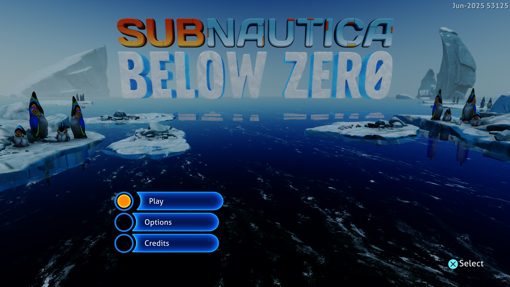

# Subnautica: Below Zero menu — September 26, 2026

Title: **PPSA02457, v1.022.125**. Host: Windows x64, NVIDIA GeForce RTX 3070 Ti.
This development-build follow-up investigates the missing menu after the
[startup file descriptor fix](subnautica-startup-2026-09-26.md).

These are historical 4K results. See the [September 27 follow-up](1080p-buffer-reuse-2026-09-27.md)
for native 1080p startup, shared buffer reuse and updated measurements.

## Missing interface

The animated scene was running, but `PlatformUtils.main.services` remained
null. `StartScreen.Update` waits for those services before creating its menu.
The platform initialization coroutine had stopped with FMOD's
`SystemNotInitializedException`, wrapping a `DllNotFoundException` for
`libfmod`.

Both `Media/Plugins/libfmod.prx` and `libfmodstudio.prx` were present in the
installation. They were absent from the mapped module graph because IL2CPP
loads them through P/Invoke rather than a static executable dependency. The
runner now includes both in its existing Unity deferred-plugin list. Linking
happens before guest execution; initialization still waits for the guest's
`sceKernelLoadStartModule` call and its real argument block.

The game now displays its warning screen and **Press Options** prompt.
Pressing Enter (the default Options binding) opens the main menu with **Play,
Options and Credits**. No game executable or asset was patched.

## Performance changes

With FMOD initialization restored, the default host-backed compute buffers
made repeated GPU passes particularly expensive. An isolated run using a
512 MiB device-local storage budget reduced sampled frame times from about
770 ms to 280–310 ms. The runner now selects that budget for PPSA02457;
`PS5_GPU_DEVICE_STORAGE_MIB=0` restores the old placement for comparison.
The game still controls its internal resolution (3840×2160 in these runs).

Scalar resource discovery also read each dword of a wide SMEM load through
the guest-memory callback separately. One load could repeat mapping checks
and GPU metadata synchronization sixteen times. The evaluator now reads the
valid contiguous prefix once, decodes little-endian words, and leaves buffer
out-of-bounds words zero. An inaccessible prefix invalidates the entire
destination just as before. This does not cache guest memory across draws.

## Verification and remaining limits

- ReleaseSafe `game-run.exe` built successfully; all **230 GPU module tests**
  passed, including wide reads, partial buffer bounds, zero-filled OOB words
  and invalidation after an inaccessible read.
- A 180-second run of the final binary uses the new defaults, keyboard input
  and frame capture. It opens the main menu after Enter, with no guest fault
  reported. The published image is renderer frame 256, resized from
  3840×2160 to 1920×1080.
- Nine sampled frames from flips 120–600 measure **193–223 ms**, median
  **204 ms (about 4.9 FPS)**. These are short warm-run measurements on this
  host, not a gameplay benchmark. The earlier FMOD-enabled control measured
  743–774 ms with GPU timestamp profiling; the device-buffer comparison
  measured 283–308 ms with the same profiling. A probe without timestamps,
  before wide reads were batched, measured 253–272 ms.
- Resource checkpoint preparation falls from roughly 70–90 ms to about
  20 ms per sampled frame. Page tracking, retained content caching and vertex
  trimming are not enabled by this profile.
- Website validation: **56 tests passed**, plus TypeScript checking and the
  production build.

The main menu is a development milestone, not a claim of playability.
Gameplay, audio correctness and longer-run stability remain unverified.
The background still has visible rendering artifacts, and short captures
include an intermittent missing-label frame. Performance remains low.

Final local runner SHA-256:
`AFDBDD62EFE281BC5CDAC3F47059FEBA2B0F12C35D4458A08EA38190670A616E`.

