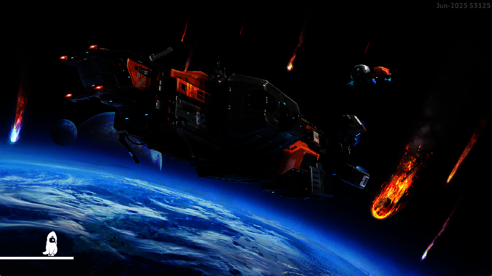
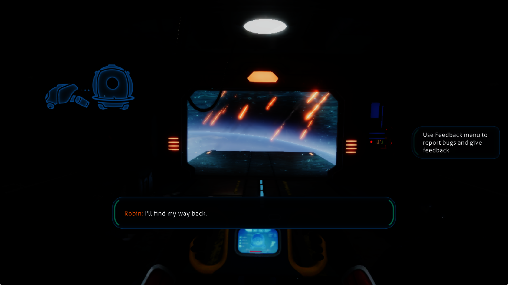
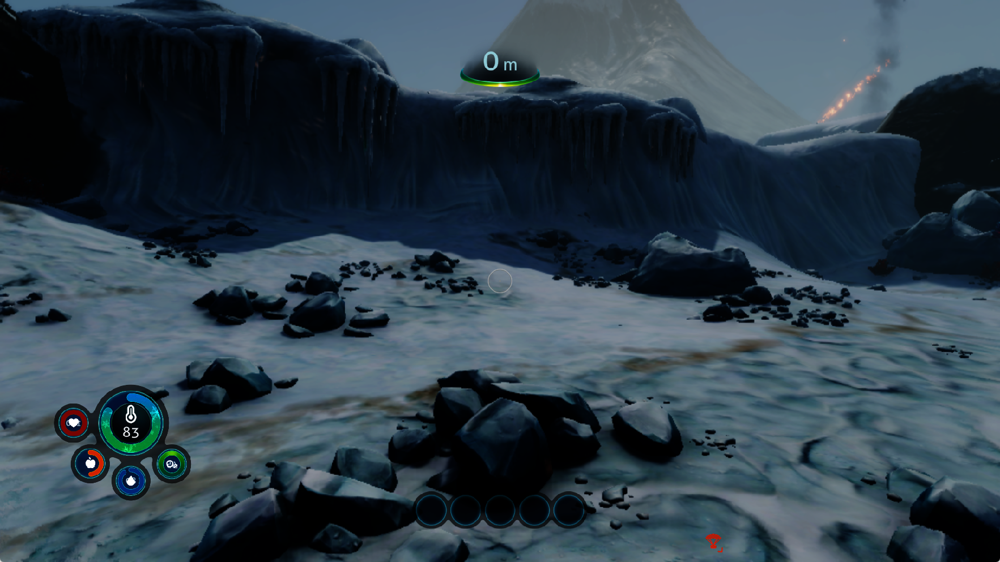

# Subnautica: Below Zero — new-game startup investigation

The final development build reaches the opening world in two separate runs.
The intro, survival HUD, camera input and walking were verified. The black
screen and observed loading corruption are resolved in these checks; dark
lighting, visual artifacts and long frame stalls remain. A stationary world
sample measures 10.43 FPS, below the 30 FPS target. The sections below retain
the failed intermediate checks and the evidence that led to the corrections.

Test title: PPSA02457 v1.022.125, supplied locally. These are development-build
results; the published 0.3.2 archives are unchanged. Installed game content and
existing saves were not edited.

## The mode-selection blocker

The original runner accepted the Survival selection but left the New Game
panel open. A debugger confirmed an `IndexOutOfRangeException` in
`Path.InsecureGetFullPath`, called through `SaveLoadManager.ClearTemporarySave`
and the `CreateSlotAsync` coroutine. The main-menu coroutine retained its busy
flag, so further button presses did not restart the operation.

Unity's temporary cache path was empty. The AppContent service returned
`/temp0`, but the filesystem did not attach that mount. The runner now prepares
`out/temp0/<title-id>` and mounts it as writable scratch storage before guest
execution. It uses the same sanitized title identifier as other per-title data
and keeps installed content read-only. The title creates its `TempSave`
directory and proceeds to the world-loading screen.

## Guest stack roots during garbage collection

A run with only the filesystem fix hit a contained worker fault in
`Throttle.Execute`, at `Il2CppUserAssemblies.prx + 0xd0a95f`. The object still
held by the worker had become a free-list entry. The next collection then
waited for the terminated worker on `SuspendSemaphore`.

The emulator delivered Unity's suspension callback from a separate firmware
stack and put the address of a local context buffer in the guest RSP field.
Consequently, the collector could miss the interrupted guest stack. The title's
PS5Util callback reads RSP at context offset `0xf8`; the local KytyPS5 source
also documents that PS5 context layout.

The firmware stack bridge now spills all six SysV nonvolatile general-purpose
registers onto the interrupted stack before switching. Signal delivery exposes
that stack pointer and the saved registers in the PS5 context. Nested firmware
calls retain the original snapshot. This is shared runtime behavior, with no
game-address patch and no forced semaphore completion.

A subsequent default-worker run with this fix lasted until the deliberate
20-minute diagnostic deadline without a contained guest fault. Main-scene
objects appeared and the graphics workload expanded, but presentation became
black; this observation alone did not establish playable gameplay.

## Deferred images after guest memory is released

Bounded live diagnostics found hundreds of `GuestMemoryReadFailed` draw
failures. A breakpoint isolated one repeating failure in
`commitGuestColorTarget`: it tried to read an old 1920×1080 target at
`0x255790000`, spanning `0x870000` bytes. A native memory query found a reserved,
uncommitted hole at `0x255ec4000` of length `0x3c000` inside that old range.
The completed-frame cache kept retrying the pending writeback, preventing its
oldest entry from being reused.

Render targets now remember whether their backing was fully accessible when
created and pass that evidence to completed frames during later readback.
Recording residency only at readback was too late: the observed stale target
was already partially unmapped by then. If writeback fails and the embedding confirms that this formerly
accessible range is now incomplete, the obsolete record is invalidated. A read
failure in a still-accessible allocation, an initially inaccessible range, or
an embedding without a residency callback retains the error. The change does
not synthesize missing pixels or silently accept arbitrary failed reads.

## Initial live check and remaining blocker

The initial installed build (`1d90211e…`) was launched with the default compiler
and resource workers, keyboard input, speed mode and 1080p output. The
interaction sequence reached Survival and produced the loading capture below.
It subsequently repeated the `Throttle.Execute` null read at
`Il2CppUserAssemblies.prx + 0xd0a95f`, followed by further guest faults. Thus the
stack-context correction fixed a demonstrable runtime defect but **did not
fully resolve the worker failure on its own**. The earlier 20-minute fault-free run was
not sufficient evidence of stability.



The render-target residency snapshot was moved from late readback to attachment
creation after the first cache-guard experiment proved too late to recognize
the old allocation. That initial live check faulted before establishing that the
black-screen/draw-failure sequence was resolved. The residency guard had focused
test coverage, but a successful loaded-scene validation was still outstanding.

At that stage, only New Game's mode-panel blocker was resolved. Gameplay, save
persistence, audio correctness and stable world loading were unverified.

## Follow-up: a deferred colour frame overwrites live objects

A hardware write breakpoint established a separate, concrete cause of the
loading corruption. A still-live `Throttle` object at `0x27f82df90` was inside
an old colour target's address range, `0x27f190000..0x27fa00000`. The first
observed overwrite came from `memcpyFast`, called by `writeGuestMemory` and
`commitCompletedFrame` during render-target cache eviction. The copy covered
`0x870000` bytes (8.4375 MiB). Subsequent guest faults contained pixel values
where object pointers should have been. This is direct evidence of stale
graphics writeback corrupting CPU memory; an apparently freed object alone
was not sufficient to attribute every failure to garbage collection.

The previous residency guard could detect holes in an old allocation but not
an allocation that remained readable after its contents had been repurposed.
Colour attachments now retain a content fingerprint and watched-page
generation from creation through deferred readback. Before publishing a
completed frame, the renderer rejects output whose guest backing has changed.
Rebinding a changed attachment also invalidates its old resident contents.
Successful writeback refreshes the matching resident image's baseline, so
the renderer does not mistake its own publication for a CPU replacement.

Unchanged watched pages avoid another content hash. A changed page generation
alone is not treated as changed image contents: the full-range fingerprint
also checks writes elsewhere in a shared page. Embeddings without a content
observer retain their existing behavior.

The regression fixture uses a readable allocation, writes two successive GPU
frames, replaces part of that allocation with CPU data, and verifies that a
third deferred frame performs no write and preserves the replacement. The
focused suite initially passed 48 tests. A default-worker live run then reached
the deliberate 20-minute diagnostic deadline without a contained guest fault.
A five-minute hardware watch on the new worker object observed no overwrite.
However, the scene remained black and slowed to roughly 0.1–0.2 FPS.

## A released storage buffer blocks cache eviction

The slow run made 30,000–44,000 Vulkan submissions per frame. Live resource
diagnostics and a breakpoint traced the repeated `GuestMemoryWriteFailed` to
readback of the same 1 MiB storage buffer at `0x283088000`. Native queries found
reserved, uncommitted pages beginning at `0x283158000`, inside that range.
Each failed eviction left the obsolete buffer dirty, so subsequent bindings
submitted another copy and waited before failing on the same destination.

Storage buffers now retain evidence that their complete backing was accessible
when GPU writes were recorded. Loss of that backing retires the old pending
result before readback, including buffers selected as alias dependencies.
This clears pending metadata publication and cached content observations while
retaining the Vulkan allocation's outstanding-use tracking. Unknown residency
and ordinary write errors in fully accessible memory still follow the error
path. A regression fixture verifies retirement without a Vulkan device, so an
accidental submission cannot satisfy the test.

## Fixed-point shadow depth bias

An actual rejected draw used a D16 depth attachment and depth-bias format
`0xf0`, with scale `-16` and offset `-4` on both faces. The renderer previously
accepted only the floating-point D32 mode. It now converts this D16 mode using
the actual host attachment precision: slope `-1`, constant `-4` for D16, or
`-1024` when the packed depth/stencil attachment uses D24. Unsupported unequal
face settings and clamps remain rejected. This follows the fixed-depth-bit
conversion in the local KytyPS5 renderer and the attachment-dependent
[Vulkan depth-bias definition](https://docs.vulkan.org/spec/latest/chapters/primsrast.html#primsrast-depthbias).
Bit-identical rasterization across drivers is not established by the unit test.

The follow-up live run reached “Press any button to continue”, then the intro
skip prompt and the in-world HUD with the “Use R to look around” tutorial.
No contained guest fault occurred before the deliberate stop. Repeated storage
rejections fell to zero; later frames submitted about 117 command batches,
with roughly 8–10 ms in storage binding, rather than tens of thousands of
submissions and seconds of failed readback. These runs did not capture matched
gameplay scenes, and the 3D image was still black, so this is evidence that the
retry storm ended, not a playable-game FPS comparison.

## A missing two-channel floating-point colour attachment

The surviving ten draw failures per frame were `MissingColorTarget`. A captured
draw actually bound a 512×512 colour surface: `CB_COLOR_INFO=0x4072c` selects
`DATA_FORMAT_32_32` with `NUMBER_FORMAT_FLOAT`. The backend supported the
corresponding sampled/storage image format but not colour attachments. It
therefore dropped the RG32F target before drawing. The colour format table and
component mapping now include this two-channel, eight-byte texel format.

A captured-register test covers decoding, surface layout and colour write-mask
mapping. The GPU colour-export probe also renders positive and negative values
into RG32F after reusing a different two-channel attachment, then checks both
32-bit float channels after guest readback. The GPU probe passed, including the
neighboring normalized and integer export cases. The live run then reported
zero draw failures, but the 3D image remained black behind the loaded HUD.

## Colour mip views used the allocation's base extent

Inspection of that run found ten RG32F attachments sharing one allocation,
with mip selectors 0 through 9, all represented as 512×512 images. Each
readback transferred 2 MiB, including the level that should be 1×1. The colour
attachment layout had ignored the mip selector for 2D images, although the
sampled-texture layout already handled it.

Mipped colour attachments now use the same subresource addressing as sampled
textures, including packed mip tails. Vulkan attachment dimensions come from
the selected view while tiling retains the allocation's original dimensions.
The CPU regression writes all ten levels of a 512×512 RG32F allocation, then
reads each through the sampled-texture path and verifies that later writes
preserve earlier levels. Linear and tiled layouts are covered, along with the
existing volume-layout tests. The GPU probe renders separate values through a
six-level chain down to 1×1 and checks their guest-memory locations.

## A depth-only fullscreen pass erased the finished scene

A per-draw trace of frame 3858 located the remaining black output. Draw 245
contained the rendered scene, including the player's hands. Draw 246 replaced
all 2,073,600 pixels of the HDR colour target with zero. That draw sampled the
half-resolution depth buffer and wrote the full-resolution depth plane with
stencil disabled. Its explicitly written `CB_TARGET_MASK` was zero, but the
host pipeline enabled all four colour channels.

The resource decoder had treated a written zero mask as missing G-buffer state
and enabled every bound colour slot. It now preserves explicit masks,
including zero, and retains the existing compatibility default only when the
register has never been written. Colour-write eligibility no longer depends
on stencil being enabled. Depth-only passes still execute their depth work;
their retained colour bindings cannot erase the scene. This is a shared
renderer correction, without a title or shader-address exception.

Resource tests cover unwritten versus explicitly zero masks, live shader
exports, multiple targets and partial channel masks. The Vulkan regression
adds a depth-writing pass after the stencil/UI sequence and checks both the
unchanged colour bytes and the updated depth value with stencil disabled.

## Live world verification

The installed colour-mask build starts a new Survival game, passes world
loading and plays the opening sequence with the cabin, planet, character and
subtitles visible. It then renders the snowy crash site and survival HUD.
Keyboard input rotated the camera and moved the player forward. No contained
guest fault occurred in this six-minute run before its deliberate restart.
A second process using the same installed binary also reached the snowy
opening area and HUD without a contained guest fault. Both runs were stopped
deliberately after verification; long-session stability is not established.

A stationary world sample recorded 313 flips over 30.010 seconds (10.43 FPS).
This includes actual presentation progress rather than averaging selected fast
frame log entries. Cold transitions still pause for seconds; some world frames
also stall. Lighting is too dark in places and visual artifacts remain. The
30 FPS goal is not reached. Recent frame diagnostics reported zero draw,
dispatch and storage-readback rejections, with one unresolved storage binding.
Zero rejection counters do not prove every shader or resource is correct.

The maintainer requested the compatibility grade **Playable · Completable**.
The checks described here cover the new-game path, intro and initial movement;
they do not independently establish a full playthrough, save recovery or audio
correctness. Public release archives remain unchanged.





## Validation

- ReleaseFast runner build passed.
- 127 focused tests passed: filesystem and temporary mount behavior, firmware
  stack switching, native bridge behavior, signal contexts, deferred frames,
  storage-buffer retirement, depth bias, colour formats, resource decoding and
  the tiling suite.
- The headless Vulkan depth-bias probe passed. The normalized/integer colour
  suite passed with the new RG32F case; the six-level RG32F mip probe passed.
- The zero-mask depth/stencil GPU regression and the fullscreen-orientation
  probe passed. A neighboring UI probe exposed an outdated expectation for a
  disabled-colour depth writer; the previous binary failed the same assertion.
  The fixture now expects the depth extent recovered by the existing behavior;
  all eight UI attachment configurations then passed.
- The register-root fixture places a sentinel exclusively in R12 across the
  assembly stack switch and checks both its visibility and preservation.
- The context fixture verifies that the collector's scan starts below a live
  caller-stack root even across nested firmware calls.
- The frame fixture covers partial unmapping, unknown prior residency, missing
  residency callbacks, and read failure while memory remains accessible.

The installed runner and matching PDB from the final build have SHA-256 hashes:

```text
game-run.exe  d995cc193c820c47b7d4b3a50e575b8b72321eb90e0e0a2fb7888d02bd1884df
game-run.pdb  f0c7df9a6d175bd18e80814a13dd923ce8f0de0ee9bf35a9cdfb67706ab9e78a
```

Local evidence is retained under `out/subnautica-new-game-*`,
`out/subnautica-temp0-*`, `out/subnautica-gc-*`, `out/subnautica-backing-*`,
`out/subnautica-storage-*`, `out/subnautica-rg32f-*`, `out/subnautica-mips-*`
and `out/subnautica-mask-*`.
Full logs and extracted game
metadata are not distributed with this report. Captures are unedited client
images of the actual game window, 1765×993 pixels on this desktop with 1080p
guest output; they are not described as native-resolution screenshots.
