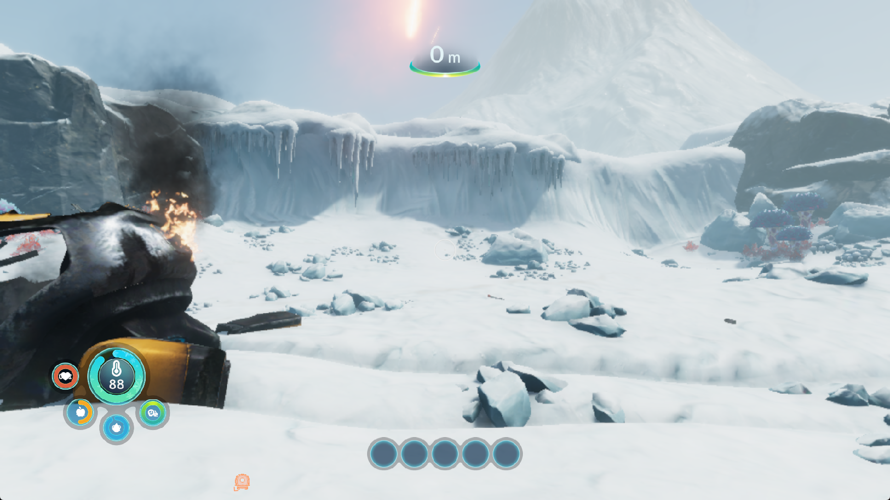

# Subnautica: Below Zero — performance repeat, October 3, 2026

**PPSA02457 v1.022.125**, measured with the installed GTA III resource-optimization
build. Two unpaused, stationary world samples record **7.27 and 11.77 FPS**,
or **9.52 FPS** across their combined measured minute. The main menu records
**14.67 FPS**. Long stalls remain; the 30 FPS target is unmet.

This is an unedited game-window capture before the first valid world sample.

## Conditions and method

- Windows, AMD Ryzen 7 7700, NVIDIA GeForce RTX 3070 Ti (8 GiB).
- Installed `zig-out/bin/game-run.exe`, ReleaseFast, source commit `43840b0`.
  SHA-256: `785b2120d658322430659e947866846db8b456e552fb5edfc9525499cda88fcc`.
- Output 1920×1080, Speed emulator preset, game preference left at Game default.
  Unity's virtual startup configuration requests 1920×1080; later internal
  targets remain game-controlled. The visible window client is 1765×993.
- Warm shader/pipeline caches, keyboard input, FPS display and GPU reports
  enabled. Pad input diagnostics are disabled. No renderer overrides, binary
  patches, debugger, profiler, builds or tests run during the measured intervals.
- A copy of the same Survival save used in the October 2 Windows-stack checks
  is restored. Both source and copied archive retain SHA-256
  `c30b4a242d29ba7cd6b9334484126895c8bcdcc6f2b9d3f0ed02f9953ed0a5d4` after the run.
- FPS is the change in the renderer's actual presented-frame counter divided
  by elapsed wall-clock time. Read-only samples are taken once per second;
  screenshot capture and pause-menu interaction happen outside each interval.
  The camera is stationary and gameplay unpaused throughout the valid samples.

## Results

| Scene | Presented frames | Seconds | FPS |
| --- | ---: | ---: | ---: |
| Animated main menu | 440 | 30.000171 | 14.67 |
| Snowy world, sample A | 218 | 30.000384 | 7.27 |
| Same world view, sample B | 353 | 30.000221 | 11.77 |
| World A + B, combined intervals | 571 | 60.000606 | 9.52 |

A preliminary world interval records 279 frames / 30.000166 seconds (9.30 FPS),
but crosses death from cold and respawn. It is excluded from the stationary
world result. The two retained intervals show the same post-respawn viewpoint
with the player alive before and after each sample. Pauses between measurements
are not included.

Sample A includes nine consecutive approximately one-second bins with no new
presented frame. The corresponding frame report at flip 4248 records 9,998 ms:
160 ms in submission processing and 9,838 ms in the reported guest/inter-submit
interval. This identifies where the delay is accounted for, not its root cause.
Other logged frames in that sample take 79–80 ms. Sample B delivers 9–13 frames
per one-second observation, without a comparable long stop.

Periodic reports inside both valid intervals record zero draw failures,
dispatch failures, unsupported compute and unresolved storage resources. This
does not certify every shader path or complete visual correctness. The process
does not report a guest fault or device loss and is deliberately stopped after
the measurements.

The [previous valid stationary sample](subnautica-vector-walk-save-2026-10-02.md)
was **7.93 FPS**. The new pooled result is numerically higher, but weather,
warm-up and stall occurrence vary. No controlled before/after executable test
was performed, so these measurements do not isolate a speedup from the GTA III
optimizations. The short test does not establish long-session stability,
completion or audio correctness. Renderer code and the installed binary were
unchanged during this repeat.

Raw counter samples, logs, manifest and before/after captures are retained in
the ignored `out/subnautica-repeat-current-20261003-run1/` directory.
