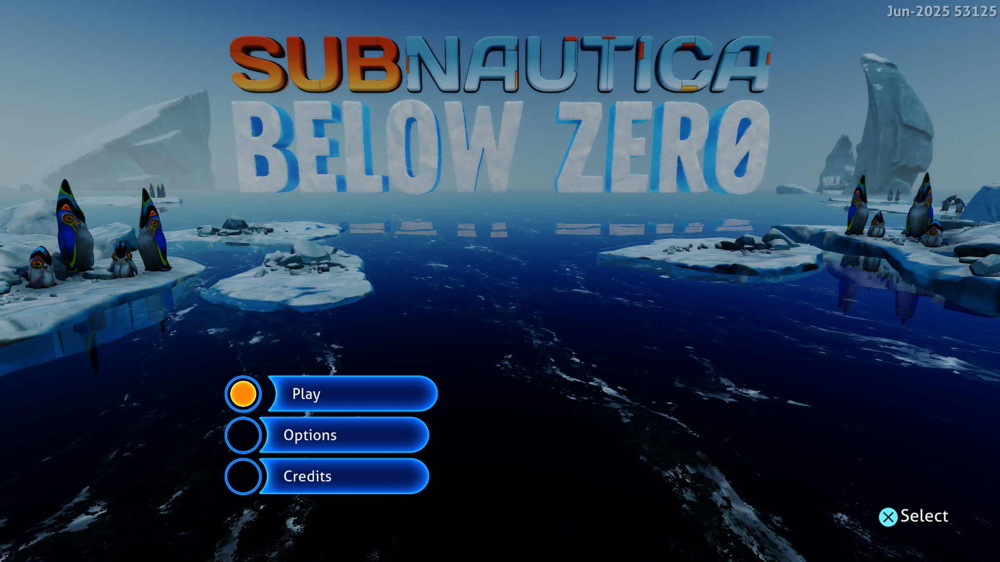

# Graphics shader and submission allocation reuse — September 28, 2026

This follow-up targets CPU work in graphics pipeline lookup. The shared Vulkan
path now retains the original translated shader modules and reuses their content
hashes. It applies to native draws, exact resource reuse, scalar-only reuse,
color passes and depth-only passes, without a title-ID condition.



The image is frame 512 from the final measured run, converted directly from the
native capture without scaling. Play, Options and Credits are readable; existing
rendering artifacts remain visible.

## Why the lookup was expensive

A separate CPU sample of the preceding build repeatedly found full SPIR-V
hashing and word comparison inside `getGraphicsPipeline`, even for pipelines
already present in the cache. Some translated shaders contain hundreds of
kilobytes. Retaining copies in the pipeline cache avoided repeated allocation,
but still required reading both shaders again on each lookup.

An immutable module lease now computes its content hash once. A matching
retained lease proves shader identity without another full word comparison.
Pipeline state remains part of the key. Different modules in the same hash
bucket still require exact word equality; after a successful match the entry
can retain the new lease. Eviction from the translation cache does not free
words still owned by a pipeline.

Raw shader buffers retain content hashing and comparison. A supplied lease is
accepted only when its pointer and full length match the submitted words, so
temporary fallback shaders and partial views cannot inherit another shader's
identity. The change does not skip guest commands or cache mutable guest data.

## Submission allocation

A subsequent diagnostic sample identified `Scheduler.captureWords` and indirect
register snapshotting as frequent callers of Windows virtual-memory allocation.
AGC now uses Zig's thread-safe SMP allocator for command snapshots, scheduler
storage and completion records. Small allocations reuse size classes instead of
mapping and unmapping host pages for each record. Large allocations still follow
the allocator's page-allocation path.

Each submission continues to own independent copies. Root commands are frozen
before waiting for the execution lock; blocked queues retain their indirect
commands and register lists. Completion ownership, release order, snapshot
mirroring and guest-memory validation are unchanged. This reuses host allocation
storage, not previously submitted command contents.

A separate 25-second sample of the installed build no longer identifies the
indirect-register snapshot path as a hot virtual-allocation caller. Remaining
allocation samples include temporary index staging. Memory copies, accessibility
queries, scalar interpretation and resource preparation remain prominent. These
diagnostic samples are excluded from the frame-time comparison.

## Measurement method

Windows, NVIDIA GeForce RTX 3070 Ti, ReleaseFast, performance preference,
keyboard input, Subnautica: Below Zero PPSA02457 v1.022.125, native 1920×1080.
The previous executable was preserved before rebuilding. Each comparison run
starts from the same pipeline cache, lasts 180 seconds, and sends Enter after
frame 256 to open Play / Options / Credits. The comparison uses the common range
of flips 600–1860 (22 samples per run).
Progress captures remain enabled. No compiler or CPU sampler runs alongside
the measured sessions.

| Build | Median frame | Approx. FPS | Sample range | Median GPU waits |
|---|---:|---:|---:|---:|
| Previous executable (`ab20b3c`) | 68 ms | 14.7 | 65–85 ms | 2.562 ms |
| Immutable graphics shader reuse only | 66 ms | 15.2 | 63–100 ms | 1.697 ms |
| Shader reuse + submission allocation reuse (installed) | **63 ms** | **15.9** | **59–77 ms** | **1.733 ms** |

The earlier published 73 ms result is historical. The fresh baseline above was
already faster, so this comparison does not attribute that difference to the
new changes. Pipeline lookup went from 2–3 ms to less than 1 ms in every sample;
the frame-time reduction from the shader-cache change alone is modest, about 3%.
With both changes the median frame is about 7% shorter than the fresh baseline.
These short comparisons are not a guarantee of the same gain in other scenes
or titles. No guest fault or device loss was reported in the measured sessions.
The remaining preparation and command costs still dominate. **The 30 FPS target
requires less than 33.3 ms per frame and remains unmet.**

Frame intervals in flip order (600–1860):

```text
Previous: 72, 66, 68, 68, 68, 72, 81, 68, 68, 67, 85, 68, 67, 69, 70, 65, 70, 72, 67, 73, 67, 69 ms
Shader reuse: 66, 65, 63, 70, 66, 64, 100, 63, 66, 68, 76, 63, 67, 66, 64, 64, 65, 63, 66, 66, 65, 67 ms
Both changes: 64, 64, 67, 65, 60, 62, 77, 63, 64, 64, 73, 64, 59, 63, 62, 60, 63, 61, 62, 67, 60, 61 ms
```

At flip 1740 the final build took 67 ms for 336 draws, 70 GPU dispatches and
1,680 CPU-emulated dispatches, with zero elided dispatches. Resource preparation
took 9 ms and checkpoint preparation about 6.7 ms over 1,070 calls. These
instrumentation categories overlap; they are not an additive frame breakdown.

## Validation

All 185 Vulkan tests passed in ReleaseSafe, including retained module ownership,
equal modules with separate allocations, different words in the same bucket,
changed pipeline state, partial views, and mutation of a raw buffer at the same
address. The ReleaseFast game runner was rebuilt successfully.

The allocator change also passed all 536 HLE tests and 233 GPU tests, including
blocked queue retention, indirect snapshots, completion ownership and teardown.

The final runner also passed a 55-second Terminator 2D: No Fate check through
its intro into the Start / Options / High Scores menu at 1920×1080. No guest
fault or device loss was reported. Gameplay was not re-tested; the other supplied
titles were not launched.

The website passed all 56 tests, TypeScript checking and its production build.

Installed runner: `zig-out/bin/game-run.exe`, ReleaseFast, built September 28,
2026 at 00:07 local time. SHA-256:
`F40D0BE2BA28CA7BC5A82B697B60DE6D002219A9CA5771434A17D7BA52DC8ECA`.

The preceding [completion and shader report](subnautica-async-completion-2026-09-27.md)
documents earlier changes and existing test-suite limitations. Rendering
artifacts and intermittent menu-label problems remain unresolved. Gameplay,
audio correctness and long sessions are unverified. Installed game assets were
not edited. These are development changes; the published 0.3.2 download predates
them.
