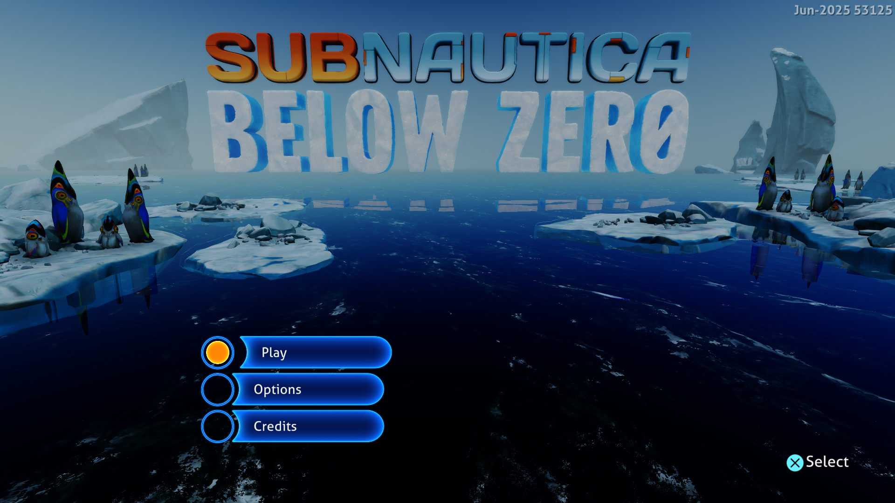

# Borrow scalar checkpoint registers — September 28, 2026

Shader resource preparation now borrows the instruction-local scalar register
snapshot instead of copying all 128 registers into a temporary evaluation for
each resource instruction. This is a shared Vulkan/GPU change with no title-ID
condition.



Frame 512 from the final measured run, converted directly without scaling.
Play, Options and Credits are readable. Existing rendering artifacts remain.

## Implementation

Buffer, image, sampler and indirect pointer resolvers accept a read-only
`ScalarRegisters` pointer. Compute resource scanning, sampled image scanning
and scalar pointer preparation pass the snapshot for the instruction's own PC.
Two temporary `ScalarEvaluation` fields are removed from resource objects;
these consumers do not use load history or execution status.

The checkpoint lease owns the register storage until resource preparation
returns. Nested preparation uses separate leased storage, and no resolver
retains a pointer in a resource object. Checkpoints are still evaluated for the
current bindings and checked guest-memory reads. The existing rules for reaching
definitions, unknown registers, descriptor bounds, branch joins and SGPR reuse
are unchanged. This does not reuse scalar values across draws or frames.

## Measurements

Windows, NVIDIA GeForce RTX 3070 Ti, ReleaseFast, performance preference,
keyboard input, Subnautica: Below Zero PPSA02457 v1.022.125, native 1920×1080.
Both sessions last 180 seconds, starting with the same 22 MiB pipeline cache.
Progress captures remain enabled and Enter is sent after frame 256. The
comparison uses 24 matching samples, flips 600–1980. No build or CPU sampler
runs alongside either session.

| Build | Median frame | Approx. FPS | Sample range | Median GPU waits |
|---|---:|---:|---:|---:|
| Previous executable (`3841833`) | 58 ms | 17.2 | 56–77 ms | 2.014 ms |
| Borrowed register snapshots (installed) | **57 ms** | **17.5** | **53–71 ms** | **1.831 ms** |

The sampled median is 1 ms (about 1.7%) shorter. This is a small difference in
one paired comparison and may include run-to-run variation; it does not establish
a reliable FPS gain or a stable minimum. The unnecessary register copies are
removed independently of this timing result. The preceding 57.5 ms published
result is historical; this comparison uses a fresh baseline.

No guest fault, device loss or shader translation failure was reported in either
measured run. Checkpoint evaluation itself remains about 6.6 ms in both runs;
this change affects consumers of its output. The 30 FPS target (33.3 ms per
frame) remains unmet.

Frame intervals in flip order (600–1980):

```text
Previous: 56, 56, 60, 58, 57, 58, 77, 58, 60, 64, 68, 62, 59, 58, 57, 56, 58, 59, 56, 58, 60, 56, 69, 59 ms
Installed: 54, 57, 57, 53, 57, 57, 68, 57, 60, 55, 66, 58, 55, 59, 54, 57, 58, 55, 55, 62, 57, 58, 71, 57 ms
```

A separate 25-second native CPU profile samples the main submission thread
inside `memmoveFast` 31 times, versus 119 in the preceding build's 25-second
profile. These are sampled instruction pointers, not call counts or exclusive
timing. This supports the reduction in register-copy work but does not assign
all of the frame-time difference to this change. The diagnostic run is excluded
from the frame-time comparison.

Memory copying, scalar evaluation, resource setup and guest-memory page
protection still appear prominently in the profile. Checkpoint evaluation is
still performed for the current draw; its roughly 6.6 ms cost is not removed.

## Validation and limits

All 233 GPU and 187 Vulkan tests pass in ReleaseSafe. Coverage includes scalar
checkpoint reuse, nested preparation, resource reaching definitions, branch
joins, SGPR clobbers and live memory reads. Existing descriptor tests now call
the register-only interfaces directly.

The ReleaseFast runner rebuilt successfully. A separate 55-second Terminator 2D
check renders the opening and reaches its native 1920×1080 Start / Options /
High Scores menu (frame 3712 inspected), without reported guest faults, device
loss or shader translation failures. Gameplay was not tested. No other titles
from the supplied list were launched.

The updated website passes all 56 tests, its TypeScript check and the production
build. Documentation and the website use the new native Subnautica capture.

Rendering artifacts and intermittent missing menu labels remain unresolved.
Gameplay, audio correctness and long sessions remain unverified. Game assets
were not modified. The public 0.3.2 download predates these development changes.

The [preceding queue-probe report](subnautica-retirement-probes-2026-09-28.md)
records the previous change and its separate measurements. Broader test-suite
limitations are recorded in the
[completion and shader report](subnautica-async-completion-2026-09-27.md).

Installed runner: `zig-out/bin/game-run.exe`, ReleaseFast, built September 28,
2026 at 09:46 local time. SHA-256:
`2246862C750623B5E0C6CED9DAAE7A2FD0690C069DE7CA4011E70F3C047B2CD7`.
