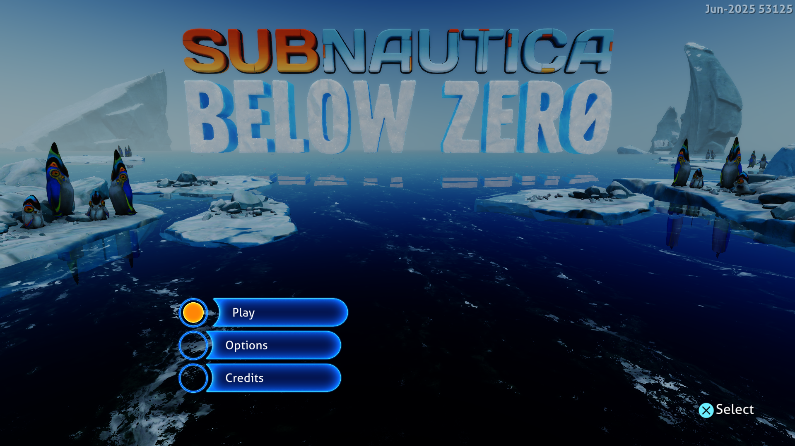

# Skip unusable SDK11 queue probes — September 28, 2026

The shared AGC submission path now checks whether the SDK11 completion table
has been established before looking for a graphics queue object in guest
registers and stack spills. There is no title-ID condition.



Frame 512 from the final measured run, converted directly from its native capture
without scaling. Play, Options and Credits are readable; rendering artifacts remain.

## Why this matters

The existing DCB generation bridge can publish only into a table established
by the ACB retirement bridge. Previously it checked that prerequisite after
searching for the queue object. A submission could therefore probe three
registers and up to 96 stack slots, validate candidate pointers and read their
fields, then have no usable destination for a completion write. The preceding
Subnautica profile repeatedly sampled Windows virtual-memory queries along
this path, and its log reported unsuccessful SDK11 DCB queue discovery.

An early atomic check now avoids that search while the shared table is unknown.
It is repeated on every submission: discovery later in the session enables the
original path immediately on a subsequent call. The existing check immediately
before publication remains, as do stream ownership validation, label bounds,
generation checks, synchronization and the checked memory reads. Ordinary
packet releases and driver completion delivery are unchanged. This does not
cache memory permissions, discard commands or assume that guest data is static.

## Measurements

Windows, NVIDIA GeForce RTX 3070 Ti, ReleaseFast, performance preference,
keyboard input, Subnautica: Below Zero PPSA02457 v1.022.125, native 1920×1080.
Both comparison sessions last 180 seconds and begin with the same 22 MiB
pipeline cache. Progress captures stay enabled, and Enter is sent after frame
256. The common window is flips 600–1980, with 24 samples per session. No build
or CPU sampler runs alongside either measured session.

| Build | Median frame | Approx. FPS | Sample range | Median GPU waits |
|---|---:|---:|---:|---:|
| Previous executable (`4b43935`) | 60 ms | 16.7 | 57–75 ms | 2.414 ms |
| Early SDK11 table check (installed) | **57.5 ms** | **17.4** | **54–72 ms** | **2.021 ms** |

The sampled median frame is about 4.2% shorter. The preceding published 59 ms
result is historical; this comparison uses a fresh baseline. No guest fault or
device loss was reported in either measured run.

Frame intervals in flip order (600–1980):

```text
Previous: 66, 59, 60, 62, 61, 57, 71, 60, 59, 62, 75, 57, 60, 59, 63, 66, 59, 61, 60, 58, 58, 60, 69, 60 ms
Installed: 56, 57, 56, 56, 59, 61, 70, 58, 59, 56, 72, 57, 62, 61, 54, 66, 59, 56, 57, 60, 57, 56, 71, 57 ms
```

Median checkpoint preparation remains about 6.5 ms in both sessions. This
change targets queue discovery, not scalar execution or shader resource setup.
CPU work remains the primary obstacle to the 30 FPS target.

These short runs do not establish a stable minimum or a gain in other titles.
The 30 FPS target requires less than 33.3 ms per frame and remains unmet.

A separate 25-second CPU sample reads the live shared-table pointer as zero
and the previous unsuccessful DCB queue-discovery messages are absent. The main
submission thread's sampled instruction pointers in `NtQueryVirtualMemory`
fall from 263 in the preceding build's 25-second profile to 59 after this change.
These are sample
counts, not syscall totals or an exclusive timing measurement. Memory copying,
scalar interpretation and resource preparation remain prominent. The diagnostic
session is excluded from the frame-time comparison.

## Validation and limits

All 536 HLE tests passed in ReleaseSafe, including SDK11 queue parsing,
generation publication and submission/completion ownership. The ReleaseFast
runner was rebuilt successfully.

A separate 55-second Terminator 2D regression reaches its native 1920×1080
Start / Options / High Scores menu. Frame 3712 was inspected; no guest fault,
device loss or shader translation failure was reported. Gameplay was not tested.
No other titles from the supplied list were launched.

The website's 56 tests, TypeScript check and production build passed with the
updated compatibility notes and menu capture.

Rendering artifacts and intermittent missing menu labels remain unresolved.
Gameplay, audio correctness and long sessions are unverified. Installed game
assets were not modified. These are development changes; the public 0.3.2
download predates them.

The [preceding index staging report](subnautica-index-staging-2026-09-28.md)
records the earlier changes and their separate measurements. Broader test-suite
limitations are recorded in the
[completion and shader report](subnautica-async-completion-2026-09-27.md).

Installed runner: `zig-out/bin/game-run.exe`, ReleaseFast, built September 28,
2026 at 03:36 local time. SHA-256:
`D496EEB8B640769A61619BB913DC591D7A78F457FC1566C76DFF640B957D4A5F`.
