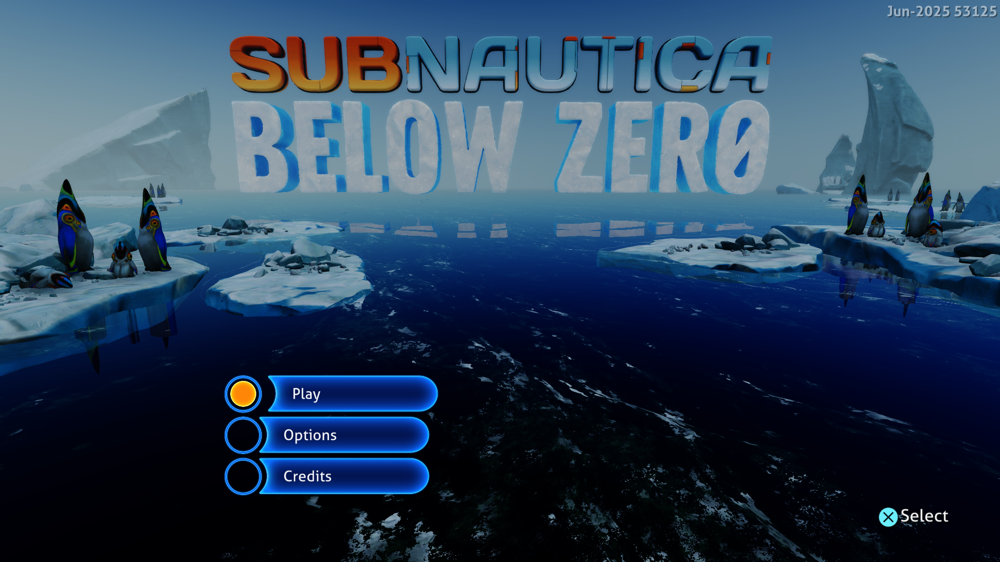

# Initialize scalar scratch on demand — September 28, 2026

The scalar interpreter now searches only occupied lane-spill slots and initializes
its branch-tracking bitsets when first used. This removes repeated initialization
from walks that do not use those facilities. The shared GPU path has no title-ID
condition; scheduling and live memory reads retain their original order.

## Implementation and correctness

A scalar lane-spill table has 128 records. Its occupancy mask already controls
restoration and invalidation; insertion now uses that mask too. Only occupied
records are read, so empty walks do not fill every record. Searching occupied
bits also avoids scanning unused records on every spill.

The previous implementation already reset the register tag when invalidating a
slot. This is an implementation optimization, not a fix for exhausted capacity.
New tests protect the existing capacity, slot-reuse, live-lane update and unknown
write behavior while changing how free and occupied records are found.

The two 65,536-bit branch tables now start logically empty and clear their storage
on the first recorded branch. Queries before that return false. Each scalar walk
starts with fresh initialization flags, so no branch evidence survives from an
earlier draw. Instruction limits, loop merging, snapshot capture and guest-memory
checks are unchanged.

## Measurements

Windows, NVIDIA GeForce RTX 3070 Ti, ReleaseFast, performance preference,
keyboard input, Subnautica: Below Zero PPSA02457 v1.022.125, native 1920×1080.
All comparison sessions run for 180 seconds with the same initial 22 MiB
pipeline cache. Enter is sent after frame 256; progress captures remain enabled.
The common window is flips 600–1980, with 24 samples. No build or CPU sampler
runs alongside any measured session.

The previous executable is commit `0c44bf5`. It was measured before the
experiments and again immediately after the installed build, in that order:

| Metric | Previous, first run | Installed build | Previous, repeat |
|---|---:|---:|---:|
| Sampled median frame | 57 ms | 59 ms | 58 ms |
| Approx. FPS (1,000 / median ms) | 17.5 | 16.9 | 17.2 |
| Sampled frame range | 54–71 ms | 55–73 ms | 55–78 ms |
| Median GPU fence wait | 1.83 ms | 2.07 ms | 1.68 ms |
| Median checkpoint preparation | 6.72 ms | 6.69 ms | 6.78 ms |

These measurements do not show an FPS improvement. The installed median is
1 ms longer than the adjacent control and 2 ms longer than the initial control.
The control itself varies by 1 ms, so the runs do not isolate the cause of this
small difference. The change removes unconditional scratch initialization;
that does not establish a shorter frame or a stable minimum frame rate.

Checkpoint preparation remains about 6.7 ms. CPU preparation and command
handling remain the main costs. The 30 FPS target requires 33.3 ms per frame
and remains unmet. No guest fault, device loss or shader translation failure
was reported in any of these three runs.

Frame intervals in flip order (600–1980):

```text
Previous, first: 55, 58, 56, 56, 60, 57, 68, 57, 57, 55, 67, 54, 58, 58, 56, 71, 58, 55, 56, 56, 54, 56, 71, 58 ms
Installed: 58, 59, 63, 56, 63, 60, 69, 60, 58, 55, 73, 57, 60, 59, 56, 58, 60, 59, 58, 59, 57, 61, 72, 58 ms
Previous, repeat: 56, 62, 59, 57, 57, 59, 68, 59, 57, 56, 70, 60, 76, 59, 57, 57, 58, 55, 55, 58, 56, 60, 78, 57 ms
```

## Rejected combined-worker experiment

An earlier prototype in this investigation combined the complete scalar walk
and resource checkpoints into one background job. Eligibility checks and a
budget-cutoff fallback preserved the tested outputs, but fewer jobs did not
improve menu latency:

| Metric | Previous build | Combined-worker prototype |
|---|---:|---:|
| Sampled median frame | 57 ms | 61 ms |
| Approx. FPS | 17.5 | 16.4 |
| Resource jobs per frame | 148 | 74 |
| Accumulated worker elapsed time per frame | 7.44 ms | 5.48 ms |
| Owner wait for resource jobs per frame | 1.07 ms | 2.91 ms |

Worker figures are cumulative counter differences between flips 600 and 1980,
divided by 1,380 frames. Accumulated worker elapsed time is not exclusive CPU time
or an additive portion of frame latency. All 148 outputs per frame were consumed,
with no additional replay or memory-validation fallback in this window. The
larger jobs reduced total work but delayed consumers. The combined-worker code
was removed before building the installed runner.

## Validation and limits

All 235 GPU and 187 Vulkan tests pass in ReleaseSafe. New regression coverage
fills the lane table, rejects overflow, invalidates and reuses a slot, checks
updates to a live lane and verifies invalidation by an unknown write. It also
checks initially empty branch tables and reset between walks. Existing tests
cover scalar loops, lane clobbers, checkpoint ownership and changed-memory reads.

The ReleaseFast runner rebuilt successfully. A separate 55-second Terminator 2D
check reaches the native 1920×1080 Start / Options / High Scores menu; frame 3712
was inspected. No guest fault, device loss or shader translation failure was
reported. This was a startup/menu check, not a gameplay or performance test.
No other titles from the supplied list were launched.

The updated website passes all 56 tests, the TypeScript check and the production
build. Documentation and the website use the same new native Subnautica capture.

Rendering artifacts and intermittent missing menu labels remain unresolved.
Gameplay, audio correctness and long sessions are unverified. Game assets were
not modified. The public 0.3.2 download predates these development changes.

The [register borrowing report](subnautica-register-borrowing-2026-09-28.md)
records the preceding change and its separate measurements. Broader test-suite
limitations are recorded in the
[completion and shader report](subnautica-async-completion-2026-09-27.md).

Installed runner: `zig-out/bin/game-run.exe`, ReleaseFast, built September 28,
2026 at 14:13 local time. SHA-256:
`0234D0ADBCB636B6B6FB4577B798A839B4CFA9FD49BB5D0751EF33A1E91D3A74`.



Frame 512 from the installed build's measured run. Play, Options and Credits
are readable; the visible scene artifacts are not corrected by this change.
