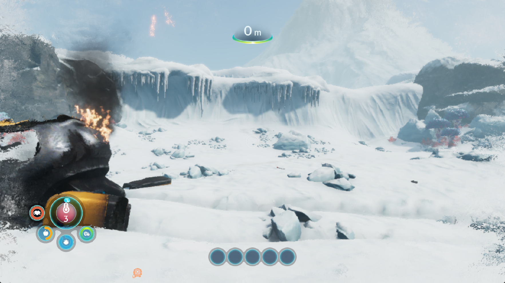

# Subnautica: Below Zero — scalar resource walks, save writes and loading faults

Title: PPSA02457, v1.022.125. Windows development checks use keyboard input,
1920×1080 guest output, the speed preset and the default buffer-cache limit.
The 30 FPS target remains unmet. These checks do not establish a complete
playthrough, accurate rendering throughout the game or reliable loading.

## Scalar resource preparation

The CPU resource interpreter now bypasses scalar execution for vector-only
instructions. It still visits those instructions to record dependencies,
invalidate overwritten lane spills and capture resource checkpoints. Scalar
destinations, lane transfers, VCC/EXEC writes and unknown families retain their
handling. This does not omit instructions from the GPU shader.

A separate correctness regression exposed stale scalar mask values: vector
comparisons and carry outputs could leave the upper mask word, or the entire
secondary scalar destination, marked as a known constant. The interpreter now
invalidates both words of those outputs. Single-word lane reads do not
invalidate the neighbouring register. Real decoded VOPC, CMPX, VOP3 and VOP3B
encodings exercise this behavior. The new test fails before the correction;
all **71 scalar provenance tests** pass afterwards.

An isolated benchmark alternates old/new/new/old resource walks, checking
load contents, read counts and checkpoints. Fixtures contain 4, 16, 64 or 256
blocks of one scalar load followed by 32 vector moves. Full walks take
17.1%, 28.1%, 34.9% and 35.9% less time; checkpoint walks take 14.6%, 26.0%,
30.4% and 32.2% less time. These are interpreter measurements, **not game FPS
improvements**. The benchmark predates the separate mask correction.

## Foreground keyboard input

Windows keyboard polling previously read desktop-wide key state while another
application had focus. Typing could move the character or activate menus in a
background game. Keyboard merging now requires a foreground window owned by
the runner. Losing focus releases keyboard contributions on the next poll;
hybrid controller input is preserved. Two native probe processes confirm that
only the foreground process receives a key, including a focus switch while
the key remains held. Input tests pass (15 passed, one platform skip).

## Live performance and loading before the save correction

The scalar-walk/focus candidate has SHA-256
`978c1f9702c756b4976b8bf04b876edaf35632164b358fea0121047766a0afc9`.
The first run, `out/subnautica-vector-focus-live-20261002`, fails during loading
at `Il2CppUserAssemblies.prx + 0x9ed6`. It follows a corrupt pointer while
scanning objects. The writer responsible for the corruption is not identified;
the trace does not establish that this optimization caused it.

The second run, `out/subnautica-vector-focus-live2-20261002`, reaches the intro
and snowy world and lasts until the diagnostic runner's 1200-second deadline.
A stationary foreground sample records 198 flips (3714–3912) in 30.050504
seconds: **6.59 FPS**. No build or profiler runs during this measurement.
The baseline at a different viewpoint near a glowing plant records 194 flips
in 30.010228 seconds (**6.46 FPS**). The earlier sRGB report's 9.49 FPS also
uses a different view and weather. None is a controlled before/after gain.

At flip 5460, a later world frame takes 134 ms, with 990 draws taking 101 ms,
39 dispatches taking 4 ms and 141 submissions. Fence waits total 3.55 ms.
Resource preparation takes 24 ms and checkpoint preparation 15.25 ms;
these scopes overlap. There are no graphics/compute pipeline-cache misses.
The frame uploads 38,976 KiB, mostly buffers and indices, and reads back
3,411 KiB of buffers. Colour-target uploads/readbacks stay at zero. Buffer
lookups still miss and evict 2,076 entries despite no new host allocations.
Warm pipeline compilation is not this frame's limiting cost.

Sampled frames report zero draw failures, dispatch failures and unsupported
compute programs, with one unresolved scalar binding. This does not prove
that every resource binding or shader calculation is correct.

## Save failure and common filesystem correction

Selecting Save through the normal pause menu fails with an invalid-handle
exception for `/temp0/TempSave/tmp945541/gameinfo.json`. The file exists but
is empty. A bounded firmware trace records successful `open`, `fstat` and
`lseek`, followed by `write(fd=0x164c, length=0x4ba) = -1`.

The exact `libScePosix` import resolves to the runtime writer, which accepts
standard streams and virtual sockets but rejects ordinary file descriptors.
The separate `libkernel` writer already supports mounted files. Runtime writes
now delegate ordinary descriptors to that validated implementation and retain
the standard-stream and virtual-socket paths. No title-specific path or
guest-memory patch is involved.

The regression resolves the exact library/module symbol used by the game,
creates a temporary save file, appends bytes and reopens it to verify persisted
contents. It also checks closed-descriptor and read-only errors and socket
writes. The test initially fails with expected 4 bytes versus -1; after the
correction, **39/39 filesystem/runtime tests pass**. The subsequent live checks
below distinguish persisted contents from successful recovery by the game.

## Remaining work

Resource staging, copying and submission costs still need work. Intermittent
loading corruption, the unresolved scalar binding, rendering artifacts,
full playthrough and audio correctness remain open.

## Installed candidate and normal Save check

The ReleaseFast build passes 7/7 steps. The candidate installed with its matching
PDB has SHA-256
`dc5d9590dcc1907822464eefe00bffb6cbc07e8d09987068a80e2df2e5ee75ea`.
All nine GPU probes pass: vector carry, Wave32 masks, scalar loops, counted
and uniform image loops, scalar pointers, unbound snapshots, resource workers
and sRGB colour. No GPU shader instructions are removed by the CPU shortcut.

`out/subnautica-save-mask-live-20261002` reaches the snowy world. Selecting
Save creates a 211,290-byte `savedata/PPSA02457/slot0000/slot0000.blb` and returns
to gameplay. The firmware trace records the complete write, commit and unmount.
The file independently decompresses with a valid gzip checksum to 749,652 bytes,
including the game's JSON and world data. This proves persisted file contents,
not successful recovery by the title.

The subsequent foreground sample records 210 flips (3446–3656) in 30.011085
seconds: **7.00 FPS**. The weather and temperature change during measurement;
no build, trace toggle or profiler runs during it. This remains short of 30 FPS
and does not establish a controlled gain over the earlier different views.

*Unedited 1765×993 client-window capture; guest output is 1920×1080.*

At flip 3600, the renderer records 130 ms, 986 draws, 39 dispatches and
140 submissions. Graphics preparation takes 22 ms and checkpoints 15.395 ms.
Uploads total 36,858 KiB (24,329 buffers, 12,527 indices, 2 textures), and
buffer readbacks total 3,411 KiB. Colour transfers and pipeline misses are zero.
A separate 10-second CPU profile records 125 renderer-thread samples in
`evaluateInto`, 117 in `memcpyFast` and 21 in `executeScalar`. These counts
locate remaining work; they are not percentages or measured time savings.

## Save metadata defect exposed by restarting

The runner is deliberately restarted after the checks. The fresh process
(`out/subnautica-save-reload-20261002`) lists the slot as **Damaged saved game**
with a year-1 date. Its firmware trace requests parameter type 0 with a
0x530-byte buffer. The old handler interprets type 0 as a title string, losing
the rest of the metadata both when writing and reading it.

The API uses type 0 for the complete structure, followed by title, subtitle,
detail, user parameter and modification time. The field layout agrees with
the local SharpEmu implementation and the public shadPS4
[structure](https://github.com/shadps4-emu/shadPS4/blob/main/src/core/libraries/save_data/savedata.h)
and [parameter handlers](https://github.com/shadps4-emu/shadPS4/blob/main/src/core/libraries/save_data/savedata.cpp).
No implementation source was copied.

The shared handler now supports the complete structure and correct field IDs,
persists modification time, reports string terminators in returned lengths
and keeps enough storage for a 1023-byte detail plus the other fields. An
individual field update preserves the others. The regression first reports
expected 1328 bytes versus 5; **52/52 save/filesystem tests pass** after the
correction, including reopening the mount and short-buffer rejection.
The subsequent in-game check below initially validates saving and menu
recognition; world recovery fails until the later mapping-ownership correction.

The metadata candidate passes a 7/7-step ReleaseFast build and is installed as
`zig-out/bin/game-run.exe`, SHA-256
`0ec117aeea6baa6b7b0166cccd6c37c0029f03aa37a5124c388be4660b46039a`,
with matching PDB
`472b3fc28fa2e03906f8db54ed46fd9724238c47a6f582692b63ce227f4cf4a1`.
Four consecutive follow-ups in the normal working directory fail before
gameplay: guest worker faults at `eboot.bin + 0xe6aa60`, `+0xafc0fb` and
`+0xe6b8e0`, and a host access violation in `hash + 0xf0`. The latter run has
bounded GPU-write tracing enabled; the fourth uses an exception observer.
The traces do not identify the original writer. These failures must not be
reported as stable loading or as proof that the save changes caused them.

A further run uses an isolated working directory under
`out/subnautica-save-isolated-20261002/workspace` for fresh test saves, with
the existing `out` directory shared through a junction. The previous slot is
preserved. This run reaches the continue prompt and intro. Its GPU-write
diagnostics are restored and the exception observer detaches without a fault.

The isolated run also reaches the snowy world. Normal pause-menu Save creates
a **213,388-byte** archive, commits it and returns to gameplay. Its SHA-256 is
`c30b4a242d29ba7cd6b9334484126895c8bcdcc6f2b9d3f0ed02f9953ed0a5d4`.
The metadata now retains the game's user parameter `3` and modification time
`1790926541`. No save files or game assets are manually changed.

On a fresh restart (`out/subnautica-save-isolated-reload-20261002`), Play lists
the slot with its October 2 date and four-minute duration, without the damaged
save label. The title opens the archive and reads the complete parameter
structure. Restoring the world then faults at `eboot.bin + 0xdfe9e0`, following
a corrupt object at `0x275a095f8`. The diagnostic process is deliberately
stopped after capture. **This candidate does not establish save-to-world recovery.**

## Released command-arena aliases

A separate regression finds a stale-pointer path in GPU memory callbacks.
Compact GPU addresses can resolve through a remembered CPU command arena even
after its mapping has been released. The resolver now rechecks the newest
matching CPU range after releasing the alias lock. It rejects inaccessible
backing instead of reviving an older arena with the same low address bits.

The regression maps two arenas, resolves the newest one, releases it and checks
that read, write and fingerprint callbacks reject the stale alias. The original
implementation fails (59/60); the corrected implementation passes **60/60 AGC
submission tests**. Existing full-address precedence and compact-label tests
also pass. This check does not pin mappings against a concurrent release or
detect reuse within a still-mapped allocation. The observed loading faults are
not yet attributed to this path.

## Deferred buffer output after mapping reuse

The alias-check candidate, SHA-256
`40f9d432caad07d2a4e70918bcf796037a57146aa778c063451bfea0fe019e47`,
still fails world recovery. In `out/subnautica-alias-reload-20261002`, bounded
GPU-write diagnostics record a **6 MiB** deferred write at `0x275d00020`, covering
the object at `0x275eb32d0` followed by the guest fault at `eboot.bin + 0x5c5858`.
The renderer previously bound this output to compute program `0x273b5d800`.
The process subsequently exits. A second run records the release of the menu's
large buffer mappings during world loading and another corrupt-pointer fault;
it is deliberately stopped after the memory trace is restored.

The retained buffer cache previously asked whether an address was still
readable. A released mapping followed by a new mapping at the same address
passed that check. Mappings now receive ownership identities that survive
protection and metadata splits but change on remapping, including replacement
with the same physical offset. Buffer entries retain that identity. Before
readback, after a GPU wait and on rebind, mismatched ownership retires the old
result and clears its cached-content proof. An untracked range retains the
existing path; this does not detect allocator reuse inside one live mapping.

The new renderer regression fails before the ownership check. Afterwards,
**29/29 memory and deferred-storage tests** and **60/60 submission tests** pass.
The Vulkan `--buffer-mapping-lifetime` probe verifies original output, rejected
readback into replacement memory and fresh contents on rebind, with both
host-visible and device-local buffers. Neighboring range-publication,
command-write and write-footprint probes pass. The default smoke sequence
still reports its previously documented `IndexedCopyMismatch`; the preceding
candidate reproduces it as well. No full-suite pass is claimed.

The mapping-ownership build passes 7/7 ReleaseFast steps and is installed with
its matching PDB. Executable SHA-256:
`387d065c51e3219d065812ce88210b9acb09cbf9aa618ca8e173e35d2b6a5a8b`.
PDB SHA-256:
`4faf79522d6f2738be9b2cd76bdc7477cbbd26f80c3ea9922532e2356697d1a8`.
`out/subnautica-lifetime-reload-20261002` restores the saved snowy world and
renders the gameplay HUD. After bounded write diagnostics finish, normal
pause/resume and forward input work. The process is deliberately stopped after
the following comparison. **This is the first successful saved-world recovery;
repeated-load reliability and long-session stability are not yet established.**

*Unedited client-window capture after resuming and walking forward; no save or
game asset was manually changed.*

## Cache-capacity comparison in one paused scene

The same process and camera remain paused while two foreground, 30-second
samples compare the host buffer-entry limit. There is no compilation, profiler
or write tracing during either sample. The 4096-entry case records 298 flips
in 30.010254 seconds (**9.93 FPS**); after raising the diagnostic limit to 8192
and allowing it to fill, 273 flips in 30.011032 seconds give **9.10 FPS**.
The retained backing grows from roughly 700 to 1093 MiB. Evictions decrease,
but the recorded upload volume remains about 35 MiB per frame.

These are **paused rendering measurements, not gameplay FPS**. This single
A/B order does not establish a general regression, but offers no evidence for
shipping a larger default. The host limit is restored before stopping the
process; that does not immediately shrink existing entries, so a second 4096
measurement in this process would not be a valid fresh control.

A separate CPU profile with 8192 entries finds 100 sampled instruction pointers
at the call to `synchronizeGuestBufferAliases`. That path scans every retained
buffer after a write-history overlap indication. The subsequent optimization
uses the existing overlap index, keeps the exact overlap and writer-order tests,
and bounds bucket work before falling back to a full scan. A regression for
128-, 512- and 4096-byte queries first fails with a complete cache scan; all
33 targeted tests and 154 backend/index tests pass after the change. Live
before/after performance is checked below.

## Second saved-world recovery and bounded overlap queries

The next ReleaseFast build restores the same archive in a fresh process,
`out/subnautica-overlap-reload-20261002`. This is the **second consecutive
successful recovery** after the buffer ownership correction. It uses the
unchanged 4096-entry buffer limit. The executable SHA-256 is
`c18cbfd1036a27b276996518d5bc2b658f06f1e154e5efa385d2358d97d36045`;
the matching PDB is
`d58a59b9ebb6eea969d743f36351b59e51c8ed9502898d0876a57f67cde2c7c9`.
The target Vulkan lifetime, range-publication, command-write, write-footprint
and incoming-eviction checks pass. This is not a clean default-smoke result.

In one paused view, a host-only diagnostic switch alternates the original
linear alias scan and the indexed scan. The exact overlap tests, writer order,
cache contents and capacities are unchanged. Four consecutive foreground
samples give:

| Order | Alias lookup | Flips | Seconds | FPS |
| --- | --- | ---: | ---: | ---: |
| A1 | Linear | 367 | 30.012590 | 12.23 |
| B1 | Indexed | 369 | 30.009703 | 12.30 |
| B2 | Indexed | 373 | 30.009376 | 12.43 |
| A2 | Linear | 358 | 30.009210 | 11.93 |

The differences are small; one ABBA sequence does not establish a robust FPS
gain. These are **paused rendering rates**, including the cold-effect overlay,
not gameplay measurements. The indexed query avoids unrelated candidates in
the tested buffer-sized ranges while preserving the full-scan fallback when
bucket work is too large. The normal indexed mode is restored afterwards.

After resuming and the character's natural respawn, a separate stationary
world sample records **300 flips / 30.010219 seconds = 10.00 FPS**. The camera
remains fixed while weather and the temperature/frost effect change. One-second
intervals vary from 5 to 13 flips. No compilation, sampling profiler or detailed
write trace runs during this measurement. The view differs from the earlier
7.00 FPS capture, so these values do not isolate an optimization gain.

*Unedited 1765×993 client capture, 1920×1080 guest output. The later screenshot
shows the cold effect spreading around the edges.*

A separate 10-second profile after resuming records 81 renderer-thread samples
in `memcpyFast`, 67 in the scalar evaluator and 36 in the Windows stack probe.
Only 10 samples are in buffer staging. This profile also includes blocking
waits and a respawn; it is a lead for further work, not a CPU-time breakdown or
a direct comparison with the previous 8192-entry profile. The process is
deliberately stopped after the measurements to replace the diagnostic build.

**30 FPS remains unmet.** Two successful recoveries do not establish long-session
reliability. The mapping check and subsequent copy are still separate operations;
concurrent remapping and suballocator reuse inside a live mapping remain outside
this protection. Unresolved scalar bindings, other rendering defects, audio
correctness, the default smoke mismatch and full-playthrough verification remain
open.

## Reusable draw state and another loading race

The next candidate moves the three scalar evaluations and two specialization
arrays used by a draw into exclusively borrowed renderer storage. A nested
draw obtains a separate allocation; each evaluation still resets its state,
and collectors replace the used register range. Pointer-load recovery also
uses an empty register array instead of a complete unused evaluation object.
PDB frame records show `drawGuestGraphics` shrinking from **447,424 to 32,640
bytes** (92.7%). This reduces stack probing, not shader instructions. It does
not by itself demonstrate a game FPS gain.

The candidate passes 71 scalar-analysis and 154 backend/index tests. Six Vulkan
checks pass: buffer mapping lifetime, sRGB colour, resource workers, scalar
pointers, wave32 masks and incoming-buffer eviction. A 7/7-step ReleaseFast
build installs executable
`e9213a175cc444a7204c353d17d9ba94c2fb8dc73dcaa395f974b244decde088`
and matching PDB
`129f159e22799af91f572adf86b1f1fbb5d9876855fb74419eb096670ec39317`.

Its first live follow-up, `out/subnautica-draw-scratch-reload-20261002`, selects
the same valid save but exits during loading with host access violation
`hash + 0xf0`, reading `0x285d50000`. It does **not** reach a gameplay benchmark.
The same hash failure occurred before this optimization; this observation
alone neither attributes nor exonerates the new draw-storage change.

The guest read and fingerprint callbacks checked accessibility under the
mapping lock, then copied or hashed the native pointer after releasing it.
Another guest thread could unmap the range in that interval. The next fix
holds a readable lease through the complete copy/hash, including completion
of parallel-copy workers. Compact aliases retain full-address precedence and
newest-arena selection; no alias lock is held while acquiring the mapping
lock. Native CRT allocations keep their accessibility fallback, but CRT frees
are not serialized by the guest mapping lock.

A regression holds a lease while another thread attempts to unmap the source,
verifies repeated hashes, releases the lease and confirms that the unmap
finishes and later reads reject the address. **34 memory/lifetime/index tests
and 60 AGC tests pass.** This read protection does not close the separate
ownership check-to-write interval described above.

The lease build passes 7/7 ReleaseFast steps. The installed executable has
SHA-256 `8732cfbbbb8b95d4092b28c72d6116172b29a1c3595abbdc87e73847d47f1f67`;
its matching PDB is
`d892852bfe1d2a199d5ae04060f4561721e587cf5c4275b63e1cc2327f91075e`.
`out/subnautica-read-lease-reload-20261002` restores the same saved world.
Following the natural respawn, a stationary unpaused sample records **259 flips
/ 30.009133 seconds = 8.63 FPS**. Weather, frost and loading warmth differ from
the earlier 10.00 FPS sample; this is not a controlled performance comparison.
No build, sampling profiler or resource-failure trace runs during the sample.
The process is deliberately stopped after diagnostics for a fresh repeat.

*Unedited client-window capture at the end of the unpaused sample.*

Bounded resource diagnostics still report one unresolved
`s_buffer_load_dwordx4` at pixel program `0x24d614700 + 0x8`. The shader samples
a texture and multiplies its components by four scalar coefficients. A frame
trace also finds this shader retained during stencil draws with colour writes
disabled. That does not yet identify which draw emitted the unresolved-resource
counter or establish whether a visible pass lost data. No claim that every
shader resource resolves is made.

A fresh repeat with the **same lease executable**,
`out/subnautica-read-lease-repeat-20261002`, exits during world loading at
`hash + 0xf0`, reading `0x284190000`. The read lease therefore does **not**
establish a fix for this observed crash. It closes the tested unmap/read window,
but the failing hash caller or another lifetime path still needs to be located.

## Default Vulkan smoke fixture coherence

The earlier `IndexedCopyMismatch` also received a separate check. The indexed
copy kernel passes in the isolated unsupported-texture continuation probe. In
the full sequence its input addresses overlap preceding GPU attachments, then
the fixture overwrites those bytes on the CPU. Unlike the game runner, that
fixture provided no fingerprint callback to expose the new CPU contents.

The default sequence now supplies its existing fingerprint implementation.
The complete default `vulkan-smoke` run passes: 19 translated dispatches, 13
guest draws, sampled/storage image checks, synchronization and presentation;
the build reports 4/4 successful steps. Evidence is in
`out/subnautica-smoke-coherence-20261002.log`. This resolves the test-fixture
mismatch recorded above, not a game performance defect or the live hash crash.

## Sampled descriptor workspace

A later live profile still includes stack probing on the renderer thread.
The sampled-descriptor update function reserved 753,720 bytes for three arrays
sized to the 8192-image limit, including draws binding only a few images.
Those arrays now use an exclusively borrowed renderer allocation. Used entries
are fully rewritten, nested use gets separate storage, and the Vulkan update
remains one synchronous call with the same descriptor count and contents.

154 backend/index tests pass, as do the complete default Vulkan smoke,
graphics descriptor reuse and large indirect-image probes. The latter checks
4352 mixed 2D/3D views, exact aliases, null bounds, relocation and a shared
sampler. The smoke PDB records a 56-byte update frame after the change; a
matching game-run frame check and live measurement follow below. This is a
stack-work reduction, not evidence of a game FPS increase on its own.

The preceding native-diagnostic build also restores the saved world. Native
access violations now log the remaining integer registers and up to 32
same-module candidates from a readable 4 KiB stack prefix. These candidates
are deliberately labelled as a scan, not an unwound backtrace. No debugger is
needed during ordinary execution, and the new diagnostic does not suppress
an exception.

## Captured host hash failure and failed-unmap safety

The diagnostic repeat `out/subnautica-host-stack-repeat-20261002` exits with
`0xc0000005`. Its same-module stack candidates resolve to
`hash → fingerprint → fingerprintGuestMemory → commitCompletedFrame →
submitOneShot → readbackRenderTarget`. The failing read is `0x285cc0000`.
Disassembly confirms the call is inside the branch holding the guest read
lease, so another ordinary successful unmap cannot race this particular read.
The completed render-target backing check is the failing consumer; this does
not by itself identify what invalidated the native pages.

A separate native regression reproduces an inconsistent memory table: unmap
of an aligned 128 KiB direct mapping requested for its first 80 KiB removes
the first 64 KiB Windows view, then rejects the partial second view. The old
interval table still reports all 128 KiB as readable. The original regression
fails and also leaves native views behind, causing four later tests to fail.

Unmap now validates every affected native view before modifying any of them,
including mixed private/direct runs and guest protection splits within a
view. It updates interval metadata immediately after the actual unmap;
optional placeholder coalescing cannot keep removed pages marked readable.
If an unexpected host unmap or protection operation still fails after it
starts, future native access checks verify real Windows page access rather
than trusting interval metadata alone. Ordinary successful operations retain
the metadata fast path.

**29 memory tests pass**, including both unmap variants and a native protection
failure which leaves the first page inaccessible. The latter verifies that
reads and leases reject those pages. This is a demonstrated memory-manager
bug fix; attribution of the captured game failure and live loading reliability
still require follow-up runs.

The descriptor candidate initially compiles but fails installation because
C: has no free space. No incomplete executable is installed. The cache cleanup
request is rejected by automatic policy, and no files are deleted. Rebuilding
with local/global Zig caches and temporary files under E: completes all 7/7
steps. Later builds use those E: paths too.

## Installed candidate and 12.03 FPS world sample

The combined descriptor/unmap candidate passes 7/7 ReleaseFast build steps
and is installed as `zig-out/bin/game-run.exe` with its matching PDB.
Executable SHA-256:
`53866d159ff3aaa924717d8185a688c43777815c807a1c8584cee9870b29c317`.
PDB SHA-256:
`1e9e86afbc00dac7bcb2ba6d01ce56be812412b6f11ce5f6345bf5a06344bb97`.
The game-run PDB also confirms a **56-byte** sampled-descriptor update frame.
The 60 AGC submission tests pass after the memory changes.

`out/subnautica-unmap-live-20261002` restores the unchanged save. An initial
30-second observation includes a roughly 10-second respawn stall and averages
7.80 FPS; it is retained as `respawn-rate.json`, not used as a stationary-world
comparison. After respawning, a fixed-view, unpaused foreground sample records
**361 flips (3217–3578) / 30.010505 seconds = 12.03 FPS**. No compiler,
sampling profiler, debugger or detailed resource trace runs during that sample.
One-second intervals range from 10 to 13 flips. Weather and frost change, and
the prior samples have different warm-up conditions, so no isolated speedup
percentage is claimed. **30 FPS remains unmet.**

*Unedited 1765×993 client capture of 1920×1080 guest output.*

A later read-only inspection reports `host_mapping_state_uncertain=false`:
this successful run uses normal metadata access checks. Bounded resource
logging still finds one unresolved scalar load at pixel program
`0x20d5d4700 + 0x8`, the same instruction pattern as before. Sampled frames
have zero draw/dispatch failures and unsupported compute programs. A later
10-second profile still finds memory copies, scalar evaluation and stack
probing in other functions. This run does not prove reliable loading or
complete rendering correctness.

In a separate fixed paused view, diagnostic toggles give 12.23 FPS for the
normal settings, 12.30 with buffer-content hashing, 12.20 with vertex-fetch
bounds, and 12.26 after restoring both defaults. Each observation lasts about
30.01 seconds. No broad gain is established; the recorded vertex trimming
counter remains zero. These are paused rendering rates, not gameplay results.
Both options are restored before deliberately stopping the process for a fresh
loading repeat. Their shipped defaults are unchanged.

The fresh repeat `out/subnautica-unmap-repeat-20261002`, using the same
executable and unchanged save, also restores the world and responds to a
three-second forward movement. Its screenshots record the world before and
after movement. It is deliberately stopped before the next GPU regression
suite. These two successful loads do not establish that the intermittent
loading failure is eliminated. The website update passes all 98 tests,
type checking, lint and its production build.

## Indirect-image scratch outside common resource preparation

The next profile-guided change isolates the 256 KiB indirect-image candidate
table from ordinary draw and dispatch preparation. A renderer allocation is
borrowed exclusively until staging finishes and retained for reuse; nested
preparation receives independent storage. Uniform-null descriptors use an
immutable empty table. The candidate resolver remains bounded and keeps its
existing recovery, deduplication and null-check behavior. No shader instruction
or guest draw is removed.

The ReleaseFast smoke PDB records `prepareComputeResources` at **34,592 bytes**,
down from 1,346,784, and `appendGraphicsResources` at **2,912 bytes**, down from
795,200. Large by-value resolver temporaries now live in the indirect recovery
helper (1,973,488 bytes), which is called only when needed. This does not reduce
the rare fallback's maximum stack requirement; it avoids probing that space
on ordinary draws and dispatches.

154 backend/index tests, the complete default Vulkan smoke and five targeted
GPU probes pass: large indirect images (4352 views), indexed images, uniform
null images, inactive image tables and graphics descriptor reuse. Game-run
frame sizes and a live sample will be checked against the installed candidate.

The installed game executable is
`f511b5b3666b02eb0693293919f46cb1a0305bdf77a76eb9220aa78e09eab77d`,
with PDB `0fbe872b77bb0d72927a990346fc249f41cc22f26718cc056b7c2b48d94f9dd8`.
Its PDB records **35,824 / 2,912 bytes** for compute/graphics resource
preparation, against **1,346,784 / 795,200 bytes** in the preceding executable.

`out/subnautica-candidate-scratch-live-20261002` restores the save. Three
unpaused 30-second observations are retained:

- Initial view facing the wreck: 217 flips / 30.017364 seconds = **7.23 FPS**.
- Respawn observation, including about five seconds without flips:
  272 / 30.054452 seconds = **9.05 FPS**. This is not a steady-view result.
- Fixed view after respawn: 351 / 30.012017 seconds = **11.70 FPS**, with
  one-second intervals of 10–13 flips.

Weather and effects evolve; these samples do not isolate a speedup or
regression against the preceding 12.03 FPS observation. The post-change
10-second profile no longer lists stack probing among the dominant samples;
guest copies, scalar evaluation, resource preparation and driver calls remain.
The process is deliberately stopped after measurement.

A separate bounded trace identifies the unresolved resource at **frame 3542,
draw 526**, pixel shader `0x24d614700 + 0x8`. That exact draw has zero active
colour attachments, colour write mask zero, depth test/write disabled and
stencil enabled. It retains the texture-and-coefficient pixel program. Thus
the reported gap is tied to a stencil-only pass, rather than an unidentified
visible colour pass. The counter remains enabled; no shader is silently
removed and no claim of complete rendering correctness is made. The traced
frame performs diagnostic readbacks and is excluded from FPS measurements.

## Bounded pointer-recovery initialization

The remaining resource profile includes repeated initialization in
`appendMissingPointerLoads`. Its unknown register snapshot is now immutable
shared storage, and the seen-PC bitmap clears only words below the eligible
prefix. Out-of-prefix producer records never touch uninitialized words; the
original maximum-PC limit remains unchanged.

**72 scalar/resource tests pass in ReleaseSafe**, including prefix zero,
non-word-aligned ends, bitmap word boundaries, the last supported PC and an
out-of-range producer. Recovery still respects branch definitions, changing
guest contents, clobbered pointer halves, and complete 16-word reads.

The default Vulkan smoke and scalar-pointer, unbound-snapshot, resource-worker
and graphics-descriptor-reuse probes also pass. The combined ReleaseFast build
completes 7/7 steps. Installed executable SHA-256:
`4001d11c94ac97e55516be9238ecff3541fdf56db6d8e8ab53902075f099fa5e`;
matching PDB:
`52b4a554a0d682afd403db0430c98849fdfc98ed18d00e397807bc64ef842ab4`.

## Full system drive affects startup independently of the candidate

Two launches of the combined executable exit immediately after the first flip
with `0x40010006`; a control using the preceding `f511b5b3…` executable exits
identically. A 45-second debugger observation reaches the menu and records
`CLogger::Write WriteFile failed(0x00000070)` debug strings. C: has zero free
bytes. Windows defines `0x70` as
[ERROR_DISK_FULL](https://learn.microsoft.com/en-us/windows/win32/debug/system-error-codes--0-499-).
The emitting component and its exact log path have not been identified.

Setting **TEMP and TMP only for the child process** to
`E:/PS5PCEM/out/build-temp` lets the same combined executable reach the menu
without a debugger (`out/subnautica-pointer-temp-20261002`). No global
environment, driver settings or exception handling is changed. The debugger
run is excluded from performance results. This startup condition is distinct
from the earlier loading hash access violation. C: cleanup remains unperformed
after its automatic approval rejection.

The same process restores the unchanged save and, after a natural respawn,
records **359 flips / 30.009704 seconds = 11.96 FPS** in the unpaused snowy
world. One-second intervals contain 10–13 flips. The final capture retains
the survival HUD and world; no profiler, build or detailed trace runs during
the sample. An earlier 8.76 FPS observation ends on the death/loading screen
and is excluded from steady gameplay results. The runner stops this process
at its recorded 1,200-second diagnostic deadline.

## Native mapping churn and a narrower Windows optimization

A separate paused observation has irregular 0.4–1.45 second stalls. A ten-second
host profile samples the rendering thread in `ZwWaitForAlertByThreadId` 1,084
times. A guest thread has 600 samples in `ZwUnmapViewOfSectionEx` and 449 in
`NtMapViewOfSectionEx`. Candidate return addresses found on the renderer stack
include mapping access checks and read-lease acquisition; these stack scans
are not fully unwound call stacks.

A bounded 12-second firmware trace confirms repeated release/unmap/remap of
the same **4 MiB** block at VA `0x2fbb00000`, physical offset `0xcdf18000`.
The physical offset is 16 KiB aligned but not 64 KiB aligned, selecting 256
native section views per mapping. The address-space lock is held during these
operations. This is evidence of a separate source of renderer stalls; it does
not establish the origin or necessity of the guest's allocation churn.

Paused worker controls record 3.87, 4.60 and 4.60 FPS with the original ceiling
of four workers, 7.56 with workers disabled, then 4.17 after restoration.
The first attempted disable was rejected by the diagnostic helper's assertion
and made no write; that 4.60 FPS sample is an untoggled control. Irregular VM
stalls confound this small experiment. The shipped worker policy is unchanged
and the process's original ceiling of four is restored.

The next patch keeps the existing 16/64 KiB view selection and unmap preflight.
An address-space bitmap tracks successful commitment by **physical offset**;
mapping an already committed section page no longer repeats its commitment
syscall. The new view still receives the requested protection and a fresh
allocation identity. Windows documents that committed `SEC_RESERVE` section
pages cannot be decommitted with `VirtualFree`:
[CreateFileMapping](https://learn.microsoft.com/en-us/windows/win32/api/winbase/nf-winbase-createfilemappinga).
The bitmap dies with its backing section. Allocation-range queries also reuse
their initial `VirtualQuery` result instead of immediately asking for it again.

Thirty memory tests and sixty AGC submission/alias tests pass in ReleaseSafe.
The new native test covers remapping after removal of all views, a wider view
mixing previously committed and untouched pages, fresh read-only/no-access
permissions, reservation replacement, writable alias coherence and partial
removal of 16 KiB views. The existing rejected-partial-unmap regression remains
green. The default Vulkan smoke also passes.

An isolated native benchmark repeatedly maps/unmaps a 4 MiB range at a
16 KiB-aligned physical offset, checking preserved data each time. Ten batches
of 100 cycles per executable give a median **169.62 ms before / 139.17 ms after**,
an **18.0% reduction in this mapping microbenchmark**. This is not an 18.0%
gameplay speedup; a fresh game process is required to check the combined build.

## Reproduced Windows diagnostic-output termination

Both fresh launches of the physical-commit build exit at the first flip with
`0x40010006`, including with TEMP/TMP on E:. The earlier successful relocation
is therefore **not a reliable startup workaround**. The memory benchmark
remains valid, but this prevents a gameplay measurement of that intermediate
executable (`3c90fbbf157280a954d3f775589d5e38052a728923adac1d4cc7882a8ca0bcaa`).

A standalone reproducer narrows the failure to the emulator's firmware stack
switch. `OutputDebugStringA` returns normally on the original Windows stack,
then terminates with exactly `0x40010006` when called through
`hle.host_stack.call`, without any game, graphics driver calls or full-disk
operation. Microsoft specifies that
[OutputDebugString does nothing when no debugger is active](https://learn.microsoft.com/en-us/windows/win32/api/debugapi/nf-debugapi-outputdebugstringa).
Thus the log-write failure is a trigger exposing an emulator stack defect,
not a sufficient explanation for why diagnostic output kills the process.

The HLE switch now saves, updates and restores Windows
`NT_TIB.StackBase/StackLimit` together with RSP. Windows can dispatch the
diagnostic exception on the stack that actually contains its frames.
The native guest bridge also snapshots and restores HLE active state,
suspended guest-stack roots and Windows bounds when a guest escape bypasses
normal returns. Nested callbacks restore their enclosing HLE state.
No diagnostic exception is swallowed by an added handler.

The same standalone executable now returns through both ANSI and Unicode
debug-output calls and exits zero. All **8 firmware-stack tests** and
**9 native bridge/dispatch tests** pass in ReleaseSafe, including register-only
GC roots, nested calls, normal bounds restoration, escaped callbacks,
`scePthreadExit` and contained guest access/illegal-instruction faults.

The new 7/7 ReleaseFast build is installed as `zig-out/bin/game-run.exe` with
its matching PDB. Executable SHA-256:
`0d190f939d3d6a48f16466912abee2bc09d5865f63de362924677e2a93668b12`;
PDB:
`e22bb763703a7078d412a30ba5e72ed982d59ddb7dad4e9f6c201312435cb8e1`.
`out/subnautica-stack-bounds-live-20261002` reaches the title screen and
restores the saved snowy world **without a debugger or TEMP/TMP override**.
This verifies the startup correction in the game despite the still-full C:
drive; it does not establish that the earlier loading hash fault is fixed.

The first 30-second observation crosses a natural death/respawn and records
3.87 FPS; it is excluded from steady-view results. The subsequent unpaused
stationary view records **238 flips / 30.016528 seconds = 7.93 FPS**. It still
contains long stalls (one logged frame takes 1,006 ms), with ordinary logged
frames around 81 ms. This is below the earlier 11.96 FPS observation and does
not establish a gain from the memory optimization. Shader gap counters remain
enabled: zero draw/dispatch failures and unsupported compute are reported in
the sampled frame, with one unresolved scalar resource still present.

The post-sample profile still finds the rendering thread waiting in native
address-space checks and read leases (715 native-wait samples out of roughly
1,700). This observation does not contain the earlier dominant map/unmap PCs
among its selected hottest threads, so it should not be described as the same
fully identified wait source. Resource preparation, copies and mapping-lock
contention still require work. The measured process is deliberately stopped;
termination takes longer than the first 30-second wait, and absence of its
PID is verified before another process starts.

Two new dated website history blocks retain the resource-preparation sample
and the Windows stack correction separately, with unedited world captures in
all eight locales. Website validation passes **98 tests**, type checking,
lint and the production build.

`out/subnautica-stack-bounds-repeat-20261002` is a second ordinary launch of
the identical installed executable, again without a debugger or TEMP override.
It reaches the menu and restores the same save with the snowy world and HUD.
A three-second forward input is delivered, but the immediately following
capture is blank white. The process is deliberately stopped before that
observation can distinguish a capture/presentation transient from a rendering
failure; this run does **not** establish successful movement rendering.
The source archive still hashes to
`c30b4a242d29ba7cd6b9334484126895c8bcdcc6f2b9d3f0ed02f9953ed0a5d4`.
This repeat is deliberately stopped after the input attempt. It supports the
specific startup fix, while the full-playthrough and intermittent loading
limitations at the top of this report remain open.

A third ordinary launch, `out/subnautica-stack-bounds-movement-20261002`,
also restores the save. Here a before/after pair explicitly shows the camera
moving forward after the three-second input, with the world and HUD rendered.
A later white capture contains **"You died."**, identifying a death transition
in this repeat. That is consistent with the earlier blank-white capture being
the same transition; the earlier frame alone cannot prove that explanation.
The third process then returns to the rendered snowy world and survival HUD
after respawn. This bounds the observed white transition rather than treating
it as a verified persistent graphics failure.
Its extra 30-second observation records 10.04 FPS but crosses another
death/respawn, so it is also excluded from steady gameplay comparisons.
The process is deliberately stopped after these checks; the reported
7.93 FPS sample remains the valid stationary observation for this build.
