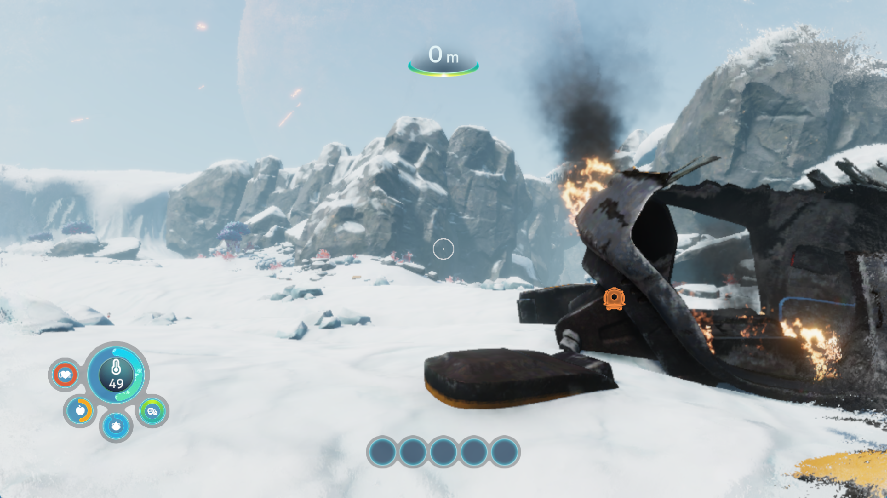
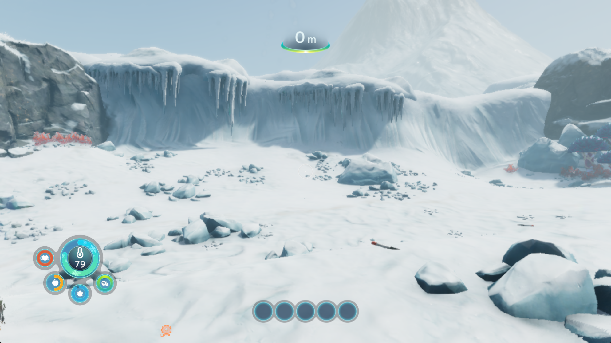
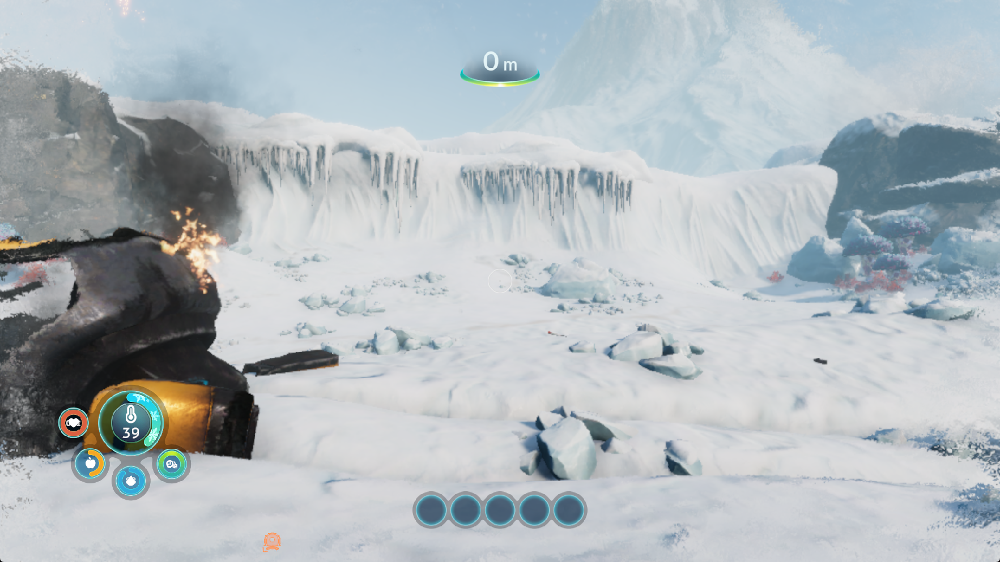
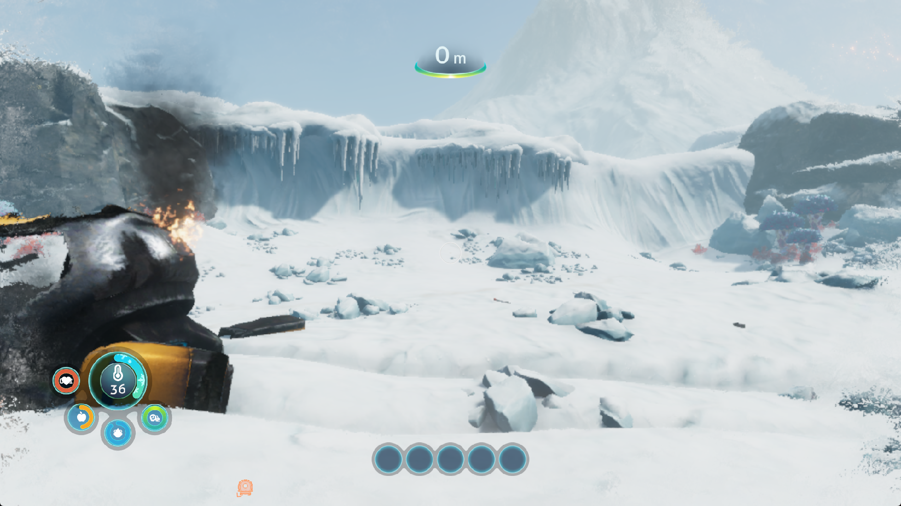

# Subnautica: Below Zero — scalar resource walks, save writes and loading faults

Title: PPSA02457, v1.022.125. Windows development checks use keyboard input,
1920×1080 guest output, the speed preset and the default buffer-cache limit.
The 30 FPS target remains unmet. These checks do not establish a complete
playthrough, accurate rendering throughout the game or reliable loading.

## Scalar resource preparation

The CPU resource interpreter now bypasses scalar execution for vector-only
instructions. It still visits those instructions to record dependencies,
invalidate overwritten lane spills and capture resource checkpoints. Scalar
destinations, lane transfers, VCC/EXEC writes and unknown families retain their
handling. This does not omit instructions from the GPU shader.

A separate correctness regression exposed stale scalar mask values: vector
comparisons and carry outputs could leave the upper mask word, or the entire
secondary scalar destination, marked as a known constant. The interpreter now
invalidates both words of those outputs. Single-word lane reads do not
invalidate the neighbouring register. Real decoded VOPC, CMPX, VOP3 and VOP3B
encodings exercise this behavior. The new test fails before the correction;
all **71 scalar provenance tests** pass afterwards.

An isolated benchmark alternates old/new/new/old resource walks, checking
load contents, read counts and checkpoints. Fixtures contain 4, 16, 64 or 256
blocks of one scalar load followed by 32 vector moves. Full walks take
17.1%, 28.1%, 34.9% and 35.9% less time; checkpoint walks take 14.6%, 26.0%,
30.4% and 32.2% less time. These are interpreter measurements, **not game FPS
improvements**. The benchmark predates the separate mask correction.

## Foreground keyboard input

Windows keyboard polling previously read desktop-wide key state while another
application had focus. Typing could move the character or activate menus in a
background game. Keyboard merging now requires a foreground window owned by
the runner. Losing focus releases keyboard contributions on the next poll;
hybrid controller input is preserved. Two native probe processes confirm that
only the foreground process receives a key, including a focus switch while
the key remains held. Input tests pass (15 passed, one platform skip).

## Live performance and loading before the save correction

The scalar-walk/focus candidate has SHA-256
`978c1f9702c756b4976b8bf04b876edaf35632164b358fea0121047766a0afc9`.
The first run, `out/subnautica-vector-focus-live-20261002`, fails during loading
at `Il2CppUserAssemblies.prx + 0x9ed6`. It follows a corrupt pointer while
scanning objects. The writer responsible for the corruption is not identified;
the trace does not establish that this optimization caused it.

The second run, `out/subnautica-vector-focus-live2-20261002`, reaches the intro
and snowy world and lasts until the diagnostic runner's 1200-second deadline.
A stationary foreground sample records 198 flips (3714–3912) in 30.050504
seconds: **6.59 FPS**. No build or profiler runs during this measurement.
The baseline at a different viewpoint near a glowing plant records 194 flips
in 30.010228 seconds (**6.46 FPS**). The earlier sRGB report's 9.49 FPS also
uses a different view and weather. None is a controlled before/after gain.

At flip 5460, a later world frame takes 134 ms, with 990 draws taking 101 ms,
39 dispatches taking 4 ms and 141 submissions. Fence waits total 3.55 ms.
Resource preparation takes 24 ms and checkpoint preparation 15.25 ms;
these scopes overlap. There are no graphics/compute pipeline-cache misses.
The frame uploads 38,976 KiB, mostly buffers and indices, and reads back
3,411 KiB of buffers. Colour-target uploads/readbacks stay at zero. Buffer
lookups still miss and evict 2,076 entries despite no new host allocations.
Warm pipeline compilation is not this frame's limiting cost.

Sampled frames report zero draw failures, dispatch failures and unsupported
compute programs, with one unresolved scalar binding. This does not prove
that every resource binding or shader calculation is correct.

## Save failure and common filesystem correction

Selecting Save through the normal pause menu fails with an invalid-handle
exception for `/temp0/TempSave/tmp945541/gameinfo.json`. The file exists but
is empty. A bounded firmware trace records successful `open`, `fstat` and
`lseek`, followed by `write(fd=0x164c, length=0x4ba) = -1`.

The exact `libScePosix` import resolves to the runtime writer, which accepts
standard streams and virtual sockets but rejects ordinary file descriptors.
The separate `libkernel` writer already supports mounted files. Runtime writes
now delegate ordinary descriptors to that validated implementation and retain
the standard-stream and virtual-socket paths. No title-specific path or
guest-memory patch is involved.

The regression resolves the exact library/module symbol used by the game,
creates a temporary save file, appends bytes and reopens it to verify persisted
contents. It also checks closed-descriptor and read-only errors and socket
writes. The test initially fails with expected 4 bytes versus -1; after the
correction, **39/39 filesystem/runtime tests pass**. The subsequent live checks
below distinguish persisted contents from successful recovery by the game.

## Remaining work

Resource staging, copying and submission costs still need work. Intermittent
loading corruption, the unresolved scalar binding, rendering artifacts,
full playthrough and audio correctness remain open.

## Installed candidate and normal Save check

The ReleaseFast build passes 7/7 steps. The candidate installed with its matching
PDB has SHA-256
`dc5d9590dcc1907822464eefe00bffb6cbc07e8d09987068a80e2df2e5ee75ea`.
All nine GPU probes pass: vector carry, Wave32 masks, scalar loops, counted
and uniform image loops, scalar pointers, unbound snapshots, resource workers
and sRGB colour. No GPU shader instructions are removed by the CPU shortcut.

`out/subnautica-save-mask-live-20261002` reaches the snowy world. Selecting
Save creates a 211,290-byte `savedata/PPSA02457/slot0000/slot0000.blb` and returns
to gameplay. The firmware trace records the complete write, commit and unmount.
The file independently decompresses with a valid gzip checksum to 749,652 bytes,
including the game's JSON and world data. This proves persisted file contents,
not successful recovery by the title.

The subsequent foreground sample records 210 flips (3446–3656) in 30.011085
seconds: **7.00 FPS**. The weather and temperature change during measurement;
no build, trace toggle or profiler runs during it. This remains short of 30 FPS
and does not establish a controlled gain over the earlier different views.

*Unedited 1765×993 client-window capture; guest output is 1920×1080.*

At flip 3600, the renderer records 130 ms, 986 draws, 39 dispatches and
140 submissions. Graphics preparation takes 22 ms and checkpoints 15.395 ms.
Uploads total 36,858 KiB (24,329 buffers, 12,527 indices, 2 textures), and
buffer readbacks total 3,411 KiB. Colour transfers and pipeline misses are zero.
A separate 10-second CPU profile records 125 renderer-thread samples in
`evaluateInto`, 117 in `memcpyFast` and 21 in `executeScalar`. These counts
locate remaining work; they are not percentages or measured time savings.

## Save metadata defect exposed by restarting

The runner is deliberately restarted after the checks. The fresh process
(`out/subnautica-save-reload-20261002`) lists the slot as **Damaged saved game**
with a year-1 date. Its firmware trace requests parameter type 0 with a
0x530-byte buffer. The old handler interprets type 0 as a title string, losing
the rest of the metadata both when writing and reading it.

The API uses type 0 for the complete structure, followed by title, subtitle,
detail, user parameter and modification time. The field layout agrees with
the local SharpEmu implementation and the public shadPS4
[structure](https://github.com/shadps4-emu/shadPS4/blob/main/src/core/libraries/save_data/savedata.h)
and [parameter handlers](https://github.com/shadps4-emu/shadPS4/blob/main/src/core/libraries/save_data/savedata.cpp).
No implementation source was copied.

The shared handler now supports the complete structure and correct field IDs,
persists modification time, reports string terminators in returned lengths
and keeps enough storage for a 1023-byte detail plus the other fields. An
individual field update preserves the others. The regression first reports
expected 1328 bytes versus 5; **52/52 save/filesystem tests pass** after the
correction, including reopening the mount and short-buffer rejection.
The subsequent in-game check below initially validates saving and menu
recognition; world recovery fails until the later mapping-ownership correction.

The metadata candidate passes a 7/7-step ReleaseFast build and is installed as
`zig-out/bin/game-run.exe`, SHA-256
`0ec117aeea6baa6b7b0166cccd6c37c0029f03aa37a5124c388be4660b46039a`,
with matching PDB
`472b3fc28fa2e03906f8db54ed46fd9724238c47a6f582692b63ce227f4cf4a1`.
Four consecutive follow-ups in the normal working directory fail before
gameplay: guest worker faults at `eboot.bin + 0xe6aa60`, `+0xafc0fb` and
`+0xe6b8e0`, and a host access violation in `hash + 0xf0`. The latter run has
bounded GPU-write tracing enabled; the fourth uses an exception observer.
The traces do not identify the original writer. These failures must not be
reported as stable loading or as proof that the save changes caused them.

A further run uses an isolated working directory under
`out/subnautica-save-isolated-20261002/workspace` for fresh test saves, with
the existing `out` directory shared through a junction. The previous slot is
preserved. This run reaches the continue prompt and intro. Its GPU-write
diagnostics are restored and the exception observer detaches without a fault.

The isolated run also reaches the snowy world. Normal pause-menu Save creates
a **213,388-byte** archive, commits it and returns to gameplay. Its SHA-256 is
`c30b4a242d29ba7cd6b9334484126895c8bcdcc6f2b9d3f0ed02f9953ed0a5d4`.
The metadata now retains the game's user parameter `3` and modification time
`1790926541`. No save files or game assets are manually changed.

On a fresh restart (`out/subnautica-save-isolated-reload-20261002`), Play lists
the slot with its October 2 date and four-minute duration, without the damaged
save label. The title opens the archive and reads the complete parameter
structure. Restoring the world then faults at `eboot.bin + 0xdfe9e0`, following
a corrupt object at `0x275a095f8`. The diagnostic process is deliberately
stopped after capture. **This candidate does not establish save-to-world recovery.**

## Released command-arena aliases

A separate regression finds a stale-pointer path in GPU memory callbacks.
Compact GPU addresses can resolve through a remembered CPU command arena even
after its mapping has been released. The resolver now rechecks the newest
matching CPU range after releasing the alias lock. It rejects inaccessible
backing instead of reviving an older arena with the same low address bits.

The regression maps two arenas, resolves the newest one, releases it and checks
that read, write and fingerprint callbacks reject the stale alias. The original
implementation fails (59/60); the corrected implementation passes **60/60 AGC
submission tests**. Existing full-address precedence and compact-label tests
also pass. This check does not pin mappings against a concurrent release or
detect reuse within a still-mapped allocation. The observed loading faults are
not yet attributed to this path.

## Deferred buffer output after mapping reuse

The alias-check candidate, SHA-256
`40f9d432caad07d2a4e70918bcf796037a57146aa778c063451bfea0fe019e47`,
still fails world recovery. In `out/subnautica-alias-reload-20261002`, bounded
GPU-write diagnostics record a **6 MiB** deferred write at `0x275d00020`, covering
the object at `0x275eb32d0` followed by the guest fault at `eboot.bin + 0x5c5858`.
The renderer previously bound this output to compute program `0x273b5d800`.
The process subsequently exits. A second run records the release of the menu's
large buffer mappings during world loading and another corrupt-pointer fault;
it is deliberately stopped after the memory trace is restored.

The retained buffer cache previously asked whether an address was still
readable. A released mapping followed by a new mapping at the same address
passed that check. Mappings now receive ownership identities that survive
protection and metadata splits but change on remapping, including replacement
with the same physical offset. Buffer entries retain that identity. Before
readback, after a GPU wait and on rebind, mismatched ownership retires the old
result and clears its cached-content proof. An untracked range retains the
existing path; this does not detect allocator reuse inside one live mapping.

The new renderer regression fails before the ownership check. Afterwards,
**29/29 memory and deferred-storage tests** and **60/60 submission tests** pass.
The Vulkan `--buffer-mapping-lifetime` probe verifies original output, rejected
readback into replacement memory and fresh contents on rebind, with both
host-visible and device-local buffers. Neighboring range-publication,
command-write and write-footprint probes pass. The default smoke sequence
still reports its previously documented `IndexedCopyMismatch`; the preceding
candidate reproduces it as well. No full-suite pass is claimed.

The mapping-ownership build passes 7/7 ReleaseFast steps and is installed with
its matching PDB. Executable SHA-256:
`387d065c51e3219d065812ce88210b9acb09cbf9aa618ca8e173e35d2b6a5a8b`.
PDB SHA-256:
`4faf79522d6f2738be9b2cd76bdc7477cbbd26f80c3ea9922532e2356697d1a8`.
`out/subnautica-lifetime-reload-20261002` restores the saved snowy world and
renders the gameplay HUD. After bounded write diagnostics finish, normal
pause/resume and forward input work. The process is deliberately stopped after
the following comparison. **This is the first successful saved-world recovery;
repeated-load reliability and long-session stability are not yet established.**

*Unedited client-window capture after resuming and walking forward; no save or
game asset was manually changed.*

## Cache-capacity comparison in one paused scene

The same process and camera remain paused while two foreground, 30-second
samples compare the host buffer-entry limit. There is no compilation, profiler
or write tracing during either sample. The 4096-entry case records 298 flips
in 30.010254 seconds (**9.93 FPS**); after raising the diagnostic limit to 8192
and allowing it to fill, 273 flips in 30.011032 seconds give **9.10 FPS**.
The retained backing grows from roughly 700 to 1093 MiB. Evictions decrease,
but the recorded upload volume remains about 35 MiB per frame.

These are **paused rendering measurements, not gameplay FPS**. This single
A/B order does not establish a general regression, but offers no evidence for
shipping a larger default. The host limit is restored before stopping the
process; that does not immediately shrink existing entries, so a second 4096
measurement in this process would not be a valid fresh control.

A separate CPU profile with 8192 entries finds 100 sampled instruction pointers
at the call to `synchronizeGuestBufferAliases`. That path scans every retained
buffer after a write-history overlap indication. The subsequent optimization
uses the existing overlap index, keeps the exact overlap and writer-order tests,
and bounds bucket work before falling back to a full scan. A regression for
128-, 512- and 4096-byte queries first fails with a complete cache scan; all
33 targeted tests and 154 backend/index tests pass after the change. Live
before/after performance is checked below.

## Second saved-world recovery and bounded overlap queries

The next ReleaseFast build restores the same archive in a fresh process,
`out/subnautica-overlap-reload-20261002`. This is the **second consecutive
successful recovery** after the buffer ownership correction. It uses the
unchanged 4096-entry buffer limit. The executable SHA-256 is
`c18cbfd1036a27b276996518d5bc2b658f06f1e154e5efa385d2358d97d36045`;
the matching PDB is
`d58a59b9ebb6eea969d743f36351b59e51c8ed9502898d0876a57f67cde2c7c9`.
The target Vulkan lifetime, range-publication, command-write, write-footprint
and incoming-eviction checks pass. This is not a clean default-smoke result.

In one paused view, a host-only diagnostic switch alternates the original
linear alias scan and the indexed scan. The exact overlap tests, writer order,
cache contents and capacities are unchanged. Four consecutive foreground
samples give:

| Order | Alias lookup | Flips | Seconds | FPS |
| --- | --- | ---: | ---: | ---: |
| A1 | Linear | 367 | 30.012590 | 12.23 |
| B1 | Indexed | 369 | 30.009703 | 12.30 |
| B2 | Indexed | 373 | 30.009376 | 12.43 |
| A2 | Linear | 358 | 30.009210 | 11.93 |

The differences are small; one ABBA sequence does not establish a robust FPS
gain. These are **paused rendering rates**, including the cold-effect overlay,
not gameplay measurements. The indexed query avoids unrelated candidates in
the tested buffer-sized ranges while preserving the full-scan fallback when
bucket work is too large. The normal indexed mode is restored afterwards.

After resuming and the character's natural respawn, a separate stationary
world sample records **300 flips / 30.010219 seconds = 10.00 FPS**. The camera
remains fixed while weather and the temperature/frost effect change. One-second
intervals vary from 5 to 13 flips. No compilation, sampling profiler or detailed
write trace runs during this measurement. The view differs from the earlier
7.00 FPS capture, so these values do not isolate an optimization gain.

*Unedited 1765×993 client capture, 1920×1080 guest output. The later screenshot
shows the cold effect spreading around the edges.*

A separate 10-second profile after resuming records 81 renderer-thread samples
in `memcpyFast`, 67 in the scalar evaluator and 36 in the Windows stack probe.
Only 10 samples are in buffer staging. This profile also includes blocking
waits and a respawn; it is a lead for further work, not a CPU-time breakdown or
a direct comparison with the previous 8192-entry profile. The process is
deliberately stopped after the measurements to replace the diagnostic build.

**30 FPS remains unmet.** Two successful recoveries do not establish long-session
reliability. The mapping check and subsequent copy are still separate operations;
concurrent remapping and suballocator reuse inside a live mapping remain outside
this protection. Unresolved scalar bindings, other rendering defects, audio
correctness, the default smoke mismatch and full-playthrough verification remain
open.

## Reusable draw state and another loading race

The next candidate moves the three scalar evaluations and two specialization
arrays used by a draw into exclusively borrowed renderer storage. A nested
draw obtains a separate allocation; each evaluation still resets its state,
and collectors replace the used register range. Pointer-load recovery also
uses an empty register array instead of a complete unused evaluation object.
PDB frame records show `drawGuestGraphics` shrinking from **447,424 to 32,640
bytes** (92.7%). This reduces stack probing, not shader instructions. It does
not by itself demonstrate a game FPS gain.

The candidate passes 71 scalar-analysis and 154 backend/index tests. Six Vulkan
checks pass: buffer mapping lifetime, sRGB colour, resource workers, scalar
pointers, wave32 masks and incoming-buffer eviction. A 7/7-step ReleaseFast
build installs executable
`e9213a175cc444a7204c353d17d9ba94c2fb8dc73dcaa395f974b244decde088`
and matching PDB
`129f159e22799af91f572adf86b1f1fbb5d9876855fb74419eb096670ec39317`.

Its first live follow-up, `out/subnautica-draw-scratch-reload-20261002`, selects
the same valid save but exits during loading with host access violation
`hash + 0xf0`, reading `0x285d50000`. It does **not** reach a gameplay benchmark.
The same hash failure occurred before this optimization; this observation
alone neither attributes nor exonerates the new draw-storage change.

The guest read and fingerprint callbacks checked accessibility under the
mapping lock, then copied or hashed the native pointer after releasing it.
Another guest thread could unmap the range in that interval. The next fix
holds a readable lease through the complete copy/hash, including completion
of parallel-copy workers. Compact aliases retain full-address precedence and
newest-arena selection; no alias lock is held while acquiring the mapping
lock. Native CRT allocations keep their accessibility fallback, but CRT frees
are not serialized by the guest mapping lock.

A regression holds a lease while another thread attempts to unmap the source,
verifies repeated hashes, releases the lease and confirms that the unmap
finishes and later reads reject the address. **34 memory/lifetime/index tests
and 60 AGC tests pass.** This read protection does not close the separate
ownership check-to-write interval described above.

The lease build passes 7/7 ReleaseFast steps. The installed executable has
SHA-256 `8732cfbbbb8b95d4092b28c72d6116172b29a1c3595abbdc87e73847d47f1f67`;
its matching PDB is
`d892852bfe1d2a199d5ae04060f4561721e587cf5c4275b63e1cc2327f91075e`.
`out/subnautica-read-lease-reload-20261002` restores the same saved world.
Following the natural respawn, a stationary unpaused sample records **259 flips
/ 30.009133 seconds = 8.63 FPS**. Weather, frost and loading warmth differ from
the earlier 10.00 FPS sample; this is not a controlled performance comparison.
No build, sampling profiler or resource-failure trace runs during the sample.
The process is deliberately stopped after diagnostics for a fresh repeat.

*Unedited client-window capture at the end of the unpaused sample.*

Bounded resource diagnostics still report one unresolved
`s_buffer_load_dwordx4` at pixel program `0x24d614700 + 0x8`. The shader samples
a texture and multiplies its components by four scalar coefficients. A frame
trace also finds this shader retained during stencil draws with colour writes
disabled. That does not yet identify which draw emitted the unresolved-resource
counter or establish whether a visible pass lost data. No claim that every
shader resource resolves is made.

A fresh repeat with the **same lease executable**,
`out/subnautica-read-lease-repeat-20261002`, exits during world loading at
`hash + 0xf0`, reading `0x284190000`. The read lease therefore does **not**
establish a fix for this observed crash. It closes the tested unmap/read window,
but the failing hash caller or another lifetime path still needs to be located.

## Default Vulkan smoke fixture coherence

The earlier `IndexedCopyMismatch` also received a separate check. The indexed
copy kernel passes in the isolated unsupported-texture continuation probe. In
the full sequence its input addresses overlap preceding GPU attachments, then
the fixture overwrites those bytes on the CPU. Unlike the game runner, that
fixture provided no fingerprint callback to expose the new CPU contents.

The default sequence now supplies its existing fingerprint implementation.
The complete default `vulkan-smoke` run passes: 19 translated dispatches, 13
guest draws, sampled/storage image checks, synchronization and presentation;
the build reports 4/4 successful steps. Evidence is in
`out/subnautica-smoke-coherence-20261002.log`. This resolves the test-fixture
mismatch recorded above, not a game performance defect or the live hash crash.
