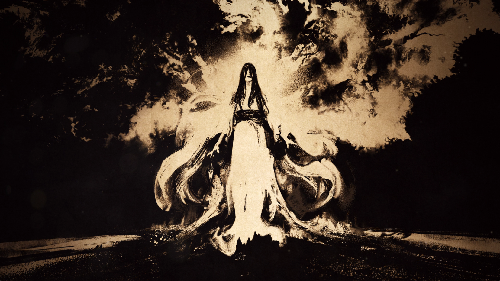
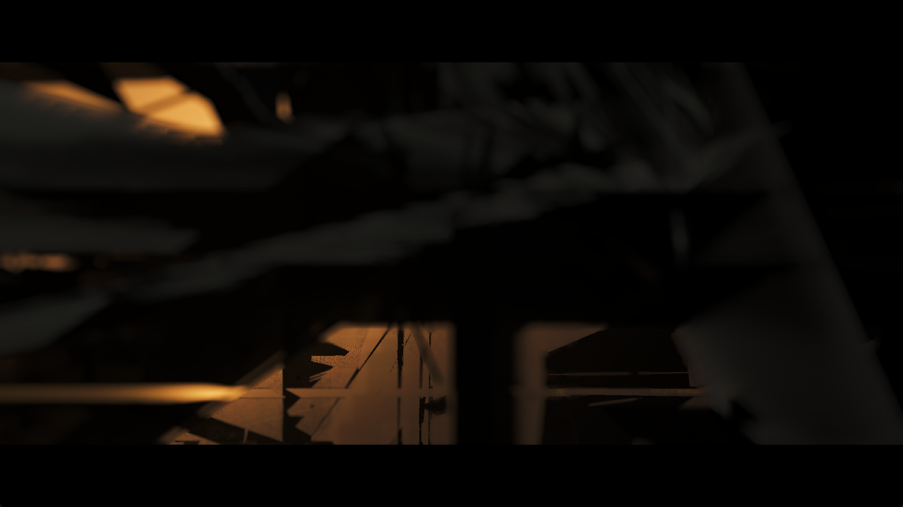
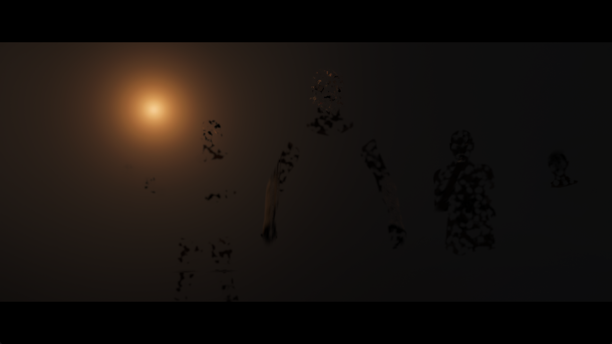
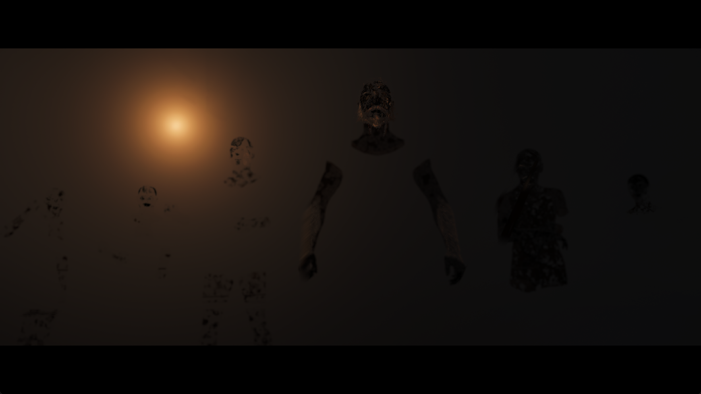

# Yotei array-layer coherence investigation

The October 4 investigation continues toward the scene after the tree and the
following cinematic. Controllable gameplay has not yet been confirmed.

## Control run

The October 3 candidate (`8b375c2139e23e47b27a667bba0271541d851368bb073b779864494a9c441e12`)
was launched with the default renderer cache budgets, 1920×1080 output, Speed,
and the Performance game preference. Original-culling diagnostic switches were
not enabled. A 30.046-second interval during the tree transition presented 31
frames: **1.032 FPS**. This is an animated setup transition, not gameplay FPS.
Vertical artifacts and missing/dark scene detail remain visible.

The run passes brightness, difficulty and experience selection. During the next
loading transition, Windows commit reaches 59,753,652,224 bytes against a
60,385,345,536-byte limit. The test harness deliberately terminates its process
after three samples below 768 MiB of commit headroom, at 1,179.629 seconds.
This is not a spontaneous guest crash. The last compiler inspection shows one
active foreground job; the 1,026-entry compute warmup had finished without a
reported failure.

A warmed frame (flip 1443) takes 1,019 ms, uploads 701,610 KiB and reads back
412,276 KiB. Graphics resource preparation accounts for 389 ms and fence waits
for 219,699 µs; these categories overlap and must not be added together.
Neither graphics nor compute pipeline creation misses occur in that frame.

Five sampled RG8 arrays, 2048×2048 with nine or ten layers, account for 376 MiB
of repeated full uploads. Matching render targets exist for individual slices,
but cannot serve the complete array view directly.

## Renderer changes under test

Unmipped color-array backing observations and publication previously included
every preceding slice. Changing a neighboring slice could therefore invalidate
a resident GPU producer whose own bytes had not changed. Restrict both the
observation and publication to the selected slices, as already done for mip
subresources. This also reduces fingerprint and guest-write spans.

A previously uploaded sampled array can now receive compatible dirty render
target slices by ordered GPU copies. Preserve the other layers from that
initialized snapshot. Require unchanged tracked CPU backing, matching source
layout and format, and no unhandled dirty producer. Reject same-batch prepared
bindings, ambiguous overlapping producers, metadata/compressed surfaces and
canonical-alias mode. Fall back to normal publication and upload when these
conditions cannot be proved. Report successful copies in `gpu sampled arrays`.

## Validation

- Eleven ReleaseSafe color-surface tests pass, including a regression for
  neighboring unmipped slices with linear, 4 KiB and render-target tiling.
- `vulkan-smoke --sampled-array-refresh` passes with timeline scheduling both
  disabled and enabled under Khronos validation, without validation errors.
  It checks two queued color revisions, nonzero untouched layers, CPU-write
  rejection, prepared-binding protection, and zero extra texture upload/readback.
- `build-vulkan-smoke` builds probes without running them. Run these probes from
  a separate working directory so their driver cache cannot replace the game's
  `vulkan_pipeline_cache.bin`.

## Candidate run

The ReleaseFast candidate is SHA-256
`3b1e2b38b86d47fdedf6e95fc1273e509f126faa3e241570b99e1b8f62bd3ef4`.
It starts with the same default renderer cache budgets and game/output presets as
the control. No cache budgets or original-culling switches have been changed
through the tree measurement.

| Visible interval | Presented frames | Duration | FPS |
| --- | ---: | ---: | ---: |
| Wolf brightness calibration | 37 | 30.046 s | 1.231 |
| Tree transition into difficulty selection | 37 | 30.046 s | 1.231 |

The tree interval improves over the control run's 1.032 FPS in this pair of
launches. Cache history and animation phases are not identical, so this is not
a universal speedup estimate. No profiler, build, input or screenshot capture
runs during either measurement.

The tree's bark and branches are visible in the candidate, whereas the control
capture at difficulty selection is largely dark. Bright vertical streaks remain.
In-game counters confirm array refreshes: for example, flips 846 and 847 each
copy eight layers into two sampled arrays. Other arrays still use full uploads.

After experience selection the next loading transition again approaches the
Windows commit limit. Reducing the live storage-image budget from 2,560 to
1,536 MiB does not prevent the diagnostic guard from stopping the process:
58,814,091,264 bytes committed against a 59,294,818,304-byte limit. This budget
change happens after the reported measurements. The last inventory records
22,050,426,880 private process bytes; the next scene and character control are
not confirmed. This is another deliberate diagnostic stop, not a guest crash.

## Shared storage transfer buffer

The tree inventory contains 1,429,907,328 bytes of persistent host transfer
buffers for storage images, in addition to the GPU images themselves. Ordinary
batched uploads already use the upload ring. Replace those per-image host
mirrors with one lazily allocated buffer that grows to the largest transfer.
Keep the image cache budgets and contents intact.

Readbacks and depth/stencil bridges order their reuse with transfer barriers.
Growing the buffer defers destruction of the previous allocation until its
queued users retire. Uploads outside the ring wait before overwriting shared
host memory, including the initial upload to a newly created image. Readbacks
still wait for their GPU result before publishing guest bytes.

ReleaseSafe native probes pass with Khronos synchronization validation:
`--storage-reuse`, `--storage-cpu-reuse`, `--depth-storage`,
`--color-cube-publication`, and `--sampled-array-refresh`. No validation errors
are reported; the layer emits a configuration deprecation warning for the
environment variable used to enable synchronization validation. The storage
probe verifies 320 resident views without allocating a transfer buffer, 1,152
queued writes, a four-byte shared readback buffer, dirty-image eviction,
buffer growth/reuse while copies are queued, and a later CPU upload. These are
correctness and allocation checks, not game FPS measurements.

The combined ReleaseFast runner is SHA-256
`9bb91d692ceacf578afc7168ad9085e103492a07743bebfa3445e4dce5b8f5cc`.
At this checkpoint, `zig-out/bin/game-run.exe` and its PDB were updated to this
build; the previous installed pair was retained locally for rollback. Public
release archives are unchanged.
With unchanged default cache budgets, its tree transition presents **38 frames
in 30.047 seconds: 1.265 FPS**. The earlier array-only candidate presents 37:
one extra frame does not establish a meaningful FPS gain. Both show bark and
branches, with bright vertical streaks still present.

The new tree inventory retains a **72 MiB** shared storage transfer buffer,
versus approximately **1,364 MiB** of per-image buffers in the array-only tree
inventory. Private process memory is 14,337,359,872 bytes versus
15,554,560,000 bytes in those snapshots. Cache contents and animation phases
differ slightly; the structural removal of per-image buffers is verified, but
the total process-memory difference is not a controlled benchmark.

## Continuation into the cinematic

The combined build passes the bonus notices, wolf brightness calibration,
Medium difficulty and Standard experience selection. The camera moves past
the tree into a very dark cinematic. Opening Options displays `PAUSED` and a
subtitle toggle, confirming that this is still the cinematic rather than
controllable gameplay. Resuming removes that overlay, but character control
has not been established. The owned diagnostic process is deliberately stopped
after approximately 36 minutes for the next isolated build and native tests.

Flip 1384, before any live cache-budget changes, takes **59,275 ms**. Graphics
pipeline creation accounts for **35,376 ms across 550 misses**; the frame also
uploads 6,412,920 KiB and reads back 2,197,188 KiB. Frame categories overlap and
must not be added together. This is a cold-transition stall, not a stationary
gameplay FPS sample. A later pipeline inventory contains 1,379 graphics
pipelines and 1,180 distinct exact shader pairs; trivial render-state
deduplication alone cannot remove most of that compilation.

Host commit approaches the limit again. To continue diagnosis, the live sampled
budget is changed from 2,048 to 1,024 MiB and the storage budget from 2,560 to
1,280 MiB. The sampled budget is subsequently raised to 1,536 and then set to
1,280 MiB; the render-target limit is reduced from 128 to 64. These changes are
**diagnostic only**, occur after the reported tree measurements, and are not
installed defaults. They reduce retained resources but cause substantial churn:
later frames upload roughly 3.3–3.8 GiB of sampled textures. Even with only
one or two new graphics pipelines, individual frames still take 8–15 seconds.
Some of those frames render the pause overlay, so they are not reported as
gameplay FPS or a controlled comparison against the default budgets.

One pixel-shader resource lookup is unresolved (`s28`, program
`0x800026ed00`, instruction `0x8b4`), and its draw is rejected. Zero unsupported
compute-program reports do not establish complete shader or resource coverage.
Dark rendering, tree streaks, resource churn and character control remain open.

## Read-only storage-image reuse

The sampled fallback cache includes the storage producer's eviction sequence
in its content identity. A read-only storage binding advances that sequence
without changing any texels, needlessly invalidating an already uploaded
sampled view. Use the existing storage content generation instead. Actual
uploads, image writes, clears and depth-to-storage copies advance this
generation; read-only bindings do not.

The extended `--sampled-storage-refresh` native probe reproduces the problem
before the change: a read-only image dispatch causes a third sampled upload
where only two are expected. With the change, four cases pass under Khronos
synchronization validation: image/buffer producers, each with timeline
scheduling disabled/enabled. Pixel readbacks verify pending and published GPU
writes, a sampler change, read-only reuse, and a later direct CPU update outside
the sampled texture's sparse probe. No validation errors are reported.

The ReleaseFast runner is SHA-256
`7d91b76040d7c9136de8f5b59738626d48bf22ee01aa0e0c788455e7b58364da`.
The installed executable and PDB are updated; the preceding pair remains in a
local backup. The game repeat starts with the unchanged default cache budgets,
1080p output, Speed preset and Performance game preference.

| Visible interval | Presented frames | Duration | FPS |
| --- | ---: | ---: | ---: |
| Wolf brightness calibration | 38 | 30.044 s | 1.265 |
| Tree transition into difficulty selection | 38 | 30.044 s | 1.265 |

The tree result matches the preceding shared-transfer build. **No game FPS
gain is demonstrated for this additional change.** Bark and branches remain
visible, and the bright vertical streaks remain. Neither measurement overlaps
input, profiling, screenshot capture or a background build. The new tree
inventory retains the 72 MiB shared transfer buffer and records 14,654,386,176
private process bytes; this is not a controlled memory comparison.

A separate eight-second resource trace is enabled and then restored before
these measurements. It records unresolved buffer-descriptor discovery in
compute and export-stage branches; no `storage incomplete` fallback is reported
in that short interval. The per-frame `storage_unresolved` counter reaches
approximately 900, but includes potentially inactive branches and is not proof
of that many executed missing accesses. First-occurrence graphics resource
failures now retain bounded scalar diagnostics without requiring verbose
buffer-lifetime tracing.

## Illustrated movie and compilation stalls

The read-only reuse build continues past the tree and the dark 3D cinematic
into a clearly visible illustrated narrative movie. This is progress beyond
setup, **not confirmation of character control**. No pause input is used in
this repeat.

A 30.045-second interval during the cold 3D transition presents one frame
(0.033 FPS). It includes first-use compilation stalls and is not a warmed
gameplay measurement. With the default 2,048 MiB sampled-image budget, later
flip 1491 takes 10,429 ms despite only one graphics and three compute pipeline
misses, totaling 8 ms of pipeline creation. It uploads 1,775,144 KiB of textures
and records 5,079 sampled misses and 5,016 evictions. Graphics resource
preparation takes 6,620 ms, with 5,060,485 microseconds of fence waits across
the frame. These overlapping categories must not be added together.

At 13:37:42 local time, the sampled-image budget is increased live from 2,048
to 2,560 MiB; storage-image and render-target budgets remain unchanged. The
scene switches to video immediately afterward. Lower texture churn in the
movie therefore **does not demonstrate a benefit from this budget change**.
The installed default remains 2,048 MiB. The live experiment is reverted to
that value at 13:49:46 to preserve memory headroom during compilation.

Subsequent loading stalls hold the last movie image on screen. Flip 1605 takes
239,431 ms, with 234,886 ms spent creating 15 compute pipelines. Flip 1606
takes 105,038 ms, including 104,146 ms of compute pipeline creation. A short
thread sample finds active NVIDIA compiler work while the submitted GPU tick
is already complete. The foreground compiler queue remains active; its startup
warmup has finished. These are observed compilation stalls, not proof of a
deadlock or a game crash.

Two pending compute modules are captured locally, approximately 1.6 MiB each.
One has a 364-case dispatcher; the other has 151 cases and 140 loops. The first
passes SPIR-V validation. An offline `spirv-opt -O` experiment reduces it from
1,628,004 to 1,448,996 bytes in 3.50 seconds, also passing validation. This has
not yet been timed in the driver or executed for comparison, and is not
enabled in the renderer. No game shader bytes are published.

The resource diagnostic still records a rejected pixel-shader draw at
`0x800026ed00`, instruction `0x8b4`, sampled resource `s28`. Its descriptor
comes through a vector-loaded pointer and nested material table; a correct
fix must resolve and stage that table, not substitute a dummy texture.
Post-movie control, steady gameplay FPS, dark lighting and remaining tree
streaks are still open at this checkpoint.

The repeat later presents black frames while compiling the next 3D scene.
Flips 1607, 1608 and 1609 take 396.2, 224.8 and 123.9 seconds. These remain
cold transitions: flip 1607 alone spends 222.1 seconds on graphics pipeline
creation and 146.6 seconds on compute pipelines. Later logs explicitly skip
compute dispatches with unsupported sampled resources (`0x80003aa700`,
`0x8000364b00`) and storage images (`0x8000265d00`, `0x80003cfa00`). Shader
translation without an unsupported-opcode report does not imply those
dispatches execute. The owned run is manually stopped after 2,370 seconds
for an isolated rebuild; it is not recorded as a spontaneous crash.

## Color attachment transfer memory

The last inventory of that run contains **1,054,163,296 bytes** of permanently
allocated host readback buffers for 128 color targets, in addition to their
GPU images and the 72 MiB shared storage transfer buffer. Remove those
per-attachment buffers as well. Initial color uploads use fresh draw-ring
slices, retaining their offsets through command recording, including MRT
attachments and ring spills. Outside a batch, or for oversized uploads, an
independently owned temporary buffer is retired after its queued users.

Color readbacks now use the existing shared image transfer buffer. Transfer
barriers order its reuse with storage-image readbacks and depth bridges;
host reads still wait for completion. The `gpu targets` diagnostic reports
`shared_image_transfer_mib` rather than the removed per-target allocation sum.

Six ReleaseSafe native probe groups pass with Khronos synchronization
validation and no validation errors: `--target-reuse`, `--integer-colors`,
`--sampled-array-refresh`, `--color-cube-publication`, `--storage-reuse`, and
`--depth-storage`. Target reuse checks both 64/128 entries and timeline
scheduling disabled/enabled, preserving the complete pixel result when
repeated CPU reseeds are queued. It retains one 256-byte shared readback
buffer. The MRT probe seeds four attachments with distinct untouched pixels,
forces ring overflow, and checks those pixels and rendered exports, including
the source offsets and spill lifetime.

The ReleaseFast repeat uses runner SHA-256
`58977d5e64d0e763ee8b37d189016ed3e5af850eda032e46f3f100654f6a1d72`,
subsequently installed with its matching PDB in `zig-out/bin`. With the same
1080p output, Speed mode and performance preference, brightness presents
42 frames in 30.045 seconds (**1.398 FPS**); the tree presents 42 in 30.047
seconds (**1.398 FPS**). The preceding build presented 38 frames in each
interval. This is a small observed increase, not a controlled attribution:
pipeline-cache history and animation position differ. No input, profiling,
capture or compilation overlaps either interval.

The tree inventory retains a **72 MiB shared image transfer buffer** and no
per-color-target host readbacks. Tree detail remains visible, including the
unresolved bright streaks. This repeat also reaches the illustrated movie.
It is manually stopped after 1,492 seconds for the next format fix; character
control and post-movie gameplay FPS remain unconfirmed.

## Packed normalized render targets and compute reads

Selective resource diagnostics identify a concrete reason for two rejected
compute dispatches: program `0x8000265d00` at `0xf0`, and `0x80003cfa00` at
`0x29c`, load valid T# tuples whose unified format is **30**. The decoder
rejects that encoding before an image can be bound. AMD's
[GFX10 format table](https://chromium.googlesource.com/chromiumos/third_party/mesa/+/refs/heads/stabilize-13982.70.B-chromeos-amd/src/amd/registers/gfx10-rsrc.json)
names it `10_11_11_UNORM`; the local KytyPS5 format definitions also retain
this normalized packed format. This is descriptor/ISA evidence, not copied
shader code.

The renderer also previously represented `CB_COLOR_INFO` format 6 with
number type UNORM as `B10G11R11_UFLOAT_PACK32`. Those bit patterns have different
meanings. The new implementation retains guest bits in an `R32_UINT` image,
packs normalized fragment exports into 11/11/10 bits, and decodes normalized
channels at compute `IMAGE_LOAD`. Compute stores clamp and quantize back to
the packed representation. Component selection, default alpha and export
component permutation remain explicit. Floating-point format 36 retains its
native float representation.

Vulkan has no matching packed UNORM attachment, so blending and
partial RGB attachment writes remain explicitly unsupported. Filtered sampled
views of format 30 are not implemented by this change. The fix covers the
observed compute image reads and full RGB attachment exports; it does not
claim complete shader or format coverage.

Four descriptor tests pass. ReleaseSafe `--packed-unorm` validates 64-pixel
reads with independent packed seeds, changed selectors and input data,
normalized stores with out-of-range values, and exact fragment-export bytes.
The storage cases pass with timeline scheduling off and on. Native
`--integer-colors`, `--sampled-storage-refresh`, `--storage-reuse` and
`--image-d16` also pass. All five groups run with Khronos validation and
synchronization validation, without VUID or synchronization errors.

The ReleaseFast repeat with runner SHA-256
`a2b61466d8a08c2dc23f5d05811169dd44ce81880603a9f026edbb840faaddc8`
reaches brightness and the tree. Each presents 37 frames in 30.049 seconds
(**1.231 FPS**). The previous runner presented 42 frames per interval; this
repeat shows no performance improvement, with differing pipeline-cache and
animation history. Tree streaks remain. The run proceeds into the dark 3D
cinematic. A subsequent 60.090-second interval presents only one frame
(**0.017 FPS**), including a long stall; this is not steady gameplay FPS.
Character control is not reached.

The live compute-program sampler observes both previously rejected programs,
and this log contains no `UnsupportedStorageImage` rejection. This is narrower
evidence than complete shader correctness. Missing pixel resource `s28` and an
unresolved compute sampler in `0x800027c200` still reject work. The packed
attachment path also exposes a new `UnsupportedColorTarget` rejection: a
six-attachment pass enables source-alpha blending on its packed UNORM plane.
Later frame counters record one failed draw per frame and no failed dispatches,
while roughly 11,800 storage-resource candidates remain unresolved; those
candidate counts are not proof that every candidate is accessed by the GPU.
That operation is not yet implemented for the integer representation, so this
candidate is not installed over the preceding local runner.

The dark cinematic continues to upload several GiB of texture data per frame.
For example, flip 1617 reports 5,590,390 KiB of uploads, including 4,043,666 KiB
of sampled textures, 5,847 texture misses and 5,957 evictions. Its 11.813-second
frame includes 5.251 seconds of fence waits. A matched-symbol CPU sample also
finds substantial time mapping and unmapping streaming memory. The run is
deliberately stopped for an isolated rebuild; it is not a spontaneous crash.

The preceding repeat also reports missing streamed texture backing (`GuestMemoryReadFailed`);
read-only Windows mapping queries find reserved, unreadable ranges at several
reported texture addresses. This separate issue remains under investigation.

## Color content generations and virtual-only mapping batches

Render-target LRU ages no longer stand in for texture-content changes. A
separate global content generation advances on actual GPU writes and seeds;
rebinding or reading an attachment only changes its eviction age. Draws with
color writes disabled preserve the content generation of initialized targets.
Depth operations and other writable MRT attachments still execute normally.
This prevents a read-only use from invalidating a sampled snapshot without
discarding real changes.

Batch-map coalescing now requires contiguous physical offsets only for direct
mappings. Unmap and protection entries can retain zero or stale unused offsets
while adjacent virtual ranges are combined. Per-entry alignment, operation,
length, protection and memory-type constraints remain enforced; invalid slices
cannot become valid merely because their combined size is page aligned. Failed
batches retain the processed prefix count.

Seven ReleaseSafe Vulkan probe groups pass with Khronos synchronization
validation and no VUID or synchronization errors: sampled-array refresh,
integer colors, target reuse, storage reuse, color-cube publication,
sampled-storage refresh, and feedback snapshots. The new checks retain a
refreshed sampled image after a producer rebind and verify unchanged pixels
and generations for a masked MRT attachment while another attachment is drawn.
Five filtered kernel tests pass, including native protection/unmapping,
invalid sub-page entries and partial batch progress. Runtime performance of
these changes remains to be measured in the rebuilt runner.

## Color-generation repeat and correlated material pointers

The isolated `65d5fa9609ec` runner presents 39 frames in 30.047 seconds on the
wolf screen (1.298 FPS) and 39 in 30.044 seconds at the tree (1.298 FPS). The
post-tree interval presents only 4 frames in 60.092 seconds (0.0666 FPS).
Measurements count presented frames without input, screenshots, sampling or
compilation during each interval. The two-frame tree difference from the
packed-color repeat is too small, and cache history differs too much, to
attribute a performance improvement to the content-generation change.

The dark cinematic advances, but bodies and lighting remain incomplete. This
run is deliberately stopped for rebuilding; character control is not reached.
A live allocation census finds approximately 1,014 MiB of color attachments,
320 MiB of depth attachments, 1,763 MiB of storage images and 2,045 MiB of
sampled images. Process private memory is approximately 22 GiB. Individual
frames still upload several GiB and spend many seconds waiting for GPU work;
these counters do not establish a single cause for the stalls.

A local replay of the failing pixel shader identifies a lost material-table
address: two `v_readfirstlane_b32` operations select a pointer produced by the
same vector buffer fetch, with WORD_0 sign extension removing the upper tag.
The proof now follows the common active lane through `s_andn1_saveexec_b64`
and accepts only bounded records with one non-null pointer. Distinct pointers,
unknown memory, changed execution masks and unsupported transforms retain
the unsupported path. Payloads are reread rather than cached as constants.

A conservative material-index bound also includes unused non-descriptor
records. The candidate collector retains decodable textures and marks this
case for a GPU check of the actual selected tuple. Both linear and hashed
lookups retain exact descriptor matching, including mixed 2D/3D banks. An
active unsupported tuple produces an explicit error; an unused malformed
record does not reject the entire draw. The captured material-table replay
now finds 60 distinct image descriptors; this is resource-discovery evidence,
not proof that the complete game shader renders correctly.

Eight focused GPU analysis tests and the pointer-staging tests pass. Native
Vulkan checks cover known pixel colors, empty descriptors and active malformed
descriptors with small and hashed mixed-view tables. Existing indirect-image,
graphics-descriptor-reuse and deferred sampled-fault probes pass with Khronos
synchronization validation. The `60cfcb943c44` game repeat measures 38 frames in 30.046 seconds on the
wolf screen (1.265 FPS), 37 in 30.045 seconds at the tree (1.232 FPS), and
3 in 60.099 seconds after the tree (0.0499 FPS). Incomplete character surfaces
remain. This candidate still rejects the material draw because its sampler
cannot be recovered. It is deliberately stopped for rebuilding. The installed
runner and release archives are unchanged.

## Checked material samplers and sampled-lookup translation reuse

The captured material shader obtains its sampler from two 136-byte records.
A possible `-1` selector previously made the analysis enumerate unrelated
fields at eight-byte intervals. Signed constant bounds now retain the negative
range and exclude wrapped offsets only when they cannot land inside the table.
Negative or oversized selectors still prevent an unconditional sampler proof.

When all in-bounds sampler records agree, the fragment path can use that
sampler with a GPU comparison of all four actual sampler words. A non-null
image with an unexpected sampler reports an explicit resource fault; null
images and inactive invocations retain their existing behavior. This requires
fragment storage and atomics support. Ambiguous records and inaccessible
memory still fail preparation. The captured replay now recovers both the
material pointer and the shared sampler, without changing guest registers.

Five focused staging tests pass. The native sparse-pointer probe verifies 26
cases across linear/hashed lookups and mixed 2D/3D images, including in-bounds,
out-of-bounds and inactive sampler selections. Large 4,352-texture tables,
deferred sampled faults and graphics descriptor reuse also pass with Khronos
synchronization validation and no VUID or synchronization errors.

Sampled-image lookup payloads no longer produce a different SPIR-V cache key
when the shader reads those payloads from its runtime lookup buffer. Exact
runtime descriptor matching remains. Lookup layout, bindings, image dimensions,
fault checks and all other code-generating options still enter the key; linear
lookups retain their literal words. Original bindings are validated before a
cache hit. The focused cache tests compare a reused module against a fresh
translation and reject invalid candidate tuples.

The combined `ea19ad75fc5f` runner repeats the tree at 37 presented frames in
30.046 seconds (1.231 FPS), unchanged from the material-pointer candidate.
A post-tree interval presents 5 frames in 60.094 seconds (0.0832 FPS). It
covers a different moment of the cinematic than the previous three-frame
interval, so this is not evidence of a sustained speedup.

The previous pixel-resource rejection at `0x8b4` is passed. Preparation of the
same `0x800026ed00` shader now reaches `0x22f0`, where it reports a 1D-array
image incompatible with the 2D operation. That instruction loads its texture
from an indexed 136-byte table. Its descriptor provenance and metadata fallback
still need investigation; adding a guessed image-type conversion would not
establish correctness. The `0x800027c200` compute sampler and source-alpha
blending on the packed UNORM attachment remain unsupported.

A genuine post-tree capture remains dark and incomplete. Tree streaks persist,
and character control is not reached. The pause overlay responds after a held
Options input but offers no visible skip action. System available physical
memory falls below 1 GiB during this run; Windows raises its commit limit
automatically. No pagefile setting or cache budget was changed. The diagnostic
is deliberately stopped for further work, not terminated by a guest fault.
The installed `zig-out/bin/game-run.exe` and public release archives remain
unchanged; this candidate is isolated under `out/yotei-gameplay-20261004`.

Local KytyPS5 source review finds texture garbage-collection thresholds derived
from its reported memory budget (`textureCache.cpp`). This is a useful direction
for a coordinated renderer budget, not a measured optimization copied into this
candidate. Repeated texture uploads and fence waits remain major costs.
