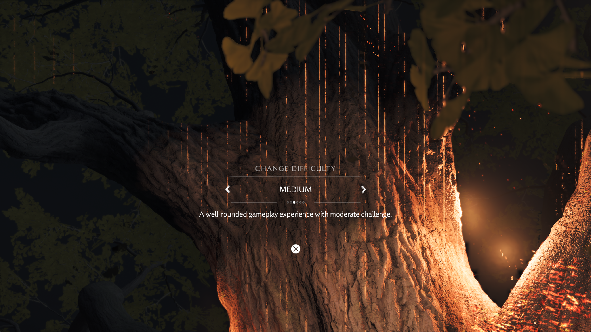
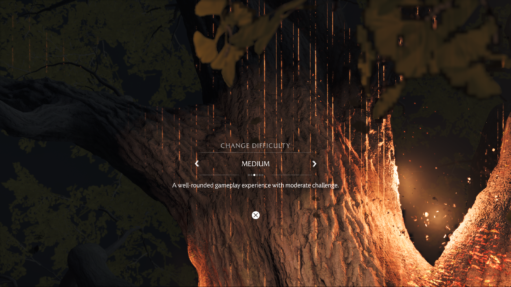

# Yotei array-layer coherence investigation

The October 4 investigation continues toward the scene after the tree and the
following cinematic. Controllable gameplay has not yet been confirmed.

## Control run

The October 3 candidate (`8b375c2139e23e47b27a667bba0271541d851368bb073b779864494a9c441e12`)
was launched with the default renderer cache budgets, 1920×1080 output, Speed,
and the Performance game preference. Original-culling diagnostic switches were
not enabled. A 30.046-second interval during the tree transition presented 31
frames: **1.032 FPS**. This is an animated setup transition, not gameplay FPS.
Vertical artifacts and missing/dark scene detail remain visible.

The run passes brightness, difficulty and experience selection. During the next
loading transition, Windows commit reaches 59,753,652,224 bytes against a
60,385,345,536-byte limit. The test harness deliberately terminates its process
after three samples below 768 MiB of commit headroom, at 1,179.629 seconds.
This is not a spontaneous guest crash. The last compiler inspection shows one
active foreground job; the 1,026-entry compute warmup had finished without a
reported failure.

A warmed frame (flip 1443) takes 1,019 ms, uploads 701,610 KiB and reads back
412,276 KiB. Graphics resource preparation accounts for 389 ms and fence waits
for 219,699 µs; these categories overlap and must not be added together.
Neither graphics nor compute pipeline creation misses occur in that frame.

Five sampled RG8 arrays, 2048×2048 with nine or ten layers, account for 376 MiB
of repeated full uploads. Matching render targets exist for individual slices,
but cannot serve the complete array view directly.

## Renderer changes under test

Unmipped color-array backing observations and publication previously included
every preceding slice. Changing a neighboring slice could therefore invalidate
a resident GPU producer whose own bytes had not changed. Restrict both the
observation and publication to the selected slices, as already done for mip
subresources. This also reduces fingerprint and guest-write spans.

A previously uploaded sampled array can now receive compatible dirty render
target slices by ordered GPU copies. Preserve the other layers from that
initialized snapshot. Require unchanged tracked CPU backing, matching source
layout and format, and no unhandled dirty producer. Reject same-batch prepared
bindings, ambiguous overlapping producers, metadata/compressed surfaces and
canonical-alias mode. Fall back to normal publication and upload when these
conditions cannot be proved. Report successful copies in `gpu sampled arrays`.

## Validation

- Eleven ReleaseSafe color-surface tests pass, including a regression for
  neighboring unmipped slices with linear, 4 KiB and render-target tiling.
- `vulkan-smoke --sampled-array-refresh` passes with timeline scheduling both
  disabled and enabled under Khronos validation, without validation errors.
  It checks two queued color revisions, nonzero untouched layers, CPU-write
  rejection, prepared-binding protection, and zero extra texture upload/readback.
- `build-vulkan-smoke` builds probes without running them. Run these probes from
  a separate working directory so their driver cache cannot replace the game's
  `vulkan_pipeline_cache.bin`.

## Candidate run

The ReleaseFast candidate is SHA-256
`3b1e2b38b86d47fdedf6e95fc1273e509f126faa3e241570b99e1b8f62bd3ef4`.
It starts with the same default renderer cache budgets and game/output presets as
the control. No cache budgets or original-culling switches have been changed
through the tree measurement.

| Visible interval | Presented frames | Duration | FPS |
| --- | ---: | ---: | ---: |
| Wolf brightness calibration | 37 | 30.046 s | 1.231 |
| Tree transition into difficulty selection | 37 | 30.046 s | 1.231 |

The tree interval improves over the control run's 1.032 FPS in this pair of
launches. Cache history and animation phases are not identical, so this is not
a universal speedup estimate. No profiler, build, input or screenshot capture
runs during either measurement.

The tree's bark and branches are visible in the candidate, whereas the control
capture at difficulty selection is largely dark. Bright vertical streaks remain.
In-game counters confirm array refreshes: for example, flips 846 and 847 each
copy eight layers into two sampled arrays. Other arrays still use full uploads.

After experience selection the next loading transition again approaches the
Windows commit limit. Reducing the live storage-image budget from 2,560 to
1,536 MiB does not prevent the diagnostic guard from stopping the process:
58,814,091,264 bytes committed against a 59,294,818,304-byte limit. This budget
change happens after the reported measurements. The last inventory records
22,050,426,880 private process bytes; the next scene and character control are
not confirmed. This is another deliberate diagnostic stop, not a guest crash.

## Shared storage transfer buffer

The tree inventory contains 1,429,907,328 bytes of persistent host transfer
buffers for storage images, in addition to the GPU images themselves. Ordinary
batched uploads already use the upload ring. Replace those per-image host
mirrors with one lazily allocated buffer that grows to the largest transfer.
Keep the image cache budgets and contents intact.

Readbacks and depth/stencil bridges order their reuse with transfer barriers.
Growing the buffer defers destruction of the previous allocation until its
queued users retire. Uploads outside the ring wait before overwriting shared
host memory, including the initial upload to a newly created image. Readbacks
still wait for their GPU result before publishing guest bytes.

ReleaseSafe native probes pass with Khronos synchronization validation:
`--storage-reuse`, `--storage-cpu-reuse`, `--depth-storage`,
`--color-cube-publication`, and `--sampled-array-refresh`. No validation errors
are reported; the layer emits a configuration deprecation warning for the
environment variable used to enable synchronization validation. The storage
probe verifies 320 resident views without allocating a transfer buffer, 1,152
queued writes, a four-byte shared readback buffer, dirty-image eviction,
buffer growth/reuse while copies are queued, and a later CPU upload. These are
correctness and allocation checks, not game FPS measurements.

The combined ReleaseFast runner is SHA-256
`9bb91d692ceacf578afc7168ad9085e103492a07743bebfa3445e4dce5b8f5cc`.
The installed `zig-out/bin/game-run.exe` and its PDB have been updated to this
build; the previous installed pair is retained locally for rollback. Public
release archives are unchanged.
With unchanged default cache budgets, its tree transition presents **38 frames
in 30.047 seconds: 1.265 FPS**. The earlier array-only candidate presents 37:
one extra frame does not establish a meaningful FPS gain. Both show bark and
branches, with bright vertical streaks still present.

The new tree inventory retains a **72 MiB** shared storage transfer buffer,
versus approximately **1,364 MiB** of per-image buffers in the array-only tree
inventory. Private process memory is 14,337,359,872 bytes versus
15,554,560,000 bytes in those snapshots. Cache contents and animation phases
differ slightly; the structural removal of per-image buffers is verified, but
the total process-memory difference is not a controlled benchmark.

Continuation past this checkpoint is being tested. Post-cinematic FPS and
controllable gameplay have not been established.
