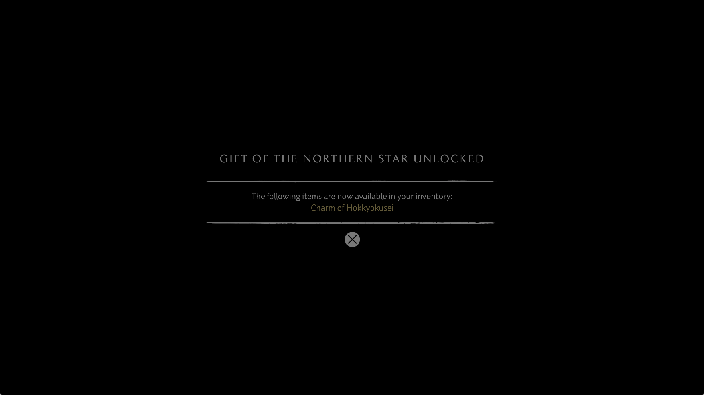
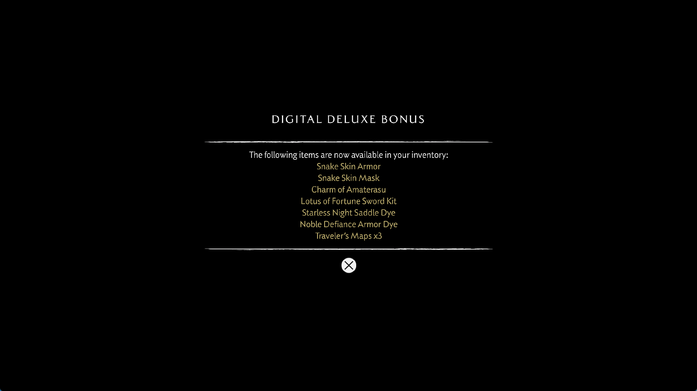

# Buffer layout identity and compute write lookup

## Reproduced shader addressing defect

Resource preparation previously reused a storage-buffer association when its
SGPR number and staged allocation matched. The same address and byte length
can have different descriptor layouts at different instructions. In particular,
changing from 16 records with an 8-byte stride to 32 records with a 4-byte
stride still describes the same 128-byte allocation.

A native Vulkan reproduction writes through this sequence of descriptors:

| Access | Index | Stride | Required byte offset |
|---|---:|---:|---:|
| First store | 1 | 8 | 8 |
| Second store | 1 | 4 | 4 |
| Third store, original layout restored | 1 | 8 | 8 |

Before the correction, byte offset 4 retained the `0xdeadbeef` sentinel instead
of receiving `0x55667788`. Preparation emitted only the original, unqualified
association and the second store used its old stride. The failing native run
exited with `TestExpectedEqual`; this is an independently reproduced renderer
defect, not an inference from the game's appearance.

Reuse now requires matching addressing and format fields, including stride,
swizzling, thread-ID addition, format, destination selectors, scalar offset,
extent and runtime descriptor selection. A changed layout receives an
instruction-specific association. A previous instruction-specific association
cannot stand in for a stage-wide fallback. Returning to the original layout
can still reuse its original association. The shared path serves graphics and
compute shaders across titles.

## Reduced cache search work

Committing a compute buffer write previously searched the entire resident
buffer array for its address and size. It now uses the address index already
maintained by staging, replacement and removal. Hash collisions and views
with different sizes still undergo the exact checks, in the original slot
order. Configurations beyond the index's capacity retain its linear fallback.
Publication ordering and the actual GPU writes are unchanged by this lookup
optimization.

The `gpu buffer lookup` log records committed resources, candidate entries
examined, and the number of entries the old linear searches would have
examined at those same successful lookups. The last value is a comparison of
search work, not a measured time saving or an FPS multiplier.

In the installed corrected runner, flip 720 performs 2,435 commit lookups with
4,844 candidate checks. The former linear searches would examine 4,421,655
entries for those same matches. This confirms reduced search work in the game;
it does not attribute a frame-time improvement to this change.

## Write attribution

Resident entries now retain the program, instruction PC, opcode, SGPR, stride
and reason that established their pending write coverage. If a dirty entry
already requires whole-buffer publication, its original reason remains until
that pending coverage is retired; the latest writer program is recorded
separately. Recycled entries clear the attribution. This is bounded diagnostic
state, not per-store logging or a change to the address proof.

This distinguishes indexed writes, atomics/other unsupported footprint
opcodes, runtime descriptors, unresolved preparation and span-budget overflow
from proven literal stores. Attribution identifies a producer and its coverage
decision; it does not identify the first instruction that corrupted CPU memory.

The local sharpemu reference in `E:/Emul-ps5` merges overlapping GPU allocations
and synchronizes tracked CPU-dirty ranges in `GuestBufferCache.cs`. It remains
relevant to the larger ownership problem. This correction uses PS5PCEM's own
descriptor associations and existing address index; it does not import that
merged-allocation architecture or claim equivalent performance.

## Native validation

The new layout probe passes eight combinations of host-visible/device-local
backing, decoded/typed-IR translation and enabled/disabled page tracking. It
checks all 32 words, including untouched sentinels, and verifies that one
allocation serves the three accesses. The previous 44 publication/footprint
scenarios and six neighboring coherence/resource probes also pass.

The focused binding-identity unit check, two write-range tests and four address
index tests pass. The index tests cover collisions, differently shaped views,
replacement, invalidation and the oversized-cache fallback. The previously
documented unrelated `--device-storage` fixture failure remains outside these
passing results.

```text
zig build vulkan-smoke -Doptimize=ReleaseFast -- --buffer-layout-rebind
zig build vulkan-smoke -Doptimize=ReleaseFast -- --buffer-range-publication
zig build vulkan-smoke -Doptimize=ReleaseFast -- --buffer-incoming-eviction
zig build vulkan-smoke -Doptimize=ReleaseFast -- --buffer-write-footprints
zig test src/vulkan/sampled_image_index.zig
```

Implementation commit: `94fa833`. The ReleaseFast runner and matching PDB are installed at
`zig-out/bin/game-run.exe` and `zig-out/bin/game-run.pdb`. Their SHA-256 values
are `8e2255bd307ac2c15203413e99c962d3676531c81a88137b47b6c0c27df07ae5`
and `d9f21c65770c82fbb2f52c3ab551b3a09a410a78a9cb78067f1c30bed65fac5a`.
Compilation succeeded on the first attempt, but installation initially ran
out of disk space. Removing the interrupted diagnostic cache's temporary file
and archiving older intermediate binaries allowed the cached build to install
successfully. The last complete driver cache was preserved.

## Diagnostic game run before the layout correction

The attribution-only runner (`01ce8b8f9eea` SHA-256 prefix) was tested first,
without the layout correction or indexed commit lookup. Scripted input,
the performance preset and 1080p output were used. No debugger was attached;
short read-only snapshots and thread samples were taken.

That run advanced beyond the previously captured bonus notice. One transition
took **166,457 ms**, including **165,641,760 microseconds of fence waits**.
The compiler was idle during the sampled wait. The submission timeline later
advanced and the next bonus notice appeared: this was a very long GPU wait,
not the previously observed unbounded guest reference-array loop.

The observed header count was 97 and the reference array held 196 entries.
That does not establish correct header initialization. A wide readback mirror
already contained 96 at the count's location, while other header bytes carried
floating-point data. The captured producers were:

| View | Producer | Coverage reason |
|---|---|---|
| 6,960,000 bytes at `0x50c4575a70` | `0x801f218b00`, PC `0x58d4`, indexed dwordx4 store, stride 116 | Indexed address |
| 64 bytes at `0x50c4c07960` | `0x80531b6800`, PC `0x4490`, atomic add at byte offset 52 | Atomic opcode |

The exact header backing matched guest memory; no overlapping storage image
or render target was found. This narrows the remaining ownership investigation
but does not prove where the first invalid initialization occurred.

A later inventory cross-checks **643 resident programs and 526,657 decoded
instructions** against guest code, with zero unknown/unsupported opcodes.
The log still reports unresolved resources and two missing sampled-image
warnings. Opcode recognition is not proof of complete shader execution.



*Unedited 1765×993 capture from the attribution-only run, before the layout
correction. This shows the next bonus notice, not the wolf or tree.*

At flip 780, one sample took 749 ms, uploading 328,130 KiB and reading back
239,226 KiB. No matched performance gain is inferred from this diagnostic run.
It was deliberately stopped near flip 823 after about 842 seconds when host
commit reached 59,775,135,744 of 60,375,973,888 bytes. The final black capture
and continued flips do not establish arrival at the wolf or tree. No
spontaneous guest fault or device loss was observed before the deliberate stop.

## Installed corrected runner: remaining corruption and crash

The installed `8e2255bd307a` runner was then tested with the same scripted
input, performance preset and 1080p output configuration. Its actual client
capture shows the Digital Deluxe Bonus notice:



*Unedited 1765×993 client capture from the installed corrected runner. It is
a bonus notice, not a new wolf or tree capture.*

At flip 720 the frame takes **892 ms**, with 942 draws and 1,396 GPU dispatches.
It uploads 337,833 KiB and reads back 237,167 KiB. Compute resource scanning
accounts for 132 ms of buffer preparation, 96 ms of image preparation and
65 ms in its remaining scan; graphics resource preparation takes 168 ms.
Fence waits total 147,696 microseconds. These counters include nested work
and must not all be added together. There are no pipeline-cache misses in
that frame. The following frame takes **19,446 ms**, including **18,270 ms**
for one compute-pipeline miss. These are individual samples, not a matched
before/after FPS comparison.

The subsequent black screen stops advancing at **flip 741**. Submitted and
completed GPU ticks both equal **60,367**, the compiler has no active or
pending jobs, and the CPU-visible completion label already equals its
expected value. The selected count at header `0x50c4c1ad40 + 0x38` is
**1,060,893,910**. The guest reference array grows from 20,480 to 786,432
entries while that invalid count remains unchanged. This reproduces the
earlier corruption despite the independently validated layout correction.

Both the 64-byte header's mapped backing and the overlapping 6,960,000-byte
view's readback mirror contain the same invalid count. No overlapping
storage image or render target is found. Their retained coverage witnesses
identify the same two producer programs as in the earlier diagnostic run:

| View | Producer / instruction | Coverage reason |
|---|---|---|
| 64 bytes at `0x50c4c1ad40` | `0x80531b6800`, PC `0x4490`, SGPR 48, stride 64 | Atomic opcode |
| 6,960,000 bytes at `0x50c4578520` | `0x801f218b00`, PC `0x58d4`, SGPR 4, stride 116 | Indexed store |

The recorded atomic instruction addresses offset `0x34`; the selected bad
count is at `0x38`. A coverage witness is not a record of every GPU store,
so this does not identify the first corrupting instruction. Establishing
initialization and write ownership across the overlapping allocations remains
necessary; clamping the count would conceal the defect.

The final inventory cross-checks **642 resident programs and 522,118 decoded
instructions** against guest code, with no unavailable instruction snapshots
and zero unknown/unsupported opcodes. Two missing sampled-image warnings
remain. Flip 720 reports 2,610 unresolved storage-resource observations;
flip 741 reports one failed draw. These observations are not unique shader
counts, and decoding all captured opcodes does not establish complete or
correct resource binding, shader translation or execution.

The last valid snapshot at 21:34:55 local time has been stationary for
388 seconds. The process subsequently exits on its own with **0xc0000005**;
the log records an unhandled host write access violation at runner offset
`0x7a4269`, targeting `0x12504`, after guest null-memory recovery messages.
The diagnostic timeout and memory guard did not terminate it. A final
snapshot taken during teardown contains invalid renderer pointers and is
excluded from these measurements. The terminal fault does not by itself
locate the earlier buffer corruption.

The layout correction has not been proven to explain the tree's streaks or
the header ownership defect. This run does not reach the wolf or tree.
Stable startup, playable tree performance and 30 FPS remain unresolved.
Raw guest shaders and memory captures stay in the ignored local evidence
directory.

Local evidence: `out/yotei-layout-20260930/` and
`out/yotei-write-origin-run-20260930/` and
`out/yotei-layout-run-20260930/`. See also the preceding
[sparse-publication report](yotei-buffer-write-spans-2026-09-30.md).
