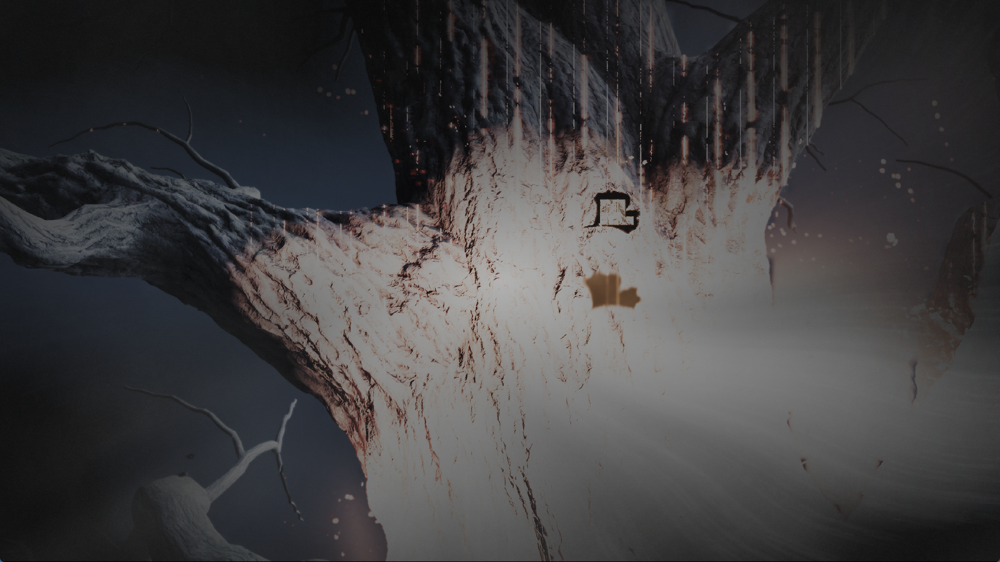

# Yotei overlapping buffer publication

## Direct evidence

A hardware watchpoint caught the write that corrupts a Yotei producer header.
On the preceding development executable (`88116549...`), the guest first zeroed
its new 64-byte header at `0x50c1310d30`. A renderer worker then published a
valid count of 482 at offset `0x20`. About 48 milliseconds later, another
renderer thread copied a 273,600-byte older buffer at `0x50c12e0700` into guest
memory, replacing the header with particle-like floating-point data. The count
became 1,053,075,479; the adjacent count became 4,294,962,203.

The captured native stack resolves to `memcpy`, `writeGuestMemory`,
`flushGuestStoragePrefix`, and `stageGuestStorageBufferAt`. The old range was
being published during cache replacement. A paused cache snapshot contains
both the old dirty wide buffer and the newer, already clean 64-byte header;
there is no overlapping storage image or render target in that snapshot.
This establishes the writer for this observed corruption, beyond the earlier
oversized-count observation. The watchpoint run is diagnostic evidence, not a
performance or stability measurement; it later exited with `0xc0000005`.

## Shared renderer correction

Independent Vulkan buffers may overlap in guest address space. They now carry
an actual GPU-writer sequence separate from the content sequence used for CPU
uploads. An old readback publishes only bytes that have not been superseded by
a newer GPU writer. Already clean newer entries still protect their ranges.

When an older range is read first, newer dirty overlapping dependencies are
published in descending writer order. An iterative worklist includes transitive
overlaps without recursion or flushing unrelated resources. Before eviction or
address-identity replacement removes a newer entry, older dirty aliases are
published while its protection still exists. A clipped old backing loses its
page-generation/fingerprint shortcut so that a later clean bind uploads the
merged guest contents.

The correction is shared by all titles. It does not clamp guest counters,
modify game files, disable shaders, or establish general byte-level GPU/CPU
ownership for every resource type.

## Native regression and neighboring checks

The new `--buffer-range-publication` probe dispatches a wide writer that touches
only its first and last words. Guest code initializes an interior header and a
newer GPU dispatch writes its count and sentinel. The unpatched renderer
reproduces the overwrite: a valid count of 487 is replaced by the wide buffer's
old `0x3f72603a` data.

The corrected renderer passes three cases: publish the header first, read the
wide range first, and evict the clean newer header while the old range remains
bound. Each case checks all header bytes, preserved disjoint GPU writes, and
readback after rebinding the merged wide range. A September 30 review found
that this initial fixture set a generation counter without attaching its
tracking callbacks. The [rebind follow-up](yotei-buffer-rebind-2026-09-30.md)
adds explicit tracked and untracked variants, plus both storage backings.

Native Vulkan checks also pass for differently sized buffer views, CPU reuse
of storage images, clean buffer retention, cache byte budgets, buffer/target
coherence, and loaded-descriptor floating atomics. The broader `--device-storage`
probe is not green: its buffer-content-cache fixture fails on both the cached
preceding build and this build. Repeats of both report `TestUnexpectedResult`;
one patched run reported an old value instead of `0x0badf00d`. This pre-existing
failing check remains a validation limitation.

## Local renderer comparison

The local sharpemu `GuestBufferCache.cs` merges overlapping allocations into a
single backing and copies their previous GPU contents into that backing. Its
`CollectDirtyPieces` downloads tracked modified subranges. This is a useful
next architectural direction for reducing overlapping storage, redundant
uploads and readbacks. The current patch preserves our existing independent
backings; it does not claim to implement that design or copy its source. No
cross-emulator performance comparison was made.

## Remaining resource gap

A 35-second bounded diagnostic window at flip 592 filled the 64-entry storage
warning limit with unresolved descriptor preparations. Program `0x8000333c00`
is one concrete example: a lane-selected index feeds 592-byte records, and
`s_buffer_load_dwordx4` loads the buffer descriptor before accesses at PCs
`0x110`, `0x118`, and `0x120`. The current `prepareBufferTableCandidates` path
uses a scalar pointer-load planner; it does not cover this scalar-buffer-load
shape. Extending descriptor-table preparation requires bounds, null/OOB behavior
and runtime selection to remain correct. The local sharpemu induction-loop
planner is a useful reference, but its proof does not directly cover this
lane-selected index.

These warnings are preparation gaps, not proof that every affected instruction
executes. A validated earlier snapshot in this run had 219 programs and 94,400
instructions with no unknown/unsupported decoded opcode. Neither observation
establishes complete shader execution or identifies the tree's faulty pass.

## Pipeline-cache persistence on this host

The E: drive had only about 350 MiB free while the driver cache occupied
1.64 GiB. Atomic cache saving needs room for a temporary copy, so that free
space could not accommodate another complete snapshot. The last cache file
was still dated 15:50 despite subsequent launches. Old diagnostic captures in
`out/live-yotei-20260923` were moved to
`C:/Users/strazewicz/AppData/Local/Temp/ps5pcem-diagnostic-archive/` and a directory
junction retains their original path. File count and total bytes match; no
files were deleted. A stale, unused 1.64 GiB temporary cache file from 15:50 was also archived after an exclusive-open check. Together these moves freed about 4.44 GiB on E:. The running renderer then logged
a successful 1,684 MiB save and the cache timestamp advanced to 22:18.
This enables later launches to reuse newly persisted work; it is not a measured
steady-state FPS improvement or a change to game data.

## Game validation

The installed ReleaseFast runner reached the wolf screen and burning tree in
one 1,488-second diagnostic run. The harness stopped it at its time limit;
there was no logged guest fault, device loss, or panic. This is a limited
observation, not a stable-startup or playability claim. After 17 minutes, queued
background warmups were cancelled in this process to reduce compiler pressure;
required foreground compilation continued. The process had reached roughly
21 GiB of private memory. No default warmup policy was changed.

This unedited 1765x993 game-window capture was taken about 24 minutes 40 seconds
after launch. It still shows vertical streaks, excessive brightness and stray
image elements. Output was configured for 1920x1080; some internal/composite
targets in the trace are 3840x2160. The image is not a rendering-correctness claim.
An accidental desktop capture in the local sequence is excluded from publication.

Frame 850 produced 160 intermediate draw images. Orange streaks are already
visible in the retained HDR target `0x505ab20000` at draw 30, whose color target
mask is zero. The base-color target `0x5050bc0000` at draw 70 does not show those
orange streaks. Later HDR/post-processing images contain them again, and the
final composite is excessively bright. Because the early HDR contents may
come from an earlier frame or compute work, this does not identify draw 30 as
the faulty producer. It narrows the next trace to HDR production/history and
its inputs; the tree artifact is still unresolved.

A subsequent validated cache snapshot contained 565 programs and 456,597 decoded
instructions with no unknown/unsupported opcode. Unresolved runtime descriptors
remain. A captured 1,349,436-byte compute SPIR-V module for program
`0x80001e5f00` passed Vulkan SDK 1.4.357.0 `spirv-val --target-env vulkan1.3`.
That validates the module's structure, not its rendering semantics.

First-use pipeline compilation caused long pauses, including an 80-second
transition frame. Untraced frame 840 took 803 ms (1,143 dispatches, 290 draws,
about 195 MiB uploaded and 147 MiB read back). Frame 850's diagnostic readbacks
made it unsuitable for performance comparison. No matched FPS improvement is
established; 30 FPS remains unmet.

ReleaseFast build: succeeded. Website lint/typecheck: passed; website tests:
56/56 passed. Installed `zig-out/bin/game-run.exe` SHA-256:
`0a2038740c4830f4f9cb848c118648308e76ccc50d3bcc8d8d5bd33798aecd82`.
The matching PDB is installed alongside it; public release archives are unchanged.

Local diagnostic evidence is retained under `out/yotei-header-writer-c-20260929/`,
`out/yotei-header-writer-checks-20260929/` and
`out/yotei-range-patched-20260929/`. Raw game memory and shader bytes
are not published.
