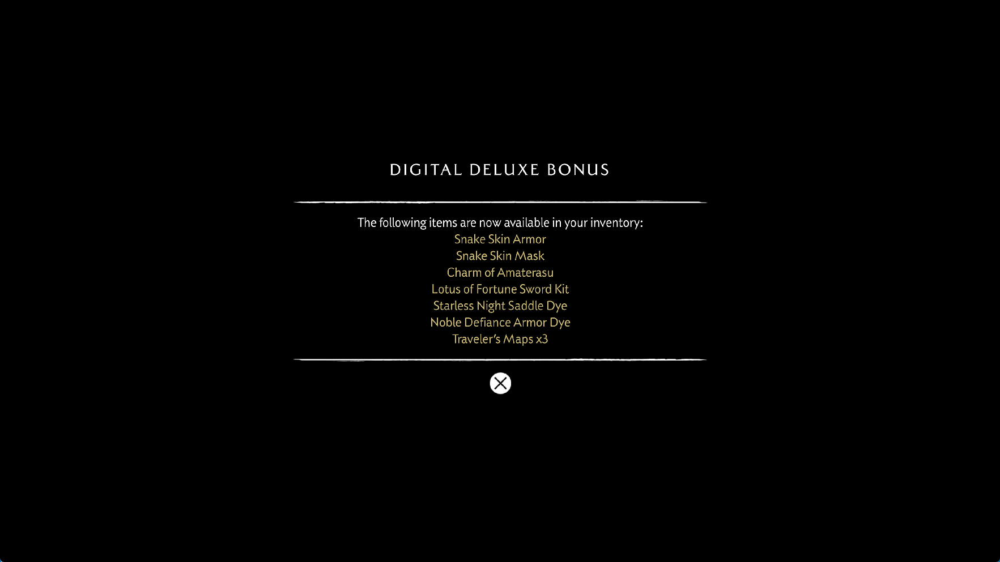

# Yotei overlapping buffer rebinds

Follow-up: [sparse buffer publication](yotei-buffer-write-spans-2026-09-30.md)
fixes the literal-store incoming-eviction reproduction described below. This
report preserves the earlier runner's measurements and failure evidence.

## Reproduced renderer defect

The earlier publication fix protects a newer nested buffer when an older,
wider buffer is downloaded. It did not cover another partial GPU write to the
wide backing before that download. Rebinding the old backing retained its
stale interior; the subsequent write then gave the whole backing a newer
publication sequence, allowing it to replace the nested header.

A native Vulkan regression reproduces this without game code. A 128-byte
writer changes only its first and last words. Guest code initializes an
interior 64-byte header and a second dispatch writes its count and sentinel.
Another dispatch touches only the wide buffer's edges. Before this correction,
reading the header returns the old `0x3f72603a` floating-point pattern instead
of zeros, the count of 487 and the sentinel. The preceding three publication
cases still pass before the new rebind case fails.

## Shared correction and cost control

Rebinding an existing allocation now checks for newer overlapping GPU
writers. When necessary, it publishes the old view while the newer aliases
still protect their bytes, publishes those dependencies and invalidates the
old backing's page/fingerprint shortcuts. The ordinary upload path then seeds
the next partial write from the merged guest bytes. Already published, clean
aliases remain relevant.

A bounded 128-record write history rejects binds with no intervening overlap
without scanning all resident allocations. If the requested history has been
overwritten, the check conservatively falls back to the resident scan. The
history is a filter, not a second source of ownership. Cache replacement resets
the per-entry observation sequence. Frame logs expose `alias_ms`,
`alias_scans` and `alias_merges` to distinguish the added coherence work from
other staging costs.

The change applies to all titles using this renderer path. It does not patch
game code, clamp guest counts, or bypass shader instructions. It is not a
complete solution for CPU/GPU ownership, simultaneous overlapping bindings,
or initial bindings with different base addresses.

## Validation

The native publication probe passes twenty scenarios: both read orders, eviction
of a clean newer header, and repeat partial writes with dirty or already clean
nested headers, each with host-visible and device-local storage, and with
page tracking enabled or disabled. It verifies
every header byte, both disjoint edge writes and the merged backing after a
later bind. Two history tests cover nested ranges, half-open boundaries and
ring rollover.

The ReleaseFast runner and its matching PDB have been installed at
`zig-out/bin/game-run.exe` and `zig-out/bin/game-run.pdb`. The executable SHA-256
is `f625d12fa50619bb8d7cd325eb6a02ba0e29fefa4edd83cae54f1206ba72fc99`;
the implementation commit is `0f88564`.

Neighboring native Vulkan probes pass for differently sized buffer views,
storage-image CPU reuse, clean buffer retention, cache byte budgets,
buffer/target coherence and scalar-buffer descriptor tables. The previously
reported broader `--device-storage` failure is not claimed as resolved.

## Relationship to the previous game failure

Further analysis of the saved guest stack from the `f908d45c950f` run finds a
loop bound of 1,055,604,826 records, not merely a large normal reference array.
The caller at `0x1177130` multiplies a signed count from a producer header by
40; its saved bound is `0x9d4c20e10`. The count's bits, `0x3eeb405a`, also encode
approximately 0.459475 as a float. This explains why the observed guest loop
keeps growing the array before allocation failure. It does not establish which
writer supplied that count.

The native rebind defect is proven independently. It is a plausible additional
route for stale floating-point data to replace metadata, but no hardware
watchpoint has tied this specific rebind case to that game's corrupt count.

The local sharpemu buffer cache in `E:/Emul-ps5` uses merged overlapping
allocations and tracks dirty subranges. That remains a useful architectural
reference for avoiding repeated copies. This correction keeps independent
backings and does not claim that architecture or a cross-emulator speedup.

## Installed-runner result and remaining defect

The `f625d12fa506` runner was launched with scripted input, the performance
preset and 1080p output, without an attached debugger. It reached the bonus
notice, but then stopped advancing at flip 801, before the wolf and tree. A
read-only inspection found 1,063,955,328 records in the header at
`0x50c4bb8410`, offset `0x34`. The growing reference array reached 655,360
entries. Both GPU queues and the compiler were idle; submitted and completed
GPU ticks were both 64,235. The final observation covers about 331 seconds
without another flip. The diagnostic process was deliberately stopped about
705 seconds after launch; this was not a spontaneous crash.

The 64-byte header's persistently mapped GPU backing contains exactly the same
bad bytes as guest memory. The readback mirror of an older 6,960,000-byte
overlapping buffer also contains floating-point data at that offset. Both entries are clean, and no
overlapping storage image or render target is present. Thus protecting guest
RAM only at the final publication is insufficient: this snapshot already has
bad data inside the newer header backing. It does not reveal its first writer.

A second native experiment isolates a remaining case: force cache pressure
while staging the newly CPU-initialized header, before its first GPU write.
Evicting the old wide buffer replaces the initialization. The header shader
then updates its own two words correctly, leaving stale floating-point bytes
in the untouched words. The opt-in `--buffer-incoming-eviction` probe preserves
this failing reproduction; it is not included among the twenty passing cases.
It is a demonstrated renderer defect, not yet a proven explanation of this
particular game write.

Run the passing suite with
`zig build vulkan-smoke -Doptimize=ReleaseFast -- --buffer-range-publication`.
At the revision documented here, the separate
`zig build vulkan-smoke -Doptimize=ReleaseFast -- --buffer-incoming-eviction`
exited with `TestExpectedEqual`; that failure was the retained
reproduction, not a passing validation result.

This remaining case needs correct CPU/GPU write ownership at resource
initialization. Unconditionally ignoring overlapping eviction readbacks can
discard a legitimately newer GPU result. No such bypass, guest counter clamp
or speculative ownership workaround was applied.

*Unedited 1765×993 capture of the installed runner's game window. It shows the
bonus notice, not the tree or successful completion of startup.*

## Performance and shader coverage

Flip 780, before the stall, records 779 ms with 1,447 compute dispatches and
850 draws. Graphics and compute pipeline misses are both zero at that sample;
shader analysis also records zero misses. Compilation is therefore not the
only large cost after warmup.

| Sample at flip 780 | Recorded cost |
|---|---:|
| Compute buffer preparation | 128 ms |
| Compute image preparation | 93 ms |
| Compute preparation tail | 70 ms |
| Graphics resource preparation | 80 ms |
| Fence waits | 177,812 microseconds |
| Uploads | 327,112 KiB |
| Readbacks | 243,051 KiB |
| Buffer-cache misses / evictions | 1,117 / 1,117 |

These are nested and sometimes overlapping profiler scopes, not additive
parts of a wall-clock frame. The rebind synchronization itself records 46 ms
at flip 800. No matched FPS gain is established, and the tree was not reached
in this run, so it supplies no new tree-FPS or lighting comparison.

A read-only inventory during loading validates 216 resident programs and
86,383 decoded instructions against guest code, with no unknown or unsupported
opcode. Later logs still contain unresolved storage-preparation resources,
two sampled-image-missing warnings and one failed draw at flip 801. Recognized
opcodes do not establish complete resource resolution or shader execution.
Tree streaks, stable startup, gameplay and the 30 FPS target remain unresolved.

Local evidence is under `out/yotei-alias-rebind-20260930/` and
`out/yotei-alias-run-20260930/`. Raw game memory and shader binaries are not
published. Public release archives are unchanged.
