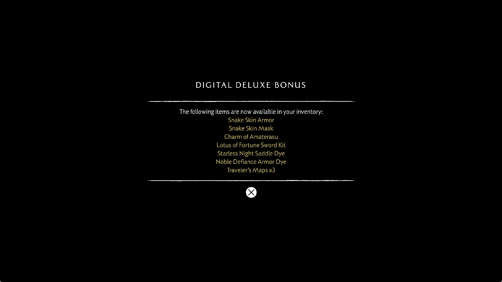

# Sparse publication of proven buffer writes

Follow-up: [buffer layout identity and indexed write commits](yotei-buffer-layout-2026-09-30.md)
adds a separate native shader-addressing correction and records a later
attribution run. The observations below describe the earlier sparse-write build.

## Reproduced defect and shared correction

The incoming-buffer eviction regression from the [rebind investigation](yotei-buffer-rebind-2026-09-30.md)
is now fixed for its statically addressed stores. A GPU dispatch changes only
the first and last words of a 128-byte buffer. The CPU initializes a nested
64-byte header before binding it. Evicting the old buffer used to publish its
entire snapshot, replacing the untouched header with old floating-point data.

Resource preparation now records byte ranges for untyped dword stores whose
addresses are provably constant. Publication and device-local readback copy
only those ranges. Pending writes accumulate across dispatches; adjacent and
overlapping spans merge. The bounded list holds eight spans and falls back to
the whole buffer when it overflows. Unknown addresses, register offsets,
indexed accesses, runtime descriptor candidates, swizzling, atomics and
formatted stores retain whole-buffer coverage. If any store's resource
preparation is incomplete, the dispatch uses whole-buffer coverage: a later
unresolved access can still select an earlier unqualified SGPR mapping in
the translator. Recognized shader instructions
are still executed; this does not suppress a dispatch or clamp a guest count.

The proof uses the same PC-qualified buffer mapping selected by the
translator. A recovered scalar-register value alone is deliberately not
accepted as a constant address across every loop iteration or workgroup.
Sparse publication invalidates whole-backing page and content-hash shortcuts:
untouched CPU bytes may be newer than the GPU snapshot and must be uploaded on
a later clean rebind. Existing newer-alias publication protection remains.

Device-local spans are copied in one Vulkan copy command and share one wait.
Ordinary explicit backing reads still return the full requested range. Frame
logs add `gpu buffer writes` counters for sparse readbacks and bytes avoided
relative to the requested publication prefix.

This applies to every title using the shared renderer. It is not complete
CPU/GPU byte ownership: a dynamically addressed wide writer still uses the
conservative whole-buffer path, and simultaneous overlapping bindings remain
a separate problem. The original game's first corrupting writer has not yet
been identified.

## Native validation

The implementation is commit `b7b1e83`. The ReleaseFast runner and matching
PDB are installed at `zig-out/bin/game-run.exe` and `zig-out/bin/game-run.pdb`.
Their SHA-256 values are respectively
`81760bee0b6e7631aced9102fdddc7e45c510b75791daa2453c7ee0348e2bef1` and
`89464563c6160a95a005131ef3bdb95542cdecd96ddbea374c8547af411eaefe`.

The formerly failing incoming-eviction probe passes all four combinations of
host-visible/device-local backing and enabled/disabled guest page tracking.
A further twenty native cases verify literal stores, accumulation across
dispatches, indexed/SGPR-offset and missing-resource fallbacks, and preservation of real
GPU output when an incoming narrow view evicts a wider producer. These cases
also assert the readback count: 8 bytes for two proven word stores versus
128 bytes for the dynamic fallback. This is a native transfer measurement,
not an FPS claim.

All twenty earlier alias-publication scenarios also pass, along with the
neighboring buffer-view, storage-image CPU reuse, clean retention, cache
budget, buffer/target coherence and scalar-buffer table probes. Two unit
tests cover span merging, prefix clipping and conservative overflow. The
previously reported broader `--device-storage` fixture failure is not claimed
as resolved.

The earlier alias probe deliberately retains indexed zero-stride stores so
it exercises whole-buffer publication and newer-alias clipping. Sparse edge
writes must not accidentally remove that regression coverage.

The probes can be run with:

```text
zig build vulkan-smoke -Doptimize=ReleaseFast -- --buffer-incoming-eviction
zig build vulkan-smoke -Doptimize=ReleaseFast -- --buffer-write-footprints
zig build vulkan-smoke -Doptimize=ReleaseFast -- --buffer-range-publication
zig test src/vulkan/buffer_write_ranges.zig
```

## Local reference

The local sharpemu implementation in
`E:/Emul-ps5/sharpemu/src/SharpEmu.Libs/Gpu/Buffers/GuestBufferCache.cs`
tracks modified ranges, collects dirty download pieces, and validates their
ownership during eviction. That supports separating an allocation's extent
from its modified bytes. This implementation is independently written for
PS5PCEM's existing cache and literal-address proof; it does not import
sharpemu's fault worker or merged-allocation architecture.

## Installed runner: remaining black screen

The installed `81760bee0b6e` runner was tested with scripted input, the
performance preset and 1080p output. No debugger was attached; short thread
sampling bursts and read-only memory inspection were used. The window was
initially minimized and restored during loading, so the early timing samples
are not an FPS comparison.

The game reaches the digital-deluxe bonus notice, then stops on a black screen
at flip 761, before the wolf and tree. The producer header at `0x50c4581b40`,
offset `0x34`, contains 1,176,703,636 records. The reference array grows from
40,960 to 458,752 entries. Submitted and completed GPU ticks both equal 58,689;
graphics, compute and compiler queues are idle. The run was deliberately
stopped after about 813 seconds, with no new flip for about 172 seconds. No
spontaneous guest fault or device loss was observed in this run.

The 64-byte resident header backing exactly matches the corrupt guest bytes.
An older overlapping 6,960,000-byte buffer's readback mirror contains the same
bad count. Both entries record **whole-buffer write coverage**, so this
literal-address correction does not apply to the remaining captured case.
There are no overlapping storage images or render targets in that snapshot.
The first corrupting writer remains unproven; this is not evidence that the
game's underlying ownership problem is fixed.



*Unedited 1765×993 capture from the installed runner before the stall.*


*Unedited capture after flips stop. This is the observed failure, not a tree
rendering or a successful startup.*

## Performance evidence

The narrow optimization saves less than 1 KiB in each of the 116 logged frame
samples. The native 128-to-8-byte reduction is real, but it does not address
the dominant transfers in this game run. No matched FPS improvement is claimed.

Flip 733 records 1,034 ms with zero graphics/compute pipeline misses and zero
shader-analysis misses:

| Measurement | Value |
|---|---:|
| Draws / compute dispatches | 1,054 / 1,579 |
| Compute buffer preparation | 167 ms |
| Compute image preparation | 100 ms |
| Compute preparation tail | 66 ms |
| Graphics resource preparation | 176 ms |
| Fence waits | 152,013 microseconds |
| Uploads / readbacks | 353,344 / 256,158 KiB |
| Buffer-cache misses / evictions | 1,758 / 1,758 |
| Alias synchronization | 44 ms |

These scopes overlap and must not be added as exclusive percentages of the
frame. The sample is before the black screen, not a tree-FPS measurement.

Loading has additional costs. A 91,904-KiB batch mapping takes 3,175 ms,
including 3,173 ms in host mapping. A short stack sample independently reaches
`batchMapCore -> mapDirectMemory -> hostMapBacking -> NtMapViewOfSectionEx`.
Batch entries are already coalesced, but Windows mappings still use 64-KiB
views. The source records a prior Cat Quest III regression with wider views;
correct partial unmapping is required before generalizing that optimization.

The first heavy render transition takes 181,116 ms at flip 716, with 178,461 ms
spent creating 206 compute pipelines. The compiler continues making progress
during that pause. Several asynchronous saves each write a 1,763-MiB driver
cache during the transition; a separate sample catches a worker in
`NtWriteFile`. This identifies additional disk traffic, not its share of the
compilation delay. Once these compiles finish, resource preparation and
transfers still leave the roughly one-second frame described above.

## Shader coverage and next boundary

A later read-only inventory cross-checks **627 resident programs and 487,516
decoded instructions** against the guest code. All instruction snapshots are
available; none contains an unknown or unsupported opcode. This covers the
captured resident programs, not every shader in the game or correct execution
of every recognized instruction. Runtime logs still contain unresolved storage
resources, one missing sampled-image warning and one failed draw.

The next correctness boundary is ownership of dynamically addressed writes
and initialization of overlapping views. Further performance work must reduce
their full transfers, cache churn and resource-preparation costs without
discarding GPU output. This run does not reach the tree, establish a stable
startup, resolve its lighting streaks or achieve 30 FPS. Public release
archives are unchanged.
