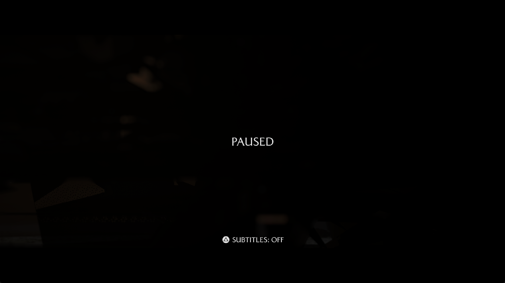

# Ghost of Yōtei: post-tree costs and cache memory

## Observed run

The color-routing runner `eace085bdf93` was tested with 1920 x 1080 output,
Speed mode, the performance game preference, two compiler workers and disk
compute warmup disabled. The tree difficulty menu presents **37 frames in
30.046 seconds (1.231 FPS)**. This matches the previous result.

The repeat reaches the 3D cinematic after the tree. The pause overlay responds;
there is no visible skip action. After resuming, a separate interval presents
**two frames in 30.045 seconds (0.0666 FPS)**. Character control is not confirmed.
The owned run was deliberately stopped for isolated checks and ended after
2,452 seconds. The measured intervals ran without emulator builds or GPU probes.

## Why the transition is slow

Flip 1748 takes **197.573 seconds**. Graphics pipeline creation accounts for
41.936 seconds across 538 misses; compute pipeline creation accounts for
135.167 seconds across 95 misses. Together these account for about **90%** of
the frame time. The next frame takes 92.652 seconds, including 65.400 seconds
of compute pipeline creation. These are first-use transition costs, not steady
character-control FPS.

Compilation is not the only remaining cost. Later observed frames upload
roughly **1.4–2.6 GiB of textures**, with around 4,800–5,200 sampled-image
evictions per frame. Resource preparation, copies and GPU waits remain expensive.
The sampled-image cache is approximately 2 GiB. Increasing its limit without
checking the total memory budget would not establish a safe performance gain.

The game also uses **3328 x 1872 internal color targets** in the captured
rejected draw; 1080p is the output size. Slot 2 requires source-alpha blending
on packed 11/11/10 UNORM. This operation remains unsupported. Tree streaks,
dark lighting and incomplete character surfaces are still open graphics issues.

## Share canonical program bytes between specializations

The translation cache previously copied the complete canonical program prefix
into every specialization key. One live inventory contains 774 compute entries:
544.745 MiB of copied prefixes representing 344.986 MiB across 543 program
identities. Sharing those prefixes would remove **199.759 MiB** of duplicate
bytes from that inventory. This is an inventory estimate, not a measured change
in total process memory or FPS.

Cache entries now own a specialization suffix and share a reference-counted
copy of their canonical program prefix. The cache still compares full content
when immutable identities differ and still rejects hash collisions. Original
code, reconstructed instructions and pipeline options remain part of the key.
Prepared-key owners can be destroyed independently. Evicting the final older
specialization retains the prefix needed by its replacement, and byte accounting
counts shared storage once. Emitted shader words are unchanged.

## Save large driver caches without another private copy

On Windows, snapshots of at least 16 MiB are extracted into a writable mapping
of an exclusive temporary file. The view is flushed and unmapped, the file is
truncated to the driver's actual returned length, and only then is the previous
cache replaced. Extraction, mapping or write failures retain the old file.
Small snapshots and other hosts keep the buffered path. Data-file mappings
avoid the page-file-backed allocation used by the old temporary buffer; see
[Microsoft's file-mapping documentation](https://learn.microsoft.com/en-us/windows/win32/api/winbase/nf-winbase-createfilemappinga).

An isolated 256 MiB fake-driver snapshot produces identical SHA-256 digests
with both paths:

| Measurement | Buffered | File mapping |
| --- | ---: | ---: |
| Private bytes before saving | 1,413,120 | 1,363,968 |
| Private bytes while the filled snapshot exists | 287,199,232 | 18,710,528 |
| Increase above the process baseline | 285,786,112 | 17,346,560 |

The measured difference is **268,439,552 bytes**, approximately 256 MiB. This
test measures host allocation behavior, not Vulkan compilation speed or game
FPS. The live driver cache is over 1.2 GiB, but its memory reduction has not yet
been measured in a new game run.

## Validation

All **21 focused ReleaseSafe tests pass**: 16 translation-cache tests and five
pipeline-persistence tests. Coverage includes independent prefix owners, hash
and suffix collisions, reconstructed instructions, eviction, allocation-failure
cleanup, mapped extraction failures, invalid returned sizes, shorter successful
writes, retry and retention of the previous complete file.

Three native Vulkan probes pass with Khronos and synchronization validation:
large indirect-image table reuse, packed UNORM targets and sparse pointer-based
fragment resources. No validation errors were reported. The ReleaseFast runner
build also passes (7/7 build steps).

The local `zig-out/bin/game-run.exe` and matching PDB have been updated.
The runner SHA-256 is
`706151525938ef5cc5968864cb849dc0c93a8c2b62ddf1109f472ec1ae692714`.
The preceding runner/PDB are retained locally under
`out/yotei-gameplay-20261004/color-routing-runner/bin/` for rollback.
The website history passes all 98 tests and TypeScript checking.
No gameplay FPS improvement or character control is claimed for these changes.
