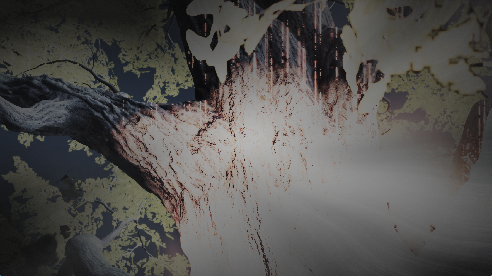

# Ordered command-processor writes and buffer publication

## Reproduced defect

An explicit command-processor write inside a cached storage buffer could be
lost when an earlier GPU result was published. The old write path flushed a
buffer only when the destination matched its base address. Interior writes
updated guest memory, but a later whole-buffer readback copied the older bytes
over them. Both `WRITE_DATA`/direct backend writes and `DMA_DATA` used this path.

A native Vulkan reproduction starts with a 128-byte buffer, writes its first
and last words on the GPU, then writes seven bytes at offset `0x35` through
the command processor. Before the correction, the test fails at byte `0x35`:
publication restores the old `0xdeadbeef` sentinel in place of the command's
payload. This establishes a renderer ordering defect independently of the
game's appearance or a particular title.

## Correction

Pending GPU buffers now retain exact byte ranges overwritten by later explicit
commands. Publication excludes those bytes while preserving surrounding GPU
results. Rebinding the backing first publishes the remaining result and
uploads the merged guest contents. A subsequent GPU store can overwrite the
command's bytes normally; these exclusions do not survive into that new write.

The exclusion list is bounded to eight merged spans. If another command would
overflow it, the previous GPU result is published while the earlier exclusions
are still available, then the new command is applied. Overflow never widens
the exclusions to the full buffer. Recycled allocations clear their state.
Imported allocations retain their existing synchronization path.

This is ownership evidence from explicit, ordered command writes. It does not
infer the locations of arbitrary native CPU stores from page generations or
buffer contents, and does not resolve every CPU/GPU aliasing case.

## Validation

Forty native scenarios pass across host-visible/device-local backing, enabled
and disabled page tracking, and ordinary writes/DMA. They cover full and
partial publication, rebind before publication, exclusion-list overflow, and
a later GPU overwrite. All 128 bytes are checked, including the original GPU
results and untouched sentinel bytes. The first interior command incurs no
storage readback in any scenario.

The previous 52 layout/publication/footprint scenarios and six neighboring
coherence/resource probes also pass, both before and after indexing the
overlap checks. Three overlap-index unit tests pass, covering nested ranges,
boundaries, replacement, swap removal, high address bits, append, oversized
fallback and selective queries against a full 4,096-entry cache.

Additional `--internal-release-queue` and `--gds-memory` probes pass.
`--deferred-release` and `--gds-resident` fail with `TestUnexpectedResult` in
both the pre-correction control binary and the command-write correction.
They are not included in the passing checks. The previously documented
`--device-storage` fixture failure also remains outside these results.

```text
zig build vulkan-smoke -Doptimize=ReleaseFast -- --buffer-command-writes
zig build vulkan-smoke -Doptimize=ReleaseFast -- --buffer-layout-rebind
zig build vulkan-smoke -Doptimize=ReleaseFast -- --buffer-range-publication
zig build vulkan-smoke -Doptimize=ReleaseFast -- --buffer-incoming-eviction
zig build vulkan-smoke -Doptimize=ReleaseFast -- --buffer-write-footprints
```

## Diagnostics and performance limits

Implementation commits: `11ee337` (command-write ownership) and `7cafaf7`
(overlap index). The final ReleaseFast executable and matching PDB are
installed at `zig-out/bin/game-run.exe` and `zig-out/bin/game-run.pdb`.
Their SHA-256 values are
`5e00c32953b60b37e12d7563aa96c26b47ad5818f1966d16f84728767843df99`
and `6195e5a6f419b9a141a9e7a7309dfa661d27b571d6d534e6c2379100ef741a0b`.

`PS5_TRACE_BUFFER_RANGE=address:size` enables bounded snapshots of small views
inside a chosen guest range. It records binds, uploads, GPU-write attribution,
readbacks, publication and explicit command writes. Up to 64 views of at most
64 bytes are tracked, with a 20,000-report limit. It is disabled by default,
does not wait for or read additional GPU work, and does not alter guest data.
Raw snapshots should stay in local diagnostic evidence.

The `gpu command writes` counter reports CPU time, examined cache entries,
overlaps and span-overflow drains. The first corrected runner scanned resident
buffers and spent 18,627 microseconds on 1,171,456 checks at flip 733, finding
only four overlaps. That exposed an avoidable cost in the correctness change.

The final implementation indexes each buffer by the smallest aligned
power-of-two region containing it. Short writes query the occupied region
sizes; hash collisions still undergo the exact overlap check. A bit set
deduplicates candidates and preserves ascending cache order. Append and
replacement update the index; removal invalidates it for rebuilding. Writes
larger than 64 bytes and oversized caches retain the complete linear fallback.
This changes candidate selection, not publication or ownership semantics.

The initial diagnostic run, before the command-write correction, reproduced
a corrupt count of 1,176,704,631 at flip 763. It was deliberately stopped.
Its initial trace range did not include that header; expanding the range at
flip 763 was too late to establish the first writer. A subsequent run must
therefore trace the relevant range from startup.

The first command-write correction also reproduced the remaining defect:
flip 759 stopped with a count of 1,138,263,738. GPU ticks were both 58,104 and
the compiler was idle. The run was deliberately stopped after retaining the
corruption evidence. Its broad trace exhausted the report limit at flip 584,
before the selected header was bound. These runs establish that fixing
explicit command writes alone does not eliminate the game's corruption;
they do not identify the first bad write.

## Indexed runner: live tree and remaining failures

The installed indexed runner reaches the tree in a fresh, scripted-input run
without a debugger attached. Output is configured for 1080p; the actual captured
client window is 1765×993. This is a new, unedited capture from that runner:



The image was saved at the sample labelled flip 941. The label comes from the
periodic state sampler, so it is not an exact image/present synchronization.
The tree still has vertical streaks and excessive brightness. One successful
transition does not establish repeatable startup or resolve the corrupt-count
failure reproduced by the earlier corrected runner.

The narrow lifetime trace was configured from startup for
`0x50c4c00000:0x40000`, covering the selected headers from the preceding runs.
It produced no events in this run: no watched small view was bound
in that range. It therefore cannot establish which write first damages a
header, or prove that headers elsewhere are correct.

The harness deliberately stopped this process at its 900-second deadline.
It reached flip 1035, with a black final capture after the tree transition.
The final sample had been on that flip for approximately 55 seconds: GPU
submitted/completed ticks were both 121,114, while one compiler job remained
active. No billion-record capture was triggered in this run. That does not
explain the later black screen or prove stable startup. This termination was
the diagnostic time limit, not an observed spontaneous crash.

### Measured costs

| Sample | Command-write CPU time | Cache candidates checked | Overlaps |
|---|---:|---:|---:|
| Unindexed correction, flip 733 | 18,627 us | 1,171,456 | 4 |
| Indexed correction, flip 720 | 662 us | 2,505 | 4 |
| Indexed correction, flip 960 | 1,289 us | 9,538 | 18 |

These are diagnostic samples from different runs/frames, not matched FPS
measurements. The native overlap tests separately verify complete candidate
selection against a brute-force reference. In the final run, flip 1027 also
exercises the bounded exclusion overflow path once; command-write handling
takes 2,155 us on that frame.

At flip 960, the complete frame takes 816 ms. Draw processing takes 241 ms
and compute dispatch handling takes 459 ms, including 275 ms of compute
resource preparation. Graphics resource preparation takes 155 ms. The frame
uploads 331 MiB, reads back 237 MiB and submits 228 command buffers; fence
waits total 149 ms. These counters overlap and must not be added together.
Even without a pipeline miss, the remaining work is far above a 33.3 ms budget.

At flip 943, one compute pipeline miss takes 18,309 ms of a 19,445 ms frame.
The later transition is worse: flip 1028 takes 72,416 ms, including 67,392 ms
for ten compute pipeline misses. Ordinary tree samples
at flips 900, 960 and 978 take 838, 816 and 1,212 ms respectively. Quoting only
their inverse frame times would hide the long stalls. No matched game FPS
improvement or 30 FPS result is established. Subsequently, flip 1031 takes
117,268 ms, including 92,822 ms of draw handling and 17,449 ms of dispatch
handling. It uploads about 3.9 GiB and reads back 1.4 GiB. The final completed
frames remain very slow (8.8–41.2 seconds at flips 1032–1035).

### Shader decoding versus executed work

A live inventory contains 756 resident programs and 647,840 decoded
instructions, with no `unknown` or `unsupported` opcode in that snapshot.
Captured program bytes were cross-checked against guest code. This covers the
resident inventory at the sample, not every shader in the title, and does not
prove instruction semantics or complete resource binding.

The same run explicitly records missing work:

- `UnsupportedSampledImage` rejects four early compute dispatches and an
  export-stage draw at program `0x80003c0800`, PC `0x370`.
- Later, compute program `0x8053ab6e00` cannot resolve its sampled image at
  PC `0x500`, even for small `1x1x1`/`2x1x1` dispatches.
- `GuestMemoryReadFailed` is reported at the later transition; flip 1027
  counts 17 rejected draws. Flip 1028 counts two rejected draws and ten
  rejected dispatches. Pixel-stage sampled resources also remain unresolved.
- Earlier indirect commands contain implausible billion-sized instance/group
  counts. The existing guards reject some of that work. Their presence is
  evidence of remaining bad command/resource data, not a valid optimization.
- Later samples are substantially worse: flip 1031 counts 346 rejected draws;
  flip 1035 counts 24 rejected dispatches and 270 rejected storage resources.
  `UnsupportedStorageImage` also appears. The final log contains 500 sampled
  image-missing messages; this is a count of log reports, not distinct
  textures or every executed shader access.

The `storage_unresolved` counter also counts static preparation gaps on
potentially inactive, lane-dependent paths. It is not a count of proven
executed missing accesses. The explicit rejected draw/dispatch counters above
do establish that not all requested graphics work is rendered.

The 756-program inventory predates the last transition. A final inventory
attempt ran after the harness had stopped the process and could not read it;
no claim is made about complete opcode coverage in those later frames.

## Remaining direction and references

The local sharpemu cache in
`E:/Emul-ps5/sharpemu/src/SharpEmu.Libs/Gpu/Buffers/GuestBufferCache.cs`
uses dirty ranges, merged overlapping allocations and ownership validation
when downloading to CPU memory. That remains a useful reference for the
unresolved dynamic CPU/GPU ownership boundary. No reference implementation
was copied in these changes. Exact command-write exclusions are narrower than
a complete shared-allocation/fault-worker design.

The next correctness targets are invalid indirect data and unresolved dynamic
sampled descriptors. The next performance targets are foreground pipeline
creation and repeated resource transfers/preparation. Native decoding coverage
alone cannot justify skipping these checks or claiming the streaks fixed.

Local native evidence: `out/yotei-command-writes-20260930/`. The first failing
and eight-case corrected logs are in `out/yotei-lifetime-20260930/`.
The indexed implementation is validated in `out/yotei-command-index-20260930/`;
its runtime log, state samples and shader inventory are in
`out/yotei-command-index-run-20260930/`. Raw guest shader code stays local.
See the preceding [buffer-layout report](yotei-buffer-layout-2026-09-30.md).
