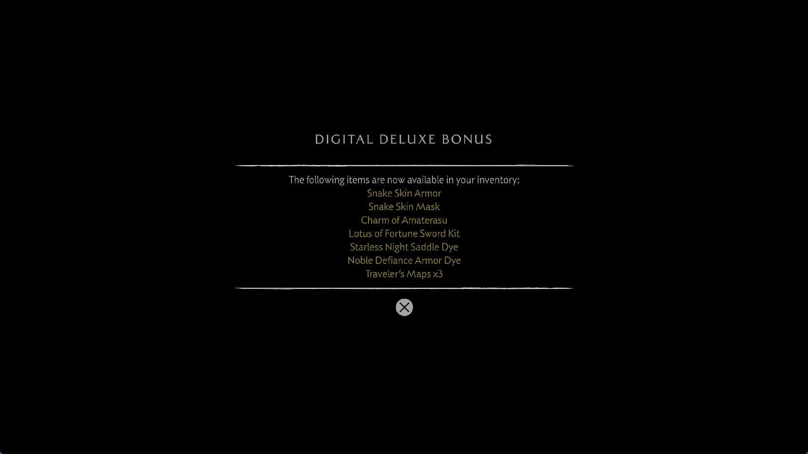

# Uniform null images and bounded descriptor recovery

The October 1 development change corrects a confirmed resource-binding failure
and reduces repeated work during scalar descriptor recovery. It applies to
shared rendering code, without title-address patches or changes to game files.
Tree rendering, performance and remaining invalid resource data require separate
runtime validation; successful shader decoding alone does not establish correct
rendering.

## Evidence and correction

A fresh control using the September 30 installed runner reproduced
`UnsupportedSampledImage` in compute program `0x8053ab6e00`, PC `0x500`.
The scalar pointer chain was accessible: its coalesced `s_load_dwordx16`
supplied an entirely zero T# in `s36:s43`. The diagnostic captured the
corresponding guest payload and valid sampler. These are live observations,
not an atomic snapshot of all guest memory.

An all-zero resource is an unbound texture whose reads return `(0,0,0,0)`.
The behavior is specified in AMD's
[RDNA2 instruction-set reference](https://www.amd.com/content/dam/amd/en/documents/radeon-tech-docs/instruction-set-architectures/rdna2-shader-instruction-set-architecture.pdf).
The renderer previously required a decodable image even for this case, unless
it happened to recover the null through its indexed-table path.

The corrected path proves every descriptor word through scalar reaching
definitions before declaring it unbound. Compute sample/fetch and graphics
sample/gather use the existing unbound-image translation. They do not require
host nonuniform sampled-image indexing. An unreadable pointer, an unknown
scalar value or a malformed nonzero descriptor is still an error. This change
does not implement null storage-image writes or claim complete image semantics.

The control also captured a different failure at export program `0x80003c0800`,
PC `0x370`. Its resource tuple contained nonzero geometry-like values. That
case must not be converted into a null texture. The same control subsequently
reproduced a record count of 1,060,342,320 at flip 808, while submitted and
completed GPU ticks were both 62,623 and the compiler was idle. It was
deliberately stopped after saving memory and thread evidence. It did not
spontaneously crash during this diagnostic.

## Avoiding repeated pointer work

Recovering a multiword descriptor could recursively reread both halves of each
intermediate pointer for every output word. A valid six-load fixture exhausted
the 512-step work budget in the old implementation.

The resolver now retains successfully recovered values for one `words()` call.
Its bounded, allocation-free table keys each value by both instruction position
and scalar register. Entries are cleared at the next call, so a relocated
pointer or changed payload is read again. Unknown values and failures are not
cached; existing depth and work limits remain.

The fixture now reads 18 words instead of 504. On the Ryzen 7 7700 test host,
with a larger work budget to
let both implementations finish, three alternating 10,000-recovery ReleaseFast
runs have median times of 134.8 ms without reuse and 29.2 ms with reuse, about
4.6 times faster. This is an isolated descriptor benchmark, not a game FPS
measurement or a prediction of an equivalent frame-time improvement.

## Validation

Fourteen focused scalar-recovery tests pass in ReleaseSafe. They include
relocated pointers, changed payloads, unreadable memory, register reuse at
different instruction positions, and the existing recovery/cache cases.

`--uniform-null-images` checks 16 compute configurations: four/eight-word T#s,
inline/nested descriptors, sample/fetch, and host nonuniform indexing enabled
or disabled. Each runs null, valid red texture, null again, then malformed
nonzero data. All 48 valid GPU dispatches return the expected four components;
all 16 malformed states are rejected. Adjacent sentinel bytes stay intact.
The valid pre-correction fixture fails on its first null sample with
`UnsupportedSampledImage`.

`--graphics-descriptor-reuse` passes seven cases. The added cases combine null
and ordinary sample/gather descriptors in reused SGPRs with nonuniform indexing
disabled. Actual target pixels and the number of materialized images are checked.

The following neighboring native probes pass:

```text
--inactive-image-tables
--nested-images
--spilled-image-descriptor
--workgroup-image-table
--scalar-buffer-tables
--uniform-image-loop
--buffer-command-writes
```

The last probe retains all 40 command-write ordering scenarios. Previously
documented failures in unrelated `--deferred-release`, `--gds-resident` and
`--device-storage` fixtures are not included in these passing results.

## Local references

The local KytyPS5 `src/graphics/shader/recompiler/ir/passes/SrtWalker.cpp`
reuses evaluated instruction values within an evaluation generation and rejects
recursive evaluation cycles. Its `tests/ScalarProvenanceTests.cpp` checks that
equivalent typed scalar reads are coalesced and evaluated once. Its
`tests/ResourceMaterializationTests.cpp` checks that missing runtime user data
rejects a stage and that ordinary mapped SRT reads use the direct reader.
These are useful reference behaviors for resource reuse without concealing
invalid inputs. No implementation was copied.

The sharpemu buffer cache remains a reference for dirty ranges, overlapping
allocations and CPU/GPU ownership. The corruption reproduced in the control
still needs first-writer evidence; null-image handling cannot establish its cause.

Local evidence is under `out/yotei-resource-recovery-20261001/` and
`out/yotei-resource-baseline-20261001/`. Raw guest shader code and memory
snapshots remain local. See the preceding
[command-write investigation](yotei-command-buffer-writes-2026-09-30.md).

## Installed runner and first live check

Implementation commit: `de3abb9`. The ReleaseFast runner and matching symbols
are installed at `zig-out/bin/game-run.exe` and `zig-out/bin/game-run.pdb`.
Their SHA-256 values are
`304c545f8bc15f523b7ff99bfc9073c4b1cae3da5be36e7ee680c2f8a92a29a6`
and `cd94850da052858817f9d7b6275a9831641ac49f285898e8e791ae334abc5d36`.

The first run used scripted input, speed/performance settings, 1080p output and
`PS5_TRACE_RESOURCE_FAILURES=1`. It reached the Digital Deluxe Bonus notice,
then stopped advancing at flip 740. The GPU was at 100% utilization; submitted
and completed timeline ticks remained 51,072 and 51,066. The compiler was idle.
A thread snapshot places the renderer in `waitForTickFrom`, reached through
`mapStorageReadbackRanges`, `flushGuestStoragePrefix`, `flushComputedMetadata`
and `commitComputeWrites`. The last recorded compute program is `0x80003d6000`.
That identifies the wait path, not the particular GPU instruction responsible.

The unedited 1765×993 client-window capture below belongs to this first run.
The sampler's flip label is not an exact image/present synchronization.



The process was deliberately terminated after 148 seconds without another
flip, following thread and shader-inventory captures. Windows retained the
terminating process for roughly two more minutes before releasing it. This
was a diagnostic stop, not an observed spontaneous crash. A fresh repeat was
started only after the process disappeared.

The inventory contains 636 programs and 519,207 decoded instructions, with no
unknown/unsupported decoder opcode in that snapshot. It includes program
`0x8053ab6e00`, but a resident/warmed shader is not proof of execution at PC
`0x500`. No resource-failure diagnostic was emitted before this earlier stall.
That cannot establish that all the later missing-resource cases are fixed.
Implausible billion-sized draw instance counts were explicitly rejected just
before the wait, so invalid indirect data remains present.

The last completed sampled frame, flip 739, takes 1,092 ms: draw processing
340 ms, compute dispatch processing 599 ms, 218 command buffers, about 341 MiB
uploaded and 235 MiB read back. Its 209 ms of fence waits overlaps those CPU
categories and must not be added to them. This is a bonus/loading frame, not a
tree FPS measurement. The first run neither reaches the tree nor demonstrates
an FPS improvement. Its evidence is in `out/yotei-resource-run-20261001/`.

## Repeat: compilation cost and the same GPU wait

A fresh process using the identical installed executable reaches flip 748,
then stops advancing on black. The renderer has the same wait stack and last
compute program `0x80003d6000`. Submitted/completed ticks stay at
53,215/53,209; the compiler is idle after 1,893 completed jobs and GPU
utilization is again 100%. This run is deliberately stopped after 155 seconds
without another flip. Both corrected runs stop before the tree, so there is
no new tree FPS result and the streaks are not established as fixed.

Before this wait, flip 742 takes 167,222 ms. Its 206 compute pipeline misses
account for 164,756 ms, about 98.5% of that frame. The next sampled frames
take 13,653 and 15,482 ms. These are large compilation/transition stalls, not
ordinary tree frame times. Host commit also approaches 50 GB and available
physical memory drops below 1 GB during preparation, so memory pressure is
another measurement limitation. The runs share the driver's persisted cache
and do not form a controlled performance comparison.

The repeat's snapshot contains 619 programs and 491,749 decoded instructions,
with zero unknown/unsupported decoder opcodes. No resource-failure report is
emitted before the stall, but invalid indirect draws remain. This result does
not certify all shader semantics or the later stages the process never reaches.

Eight recently used compute SPIR-V modules were retained locally. All pass
`spirv-val --target-env vulkan1.3` from Vulkan SDK 1.4.357.0. The most recently
used module has 30 control barriers. Structural validation does not prove
runtime convergence: workgroup execution barriers require participating
invocations to reach the same dynamic barrier instance, as specified by
[Khronos SPIR-V](https://registry.khronos.org/SPIR-V/specs/unified1/SPIRV.html#OpControlBarrier).
The saved modules and repeated wait justify investigating wave exchange and
the submitted batch, but do not yet prove a barrier bug or identify the first
offending GPU instruction. A replay still needs the actual bound inputs.

Evidence is in `out/yotei-resource-repeat-20261001/`. The next targets are the
repeated GPU wait, excessive pipeline variants/creation time, and the first
writer of corrupt indirect data. The native null-image correction and scalar
recovery improvement are verified independently; game stability, complete
rendering, 30 FPS and playability remain unresolved. Public release archives
are unchanged.
