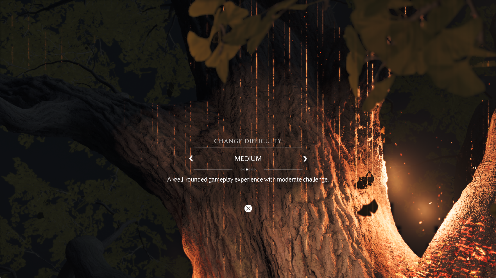
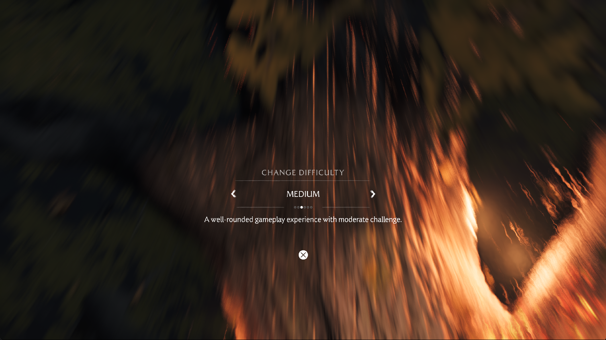

# Yotei post-tree investigation and dynamic graphics state

The October 3 investigation targets the scene after the burning tree and its
following cinematic. The first two launches reach the tree and the subsequent
loading transition, but do not reach the requested character scene. Both are
deliberately stopped by the diagnostic harness when Windows commit headroom
stays below 768 MiB for three samples. These stops are not spontaneous guest
crashes or observed Vulkan device loss.

The third launch uses the candidate below and reaches the tree and experience
selection. The user closes it after 1,817 seconds while the next scene is being
prepared. No post-cinematic character scene or controllable gameplay is visually
confirmed in these three runs. The user requested publication at this checkpoint.

## Measurements before the change

The installed runner was SHA-256
`61425eb41d58ab73a15eb3e85634bc5b72893b5a658fb43a5658b1b388c9201c`.
Each measurement counts actual presented frames over 30 seconds, with no input,
profiler, screenshot capture or concurrent build during that interval. The
introductory tree animation continues; these are not gameplay or post-cinematic
FPS results.

| Run and interval | Presented frames | Duration | FPS |
| --- | ---: | ---: | ---: |
| Run 1, tree transition to difficulty selection, game preference Default | 25 | 30.047 s | 0.832 |
| Run 2, same transition, game preference Performance | 29 | 30.045 s | 0.965 |
| Run 2, difficulty screen, original GDS culling enabled for diagnosis | 29 | 30.044 s | 0.965 |

Both runs request 1920×1080 output with the Speed rendering preset, on an RTX
3070 Ti. The actual captured window client is 1765×993. Guest internal targets
include larger resolutions, so output selection does not prove 1080p internal
rendering. Different cache histories and animation phases prevent attributing
the difference between launches solely to the game preference.

This is an unedited capture before the dynamic-state change and before enabling
the diagnostic original culling passes.

## Where time and memory go

An ordinary warmed tree sample in run 1 takes 1,243 ms, with approximately
878 MiB uploaded and 558 MiB read back. Graphics resource preparation accounts
for 378 ms; fence waits total 292 ms and overlap the higher-level categories.
Shader compilation is negligible in that sample. Transfers and resource
preparation remain major recurring costs.

The late loading frame 1334 takes 248,580 ms. Creating 579 graphics pipelines
accounts for 220,823 ms. It also creates 8,074 sampled images and evicts 7,455,
uploads about 4.67 GiB and reads back about 1.46 GiB. The `frame split` counters
do not have exclusive, matching boundaries with these draw/dispatch intervals;
their residual `guest_ms` must not be treated as a separate CPU measurement.
Likewise, `resident_kib` sums reused resource traffic, not allocated RAM.

Run 2 reaches a 96,798 ms loading frame with 657 graphics pipeline misses taking
64,684 ms. Its later cache-budget intervention increases eviction and transfer
work; this is not a controlled improvement over run 1. Windows system commit
reaches 58,783,199,232 bytes against a 59,294,818,304-byte limit before the
harness stops it. Physical availability and commit headroom are different
limits.

## Shared renderer change

A read-only snapshot of 1,007 live graphics pipelines contains 851 distinct
vertex/fragment shader pairs. Keeping shader bytes and every other key field
unchanged, making depth-bias factors and front/back stencil references dynamic
reduces that snapshot to 946 keys: 61 avoidable variants, approximately 6.1%.
This is a cache-key census, not a measured 6.1% FPS improvement.

Graphics pipelines now declare these values dynamic, and every draw records
the current depth bias and the two stencil references. Both resource-reuse
paths restore the new dynamic values instead of retaining previous draw state.
Depth/stencil enable bits, masks, operations, attachment formats and other
static compatibility requirements stay in the key. No draws or shader
instructions are skipped by this optimization.

The commands are part of Vulkan 1.0: [depth bias](https://docs.vulkan.org/refpages/latest/refpages/source/vkCmdSetDepthBias.html)
and [stencil reference](https://docs.vulkan.org/refpages/latest/refpages/source/vkCmdSetStencilReference.html).
Depth-bias clamp stays zero, matching the existing supported state.

## Graphics and shader checks

The pre-tree run 1 inventory captures 641 resident programs and 508,781 decoded
instructions, with no unknown or unsupported decoded opcode and no unavailable
instruction snapshot. Captured program words are checked against guest memory.
The retained translation audit reads 348 graphics and 589 compute variants,
with no linear control-flow fallback. A captured pending 1,155,096-byte fragment
SPIR-V module passes Vulkan 1.3 validation. These checks do not establish correct
shader semantics or resource access throughout later scenes.

The tree still has vertical bright streaks. The older CPU culling fallback
produces dense indices instead of the original shader's depth-filtered packed
coordinates. Enabling the original GDS shader in run 2 does not visibly resolve
the streaks or increase the measured tree frame rate. The original visibility
shader is also enabled later in that diagnostic process; no clean visual or
performance improvement is established. Neither experimental default is changed.

Storage resource-preparation gaps remain in the logs. They must not be counted
as proven executed shader failures: resource discovery can inspect inactive
branches. No assertion that every later shader/resource is correct follows from
the opcode audit.

## Candidate run and rejected cache settings

The ReleaseFast candidate has SHA-256
`8b375c2139e23e47b27a667bba0271541d851368bb073b779864494a9c441e12`.
It remains in `out/yotei-post-tree-20261003/patched/bin/`; the installed
`zig-out/bin/game-run.exe` still has the baseline hash above. A clean default-cache
visual comparison is required before replacing that installed runner.

Run 3 initially limits render targets to 64, sampled images and storage images
to 1 GiB each, and compute/graphics translation caches to 256 MiB each. The game
preference is Performance; the experimental original culling switches stay off.
The 1 GiB image budgets are rejected: bonus-screen samples create and evict
roughly 5,000 sampled textures and evict 230 storage images per frame, taking
4.17–4.31 seconds per frame. These settings are diagnostic environment overrides,
not new source defaults.

At Unix time 1791056458.955, the owned process's sampled-image budget is restored
to 2 GiB and its storage-image budget raised to 1.5 GiB. Eviction churn subsides.
With these settings and 64 render targets, the tree-to-difficulty interval presents
39 frames in 30.046 seconds: **1.298 FPS**. The same no-input/no-profiler measurement
method is used. This is not a controlled code-only comparison: cache sizes,
cache history and the visual result differ from the baseline.

The candidate capture is more smeared than the baseline capture. Restoring the
render-target limit to 128 at Unix time 1791057427.781 does not visibly remove
the smearing before the run ends. Its cause is not established: neither the new
dynamic state nor the earlier cache interventions have been isolated in a fresh
run with default budgets. The 1.298 FPS result is therefore not accepted as a
verified graphics-preserving improvement. The shared renderer change passes the
native probes below, but its live-game visual regression check remains open.

The last successful process snapshot records flip 2007 and 1,595 presented frames.
System commit shortly before closure is 55,686,696,960 bytes against the
59,294,818,304-byte limit. There is no memory-guard stop record for run 3; the
user explicitly confirms closing it.

Next steps are a default-cache candidate/control visual comparison, then a
repeatable post-cinematic scene measurement. Repeated image transfers, resource
discovery and the many distinct shaders remain separate optimization targets;
reducing redundant pipeline state alone cannot remove those costs.

## Validation

Seven relevant ReleaseSafe unit tests pass. The new native
`--dynamic-depth-stencil` probe checks signed bias, restoring zero bias,
independent front/back stencil values, reversed winding and pipeline reuse.
It passes with both transient and persistent depth passes. Neighboring
`--dynamic-viewport-scissor` and `--graphics-descriptor-reuse` probes also pass.
Khronos validation reports no errors; depth-only diagnostic draws report the
existing unused fragment-color-output warnings.

The candidate runner builds successfully. No claim of repaired tree lighting,
fixed streaks, post-cinematic FPS or a verified gameplay speedup is made.

The accompanying website checkpoint passes TypeScript checking, all 98 tests
and the production build. Both dated run blocks are available in all eight
site languages, with the baseline and candidate captures labeled separately.

## Evidence

Local logs, manifests, measured intervals, process snapshots and unedited
captures are in `out/yotei-post-tree-20261003/`. Game memory and raw shader
modules remain local ignored artifacts. Saves were copied to
`savedata-before/` before launching. Public release archives are unchanged.
