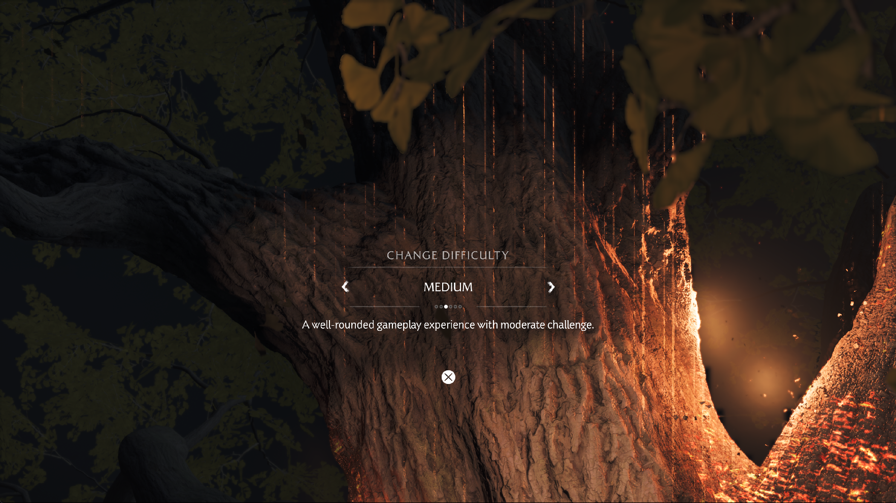

# Yōtei: runtime image tables and cache persistence

The October 4–5 continuation still does not establish character control or a
gameplay FPS improvement. The preceding `8cc8cf3c3c7a` runner measured 1.231 FPS
at the visible difficulty menu. Its subsequent cinematic has long first-use
pipeline compilation, bright tree streaks and unsupported packed-color blending.

## Evidence from the continued run

The live compute-translation cache was captured read-only with its matching PDB:
820 entries were stable across the read. Several variants of the same immutable
program differ only in sampled-image candidate address words. For example, two
entries for program identity 204 differ solely in `images[0].candidate_words[0]`;
variants for identity 156 also vary image width/address words. These identities
are local analysis-cache IDs, not portable game shader addresses.

The backend previously created runtime image lookup tables only for groups of
at least 64 candidates. Smaller indirect tables retained complete literal T#
comparisons in SPIR-V. Relocating their textures consequently changed both the
translation key and pipeline code. Large runtime tables also specialized their
maximum probe count on the current collision chain.

All indirect sampled-image groups now use the existing exact runtime lookup
when a storage-descriptor slot is available. Direct image bindings retain their
existing path. The bounded lookup terminates on an exact eight-word match or an
empty entry; its maximum count is the stable table capacity. Relocation and
different hash collisions therefore do not by themselves require compilation.
A full descriptor set retains the complete literal comparison path. Image view
types, slots, null checks and other shader-relevant state remain in the key.

This removes a demonstrated source of redundant variants. It does not establish
that all variants are redundant, or predict a particular game FPS gain.

## Validation

The expanded native workgroup-image probe executes three passes with relocated
textures, opposite expected colors and both colliding and non-colliding lookup
keys. It verifies all output channels, six texture creations, one pipeline miss
and two pipeline hits. The shader still uses shifted workgroup IDs and 440-byte
records containing unreachable descriptor-like fields.

Nine ReleaseSafe native Vulkan probe commands pass with Khronos synchronization
validation and no VUID or synchronization errors: `--workgroup-image-table`,
`--flat-material-fragment`, `--sampled-array-refresh`, `--inactive-image-tables`,
`--unsupported-texture-continuation`, `--indexed-images`, `--shifted-images`,
`--uniform-null-images`, and `--large-indirect-images`. They cover compute and
fragment lookup, null/invalid descriptors, mixed image dimensions, relocation,
array refresh and unchanged output on a rejected dispatch. The focused
translation-cache test also passes, including rejection of invalid bindings and
cache misses for genuine code changes.

## Disk-cache recovery

During the same run, the E: volume had only 569,475,072 free bytes. Its existing
pipeline cache was 1,145,809,523 bytes, and read-only inspection showed failed
asynchronous saves with persisted generation zero. There was insufficient space
for a complete new temporary snapshot beside the retained old cache.

Four redundant cache copies from completed, owned compiler probes were removed
after verifying their paths and recording hashes. This freed 4,337,915,118 bytes.
The main cache, its rollback copy, shader fixtures, games and saves were kept.
The still-running process then successfully persisted successive snapshots;
the cache reached 1,240,586,618 bytes at 00:26:22 local time.

Snapshot failures now report the failed phase and error once per changed error
condition, retain the previous complete cache and retry later. A successful
retry clears the diagnostic state. Four focused ReleaseSafe tests pass,
including driver-extraction failure, oversized data, an unwritable destination,
preservation of the old file and a successful retry. This is cache persistence
and observability work, not a steady-frame-rate optimization.

## Limits of this continuation

Two cold cinematic frames took 401.933 and 592.048 seconds. The latter included
505.051 seconds in compute pipeline lookup/creation and 54.504 seconds in
graphics pipeline lookup/creation; these nested counters must not be added to
frame time. It also reported 142 rejected draws and zero failed dispatches.
Packed 11/11/10 UNORM blending remains unsupported. The local SharpEmu source
maps that UNORM target to a floating-point host format; this was inspected but
not copied, because it does not preserve the existing integer-packed semantics.

The diagnostic memory guard deliberately stopped PID 29880 at 00:27:04 after
three low-headroom samples. A concurrent smoke-test build contributed to memory
pressure, so this stop is not evidence of a spontaneous game failure or a clean
game-only memory measurement. Subsequent builds and native probes are completed
before starting another game run.

The ReleaseFast runner and matching PDB are installed in `zig-out/bin`, with
SHA-256 `e5d43a4272cea001e8e89686c91021dffc4c14cd4d73c44cc0b58a0876fdc581`.
The preceding `8cc8cf3c3c7a` pair is backed up locally. Public release archives
are unchanged. A new separate run uses the existing driver cache, 1080p output,
Speed, the Performance game preference, two compiler workers and disabled
background compute warmup. No build or other GPU probe runs alongside it.

At the visible Medium difficulty menu, the new runner presents **37 frames in
30.049 seconds (1.231 FPS)**. The only background diagnostic is the existing
memory guard; no input, capture, profiler, build or other GPU test occurs during
the interval. This matches the preceding 1.231 FPS sample and does not demonstrate
a frame-rate gain. Bright vertical tree streaks remain. The subsequent transition
is being investigated separately from this steady menu measurement.

