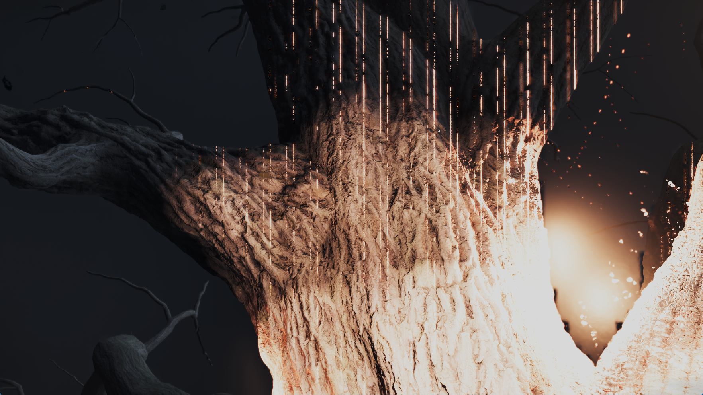
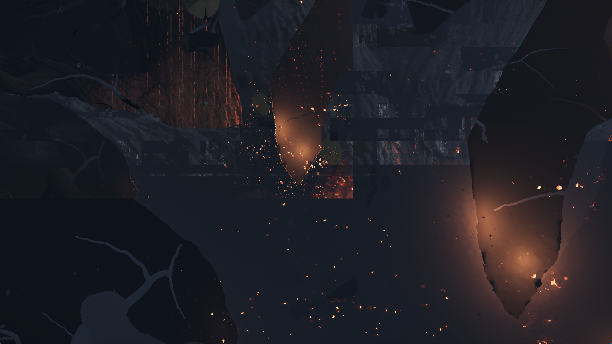

# Scalar-buffer descriptor tables and HDR tracing — September 30, 2026

## Fixed resource-preparation gap

The September 29 capture contains a lane-selected descriptor table in compute
program `0x8000333c00`: a scalar-buffer load fetches a four-word V# from a
592-byte record, then vector buffer instructions use it. The backend's dynamic
buffer candidate path previously accepted pointer-form scalar loads only.
Recognizing an opcode therefore did not guarantee that its resources were bound.

The shared renderer now also uses its existing scalar-buffer table planner for
buffer candidates. It follows reaching definitions for all four descriptor
words, accounts for the planner's 32-bit offset wrap, reads within the table's
declared extent, and retains execution-time matching of the complete V#.
Repeated tuples are deduplicated before applying the 32-unique-candidate limit.
All-zero records need no allocation; unmatched zero tuples read zero and suppress
writes. Different payload lengths retain the selected buffer's bounds.

This remains conservative: incompatible addressing/format layouts, invalid
nonzero descriptors, more than 32 distinct candidates, or more than 16,384
candidate offsets remain unresolved. An entirely null candidate set keeps the
existing missing-resource path. This change does not prove that every dynamic
resource in the captured game is resolved or that the tree artifact is fixed.
No title checks, shader hashes, guest edits or count clamps were added.

## Native validation

The new `vulkan-smoke --scalar-buffer-tables` fixture executes real RDNA2 through
the renderer on Vulkan. With the pre-fix backend, its valid read/write returns
zero instead of 100. The fixed backend passes tables with 2 and 64 records,
active-lane selection, repeated and null entries, out-of-table indices, unequal
payload bounds, untouched neighbouring words, and relocation between dispatches.
The negative control is retained in `baseline-corrected-test.log`.

`--buffer-tables` also passes the existing 128-candidate hash lookup and the
small/large pointer-table cases. Neighbouring native probes pass:
`--buffer-range-publication`, `--buffer-atomic-resources`, and `--nested-images`.
The previously documented `--device-storage` baseline failure was not changed or
reclassified by this work.

## Avoiding relocation-only pipeline variants

The former 64-mapping threshold left smaller dynamic buffer tables embedded as
literal descriptor comparisons. Changing only guest addresses consequently
created another pipeline. The relocation regression observes two cache misses
for two dispatches before the optimization. Dynamic V# tuples now use runtime
lookup data regardless of table size, while ordinary fixed bindings avoid lookup
allocation. The existing direct-comparison fallback remains when no descriptor
slot is available. The fixed fixtures now assert one miss and one hit for both
small/large pointer tables and both scalar-buffer table sizes. All four cases
pass while still checking their GPU results after relocation. Native cache reuse
is measured separately from game FPS.

## Runtime table observation

A consistent read-only snapshot of the live `0x8000333c00` table contains
14 records. Field `0x168` contains 14 different descriptors with 24-byte stride
and a common layout, a shape covered by the new path. Field `0x178` contains
zero-length descriptors with nonzero address/format words; this empty-table
shape still reports as unresolved. The diagnostic window still records gaps at
other instructions. These are preparation observations, not proof that all
reported instructions execute with missing resources.

## Narrower tree trace

In the preceding frame-850 capture, the retained HDR surface is cleared after
draw 59 by dispatch 651. Its subsequent lighting writers are programs
`0x8000318900`, `0x80002f5700`, `0x800024de00`, and `0x80001d5700`, followed by
later drawing/post-processing. Streaks seen before that clear are not evidence
that the early depth-only draw caused them.

Explicit frame tracing now saves intermediate images after writes through a
render-target storage image, as well as after draws. These use readbacks already
performed by the diagnostic trace and include frame, draw, dispatch and target
address in their filenames. Ordinary execution does not write these images.
Traced frame timings remain unsuitable for FPS comparisons.

The new frame-620 trace contains 159 draw snapshots and 13 storage-image
snapshots. On HDR target `0x505ab20000`, snapshots after dispatches 1410 and 1411
do not show the vertical streaks. They first appear after dispatch 1412,
program `0x800024de00`, and remain after dispatch 1413 and subsequent processing.
This identifies the first visibly affected lighting pass in this capture;
it does not distinguish incorrect shader arithmetic from incorrect input
resources. The trace does not establish that this program is the root cause.

## Reference review

The local SharpEmu `BufferCandidateTablePlanner.cs` validates a related
four-word scalar-buffer descriptor shape with loop-bound proof. Its approach
reinforces retaining provenance and bounds instead of treating memory extent as
a proof of which branch executes. This implementation reuses PS5PCEM's own
planner, including its conservative wrapping-offset enumeration; no external
source was copied. The local Kyty/sharpemu review does not establish an FPS
comparison on this host.

The local KytyPS5 `ShaderRecompiler.cpp` also performs SSA conversion, constant
propagation, identity/dead-code elimination, and read-lane elimination before
SPIR-V emission. Reducing translator-generated work before driver compilation
is a concrete direction to investigate against the captured large modules.
Those passes were not transplanted or benchmarked here, and the offline
SPIRV-Tools experiment below is not equivalent to Kyty's IR pipeline.

## Game validation

The first runner containing descriptor support and the new trace, before the
small-table cache optimization, exited by itself around flip 626 after about
701 seconds with status `0xC0000005`. No guest-fault report or device-loss message
was logged. The planned frame-850 trace and tree capture were not reached.
This is a failed stability run, not a successful game validation. Its SHA-256
was `fcc9c4ee43f44320f7cbbc23890b8cd875e2d163630f8d0d4421eb552b43f5e6`.
A 35-second diagnostic resource-log window was enabled and restored. Background
warmups were not cancelled.

On a loading pause, all four sampled hot threads were in NVIDIA compilation
routines. A pending 1,638,616-byte foreground SPIR-V module passed `spirv-val`.
Offline SDK optimization reduced it to 1,263,088 bytes and the result also passed
structural validation; that experiment was not enabled in the emulator and does
not demonstrate faster compilation or FPS.

The installed final runner includes runtime lookups for small dynamic tables:
`zig-out/bin/game-run.exe`, SHA-256
`adeb4c88b0ec44286991b8202d3bdf9c41ec030d5fefc0688304c3cbc752a0d8`.
Its matching PDB is installed alongside it. The ReleaseFast build passes all
7 build steps; code commit: `db95e98`.

An initial diagnostic attempt with the debugger attached immediately failed
before rendering: the first guest heap mapping returned `ENOMEM`, followed by
a contained libc access violation and exit 1. A repeat attached the debugger
after the first GPU frame and passed startup. Debugger timing is a possible
contributor, not a proven explanation of the failed heap mapping.

That repeat reached the bonus notice, wolf and burning tree. All 920 background
warmup jobs finished naturally with zero reported failures; none were cancelled.
No second-chance exception, guest-fault report or device loss had been recorded
when a planned close was requested after about 22 minutes. The process did not
close promptly while pipeline creation was active and was explicitly terminated
about two minutes later. Its exit status 0 was chosen by that planned
termination, not a successful natural game exit. This run passed the
previous flip-626 failure point but is not evidence of repeatable startup or
long-session stability. The later scene stalled during serial graphics pipeline
compilation, and both rendering artifacts and resource failures remain.

### Shader coverage and skipped work

A read-only inventory cross-checked retained shader code against guest memory:
789 programs, 722,477 decoded instructions, zero `unknown` and zero `unsupported`
opcodes in that snapshot. This is coverage of captured programs only, not every
shader in the game, and opcode recognition does not prove correct execution.

The same run logs 34 skipped compute dispatches with `UnsupportedSampledImage`
across seven program addresses, two more with `UnsupportedStorageImage`, and
two rejected draws (one
`UnsupportedSampledImage`, one `GuestMemoryReadFailed`). These are logged events,
not a complete count of execution failures. Late frames 909 and 910 each report
one dispatch failure, with 3,120 and 3,278 unresolved storage preparations,
respectively. Repeated preparation attempts are not distinct missing resources.
Consequently, a claim that no shaders or passes are skipped would be incorrect.
The late repeated failure names program `0x800027c200`.

### Tree performance

The tree remains far below 30 FPS. These are diagnostic observations rather than
a matched before/after benchmark. The debugger handled 2,067,777 first-chance
access violations during approximately 1,431 seconds; none became a recorded
second-chance crash. Such handled exceptions can belong to the emulator's
memory-tracking paths. Relaying them through a debugger adds unmeasured overhead.
Together with profiling and the traced frame, this makes these numbers unsuitable
for predicting normal game performance. A separate run without the debugger or
frame dump is reported below.

| Observation | Measured result | Interpretation |
| --- | --- | --- |
| Early tree frame 840 | 826 ms; 284 draws / 240 ms, 1,150 dispatches / 442 ms | Even without a long compilation stall, this frame is far above the 33.3 ms target. |
| Next transition, frame 905 | 59,369 ms; graphics pipeline creation 45,181 ms across 42 misses; compute pipeline creation 7,280 ms across 47 misses | Newly encountered pipeline variants dominate this stall. |
| Following frame 906 | 3,128 ms; 1,028,400 KiB uploaded, 511,739 KiB read back, 921 texture evictions | Resource transfers and churn remain substantial after compilation. |
| Later frame 908 | 70,209 ms; compute pipeline creation 16,174 ms | More late stalls remain; timing buckets do not explain the whole frame. |
| Later frame 910 | 16,463 ms; no new graphics or compute pipeline misses in that completed frame | Compilation is not the only remaining source of delay. |
| Later frame 911 | 443,464 ms; 601 new graphics pipelines / 401,941 ms; 5,656 draws | A much larger scene batch is extremely slow under the debugger; it is not an ordinary FPS measurement. |
| Later frame 912 | 141,710 ms; 245 new graphics pipelines / 83,222 ms | More new pipeline variants remain after the first tree view. |
| 30-second presentation sample spanning the transition | 2 presented frames, about 0.067 FPS | This is a stall-dominated interval, not steady tree performance. |

The next pending frame stopped presenting while one foreground graphics compile
job remained active. The sampled GPU timeline had completed all submitted work
(`submitted_tick == completed_tick`); this particular pause was not a pending
GPU fence. Two read-only captures found different pending vertex/fragment pairs
at the same waiting submission stack, indicating serial pipeline creation rather
than proof of one permanently stuck job. The first pair was 190,472 and
1,053,008 bytes and both passed `spirv-val --target-env vulkan1.3`.

An offline `spirv-opt -O` trial increased that fragment module to 1,217,312 bytes
in 2.29 seconds; the result also validated. It was not enabled at runtime and
provides no measured compilation or FPS improvement. Blindly applying that
option is not a demonstrated fix. The earlier compute-module reduction likewise
does not establish faster driver compilation.

A seven-second sample during an earlier transition also found mapping/file I/O
and GPU waits. Those samples cover four selected threads and cannot assign a
percentage of total frame time. Profile categories may overlap or span submission
boundaries; do not add them as independent costs.

### Repeat without the debugger

The same installed executable was launched again with scripted input, 1080p
output, speed/performance settings and the FPS display, without the debugger,
HLE profiling or a frame dump. Read-only counter sampling and brief stack samples
were used; this remains a development measurement rather than a controlled
before/after comparison.

All 920 background warmups completed naturally. Around flip 680, several
30-second intervals presented zero frames while the GPU timeline was caught up.
The pending foreground compute module for `0x805c5f3600` was 2,271,248 bytes and
passed Vulkan 1.3 SPIR-V validation. Compilation stalls therefore also occur
without exception-debugger overhead.

After that pause, frame 700 took 1,011 ms without any graphics/compute pipeline
misses: 707 draws / 419 ms, 1,448 dispatches / 436 ms, 270,409 KiB uploaded and
173,058 KiB read back. This loading/transition frame is not a verified tree FPS
sample. It demonstrates that eliminating compilation pauses alone is insufficient
for the 33.3 ms frame budget.

The warmup catalog contains 536,865,428 bytes, almost its 512 MiB bound. The current
append-only catalog cannot save a new multi-megabyte module at that occupancy.
A bounded replacement policy is an identified follow-up; this change does not
implement it or increase the memory budget.

Subsequent work implements and tests that bounded replacement policy; see the
[warmup catalog follow-up](yotei-warmup-catalog-2026-09-30.md). It also records
a later repeat that passes flip 725, qualifying the stall observation below.

A later consistent translation-cache sample read all 391 graphics modules and
547 compute modules in those caches. None used the linear control-flow fallback
that drops branches; 145 graphics and 451 compute modules used the dispatcher
path. These are retained translation variants, not 938 distinct guest programs.
This does not establish coverage of evicted modules, later stages, dispatcher
iteration exhaustion, or missing resources.

The repeat subsequently stopped presenting at flip 725 (410 presentations,
GPU submitted/completed tick 54,402) and did not reach a visible tree before its
13-minute limit. Its final compiler snapshot had no active or pending jobs.
That later stall is therefore unresolved and must not be attributed to the
previously captured compilation pause. No ordinary tree FPS result or stable
startup is established by this repeat. The harness requested termination at its configured limit; shutdown completion
was delayed, then the harness confirmed `stopped after 780 seconds`. Both the
owned game and harness have exited. This was a planned termination, not a
spontaneous crash or successful natural exit. The idle compiler snapshot was
taken about eight seconds before the timeout, not during teardown.

### Actual captures

Both images below are unedited 1765×993 captures of the real game window from
the same final-runner session, with output configured for 1080p.

The tree is reached, but vertical streaks and excessive brightness remain.

The later transition adds block-shaped corruption. A still later lighting phase
looked cleaner without a code change; it is not evidence that the artifacts are
fixed. Gameplay itself and a steady-state FPS improvement remain unverified.
Public release archives are unchanged.

Local evidence: `out/yotei-scalar-tables-20260929/`,
`out/yotei-scalar-run-20260930/`, `out/yotei-scalar-stable-run-20260930/`, and
`out/yotei-scalar-stable-b-20260930/`, and `out/yotei-scalar-perf-20260930/`. Raw guest memory and shader binaries are not
published.

Website validation: ESLint, TypeScript checking and all 56 existing tests pass.
