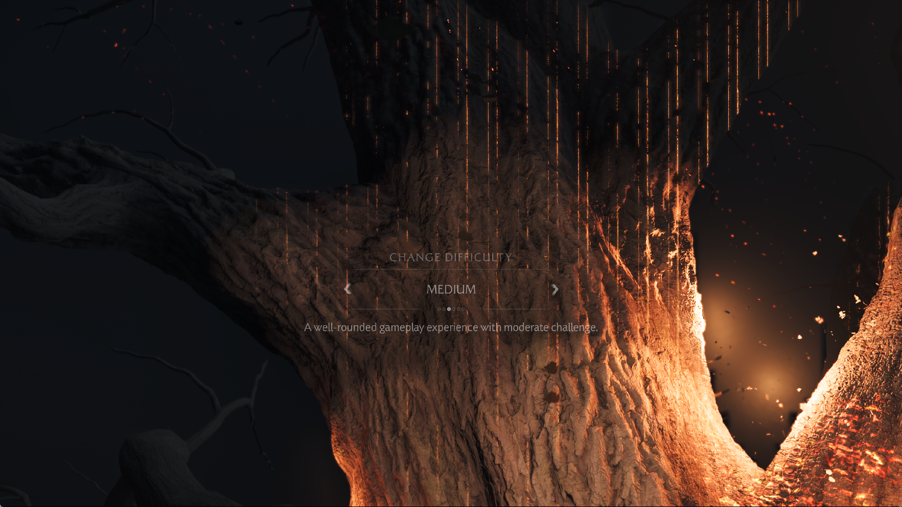

# Ghost of Yōtei: bounded compute warmup catalog replacement

September 30, 2026. Follow-up to the
[scalar-buffer table investigation](yotei-scalar-tables-2026-09-30.md).
This change addresses retention of compiled compute modules across launches.
It does not change shader instructions, skip additional rendering work or fix
the tree's lighting artifacts.

## Confirmed cache problem

The title's catalog contained 920 SPIR-V modules occupying 536,865,428 bytes,
only 5,484 bytes below its 512 MiB limit. The previous append-only catalog
rejected new modules once this budget was exhausted. Later shaders could be
compiled during gameplay without being retained for compute warmup on the
next launch. Raising the limit would only postpone the same condition.

The shared Vulkan implementation now:

- Indexes retained modules by hash instead of scanning the catalog on insertion.
- Refreshes recency when a live compute pipeline is reused. This path does not
  allocate, hash the shader body again, access disk or re-admit absent modules.
- Admits newly compiled modules by removing the oldest completed records until
  both the byte and entry limits have room. Queued readers, active warmups and
  pending file publishers cannot be evicted.
- Retains the existing 512 MiB catalog, 2,048-record and 32 MiB pending-save
  bounds. Copied module contents are still written and atomically published
  by background workers. Removing old files happens during admission on the
  renderer thread; deletion failure conservatively prevents that admission.
- Allows a completed failed save or corrupt retained module to be replaced
  using the successfully compiled live module.

This is a best-effort compilation cache. A working set larger than its budget
can still require recompilation. Usage order is tracked within the current
process, not persisted as a separate database. Graphics pipelines and the
driver's opaque pipeline cache are separate from this catalog.

The local reference review also covered KytyPS5 `0c844e4`
(`pipelineCache.cpp`) and SharpEmu `a9e1c25` (`ShaderPipelineCache.cs` and
`VulkanPipelineCacheStorage.cs`). They separate shader/program identity from
pipeline state and isolate persistent driver data by title; Kyty additionally
includes its build and device/driver signature. These are useful design
references, not evidence that their shaders or opaque driver caches can be
reused by PS5PCEM. No source was copied, and neither emulator was benchmarked
in this investigation.

## Regression validation

The full-catalog retention regression fails against the append-only policy:
the new module is absent and the test reports `FileNotFound`. With replacement
enabled, tests cover both byte and entry pressure, retention of a recently
used module, replay on the next cache instance, removal of multiple victims,
an active worker that must remain protected, subsequent admission after that
worker finishes, corruption repair, pending-write limits and shutdown.

The Vulkan root now explicitly imports the warmup module in its test block.
Previously its tests were not discovered through that root; a root-only pass
was not accepted as evidence for this fix.

Final validation passes all seven warmup/root tests in ReleaseSafe. A native
Vulkan replay loads and compiles two retained modules with no failed warmups
and no retained executable pipelines. The native scalar-buffer table probe
also passes, including GPU reads/writes, duplicate/null entries, bounds and
relocation. The ReleaseFast runner builds successfully. Its first staging
attempt failed with a missing executable while C: was almost full; the final
rebuild and validation succeeded after space was recovered from generated
build intermediates.

`zig-out/bin/game-run.exe` and its matching PDB are installed locally. The
executable SHA-256 is
`f908d45c950f6e44f7a1e0b7c18d5b08bea4fca694ef7ddd8da94a07ddb61959`.
Public release archives are unchanged.

## Repeat without a debugger

Before installing this change, a repeat of the previous `adeb4c88b0ec` runner
passed the previously observed stop at flip 725 and reached the wolf brightness
screen and tree difficulty screen. It used scripted input, the performance
preset and 1080p output, without debugger attachment or frame tracing.

Two-second read-only snapshots clarify the earlier deadlock suspicion. During
one approximately 147-second interval at flip 700, 71 of 72 observations show
one active, outstanding compiler job. Only one observation catches an empty
queue between jobs. A separate native stack snapshot reaches the foreground
compute job wait. That brief empty-queue sample does not establish a lost wake
or permanent deadlock. The previous incomplete run remains an unresolved
observation; this repeat is not proof of reliable startup.

The tree still has vertical lighting streaks and excessive brightness. Later
scene transitions still incur very long compilation/resource-processing
pauses. The run records 90 `sampled image missing` messages, so the earlier
opcode inventory must not be interpreted as complete shader execution.
It ends at the planned 1,200-second limit, with no logged guest fault, Vulkan
device loss or panic. This is a bounded observation, not a stability claim.

The later part overlaps a runner build and host disk/pagefile pressure. Its
frame timings are unsuitable as an isolated FPS baseline. No matched FPS gain
or 30 FPS result is claimed from this repeat.

*Unedited 1765×993 game-window capture from the preceding runner, before the
catalog replacement change. It records the remaining lighting streaks and
excessive brightness. It is not a capture of the patched runner reaching the
tree.*

## Installed-runner observation

The installed `f908d45c950f` runner uses the same 1080p output and scripted
performance preset, without debugger attachment or frame tracing. All 920
startup warmups complete naturally with zero failures. At the later idle
rendering interval, disk inventory and live counters agree:

| Observation | Result |
|---|---:|
| Retained modules before launch | 920 |
| Retained modules at the checkpoint | 955 |
| Catalog size at the checkpoint | 536,586,900 bytes |
| New module files still retained | 138 |
| Original files replaced | 103 |
| Total completed-record evictions, including newer records | 121 |
| Blocked admissions observed | 0 |

Two newly saved live modules were copied into an isolated fixture and replayed
through native Vulkan: both compile successfully with no failed warmups and
no retained executable pipelines. This verifies live publication and replay,
in addition to the synthetic pressure regressions. It does not measure an FPS
gain or guarantee that every future working set fits the budget.

This run also reproduces a different long black-screen interval at flip 745:
409 presented frames, submitted/completed GPU tick 54,678, no pending graphics
or compute queue work, and no outstanding compiler job. These values remain
unchanged across repeated two-second samples, rather than one brief gap
between compilation jobs.

A five-second native-thread sample finds the main guest thread in the list
search at `eboot.bin` virtual addresses `0x1369417..0x1369451`. The surrounding
function at `0x1369260` allocates a larger array of 64-byte records and moves
their references, repeatedly searching linked lists to remove old references.
Separate register snapshots show its outer index changing from `0x2b07e` to
`0x47cef`; the thread is doing guest CPU work, not waiting on the compiler.
The array at `0x6af99d0` grows from 327,680 to 786,432 records in the sampled
interval. All 4,096 entries in a read-only prefix sample reference one common
owner. Repeated linear searches during growth can therefore be expensive.
The cause of this growth is not established, and no guest loop or data was
patched to bypass it.

This distinguishes a concrete guest CPU cost from the earlier foreground
driver compilation pauses. It does not establish a deadlock, explain all
black screens, or resolve the rendering failures. Tree FPS cannot be measured
from this black-screen interval, and neither 30 FPS nor reliable startup is
claimed for the installed runner.

The process then exits by itself with `0xC0000005`, about 770 seconds after
launch, before reaching the tree. The last guest diagnostics are null writes
inside the same array-growth function after its allocation returns zero. The
final host access violation is at runner RVA `0x808105`; the matching PDB
resolves this to the thread manager's lock in `Manager.wake`, reached through
`wakeWaiters` and `scePthreadMutexUnlock`. This locates the final host failure,
not its cause. There is no demonstrated waiter-lifetime bug or established
causal link between the catalog change and this failure. The new runner has
not passed a stable tree run, and no containment-only workaround was added.

Local evidence is retained under `out/yotei-stall-baseline-20260930/` and
`out/yotei-catalog-20260930/`, with the installed-runner evidence under
`out/yotei-catalog-run-20260930/`. Game modules, raw process memory and generated
shader binaries are not included in the repository.
