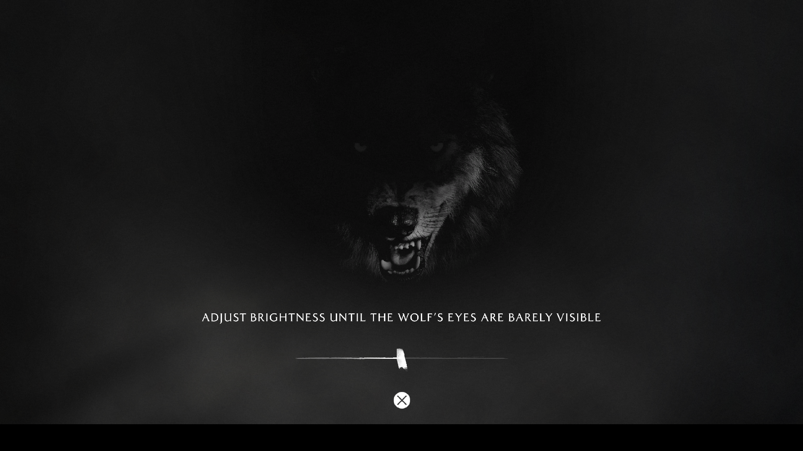
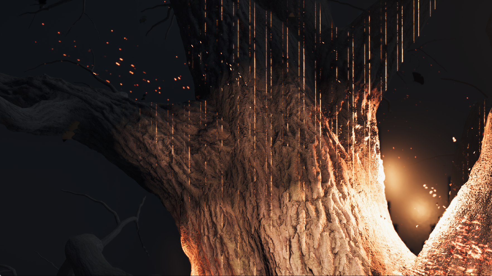

# Yotei black-screen investigation and compiler admission

The reported black screen before the wolf brightness screen and subsequent
process exit are **not yet explained**. A separate startup delay was reproduced:
background shader-cache warmups could occupy every compiler worker while a
shader required by the current frame waited in the foreground queue.

## What was observed

The maintainer's process, PID 15884, was inspected without changing its guest
memory or terminating it. Audio continued. Its main guest thread repeatedly
sampled in the reference-removal loop at `0x1369420`, reached from code carrying
the source string `psys.cpp:6062`. The array being grown contained 655,360
64-byte records. This establishes an expensive guest-side operation; it does
not establish a cyclic list, the meaning of every record, or the cause of the
later exit. The maintainer confirmed that the process exited on its own.
Its exit code was not captured.

The supplied last graphics messages report `UnsupportedSampledImage`, with
resource register `s0`, ten user-data words and an SRT. The renderer rejects
those draws. That message alone does not identify the shader or establish
why all visible output disappeared. KytyPS5 and sharpemu resource analysis was
compared locally; no descriptor fallback or guest-program bypass was added.

A separate 900-second diagnostic launch of the preceding executable reached
profiled flip 486. It did not reach the reported failure. Live queue inspection
found all four compiler workers running cache warmups with a foreground job
pending. As a diagnostic intervention in that owned process only, unstarted
warmups were cancelled at 15:59:56 local time. Already-running compilations
were allowed to finish. The final warmup counts were 390 compiled and 920
finished, including skipped jobs. Subsequent frame progress does not constitute
a controlled FPS comparison; one required frame still took about 62 seconds.
The harness deliberately ended this launch at its 900-second deadline.

## General correction

The shared CPU queue now leaves one worker slot available to newly arriving
foreground work when its configured ceiling is at least two. Background jobs
can use at most `ceiling - 1` slots. A foreground request can use this capacity
even if adaptive admission has fallen to one. The configured overall ceiling
is still enforced. A one-worker configuration remains serial, and native
thread-creation failure retains the existing fallback.

Running jobs are not interrupted. Foreground-only resource preparation can
still use its full limit. Background jobs retain FIFO ordering, complete
normally and drain on shutdown. This can slow speculative warmup throughput
in exchange for reducing foreground queue delay. It cannot remove a long
foreground driver compilation or guarantee a higher steady-state frame rate.

Compiler profiles now include the number of active background jobs. The normal
missing-image message includes stage, program address and instruction PC, so
a future report identifies the failed shader even without full tracing.

## Validation

The GPU module passed 239 tests in ReleaseSafe. Two new concurrency regressions
verify that foreground work completes while background jobs remain blocked,
including adaptive admission at one. The standalone worker/policy suite passed
all ten tests after final review. The catalog cancellation test also passed.
Formatting and whitespace checks passed.

The installed `zig-out/bin/game-run.exe` is the September 29 ReleaseFast build,
38,698,496 bytes, SHA-256
`f20c9bc8c53bd48be469e6eea0f7cf3518f3e5238fd04723722c0e998ba4de6e`.
Its matching PDB is installed alongside it. The website also passed its type
check, 56 tests and production build.

## Native verification

Three launches used that same executable, scripted input, the performance
preset and 1080p output. Internal render targets can be larger. The completed
buffer pool remains enabled by default at 32 MiB; this patch does not change
buffer reuse or resource-coherence behavior.

| Run | Buffer pool | Observed result |
| --- | --- | --- |
| A, PID 16228 | Default 32 MiB | Exited on its own with code 1 after a guest read fault; the last live snapshot recorded flip 740. No wolf or tree capture was obtained. |
| B, PID 3484 | Disabled for diagnosis | Reached the wolf image and burning tree. Manually stopped after verification during later streaming. |
| C, PID 24444 | Default 32 MiB | Reached the wolf brightness screen, including text, slider and confirmation glyph, and then the burning tree. The harness stopped it at its 900-second deadline during later streaming; the last sampled flip was 1073. |

These are diagnostic runs, not a controlled performance comparison. CPU-only
resource tracing was enabled after the first missing-image message in each
process. B and C also used a hardware data watchpoint while investigating the
guest count described below; debugger overhead changes scheduling. None was
created with the NVIDIA diagnostic-checkpoint extension enabled by
`PS5_TRACE_RESOURCE_FAILURES=1`. The earlier 900-second diagnostic launch did
enable it, so its much slower startup cannot be attributed solely to the queue
change. Driver caches also changed between launches.

Passing with both pool settings does not prove that buffer reuse caused the
failure or that it is safe in every case. It does establish that disabling the
pool is not required to reach these screens in the observed repeat. No buffer
pool workaround is shipped. Stability and a steady-state FPS improvement are
not established; 30 FPS in these scenes remains out of reach.

Both are unedited 1765×993 captures of the real game client in run C. They show
a development milestone with diagnostic instrumentation, not stable gameplay
or a completed playthrough. The public release archive does not contain this
development change.

## Remaining fault and resource evidence

Run A stopped at guest instruction `0x133214d`, reading `0x50d3400800`. Static
inspection identifies a loop converting 32-byte input records into 48-byte
output records. It uses the count at `0x6af91c8`; its source pointer is at
`0x6af91b8` and destination pointer at `0x6af91c0`. At the fault, the read index
was around 4.87 million. The producer at `0x1177c76` increments the shared count
from a per-object count and limits the subsequent copy to the remaining
4,096-record capacity. This identifies where to investigate the oversized
total; it does not establish whether invalid object data, excessive submissions
or another error produced it. No guest counter clamp or executable patch was
applied.

The data watchpoint recorded 4,102 count writes with a maximum of 32 in B and
9,571 writes with a maximum of 39 in C. Both observed writers match the reset
at `0xb9112c` and increment at `0x1177c93` (instruction pointers after the
writes). No oversized producer was caught in those intervals. Watchpoints
were removed and the debuggers detached before the runs were stopped.

The original process's expensive reference-array growth was not observed in
these three launches. Its large reference array and run A's conversion fault
must not be treated as the same proven failure.

Later runs report a different sampled-image failure from the maintainer's
`s0`/ten-user-data-word message: export-stage `s16`, twelve user-data words,
program `0x80003c0800`, PC `0x370`. Captured scalar values at that resource slot
look like matrix values rather than an image descriptor. Additional compute
resource failures and implausibly large dispatch dimensions occur with both
pool settings, including launches that reach the tree. Their relationship to
the exit remains unproven. These messages alone do not justify treating a
missing resource as a null texture or silently dropping more guest work.

The immediate remaining task is to capture the first invalid producer object
and trace the origin of its count. The indirect-argument readback path is also
an unverified coherence lead: it currently materializes storage only at an
exact resource base. No change to that policy is included without evidence
that an interior read is authoritative and will not overwrite unrelated
guest data.

## Local evidence

- `out/yotei-live-black-20260929/`: original process CPU, stack and memory reads.
- `out/yotei-black-performance-repro-20260929/`: preceding-runner diagnostic
  launch, queue snapshots and the explicitly recorded warmup cancellation.
- `out/yotei-warmup-priority-20260929/`: preceding binary/PDB and test logs.
- `out/yotei-priority-repro-20260929/`: final build, matching PDB descriptions,
  run A progress and guest-fault report. The detailed fault report is at the
  start of `stderr.log`; the final contained-fault line is near its end.
- `out/yotei-no-recycle-repro-20260929/`: run B captures, resource snapshots and
  compressed `stderr.log.gz` (verified against the original before removal).
- `out/yotei-recycle-repeat-20260929/`: run C manifest, progress, count writes,
  resource snapshots, verified compressed log and the published
  `window-0542.png` / `window-0603.png`. Website checks were repeated here after
  adding the gallery images and compatibility text.

The public 0.3.2 release archive predates this development change.
